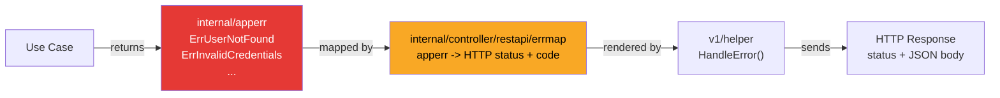
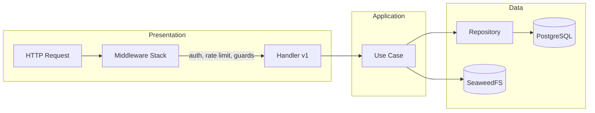

# Project Structure

This document specifies the layout and responsibilities of the AstroCTFb codebase. The backend is implemented in Go and follows a layered (clean) architecture with separate presentation, application, domain, and data layers.

## 1. Architecture

| Layer         | Path                              | Role                                 |
| ------------- | --------------------------------- | ------------------------------------ |
| Presentation  | `controller/restapi`, `websocket` | HTTP handlers, middleware, WebSocket |
| Application   | `usecase`                         | Business logic (per-domain packages) |
| Domain        | `domain`                          | Entities and domain types            |
| Data          | `repo`, `storage`                 | PostgreSQL repositories, S3 storage  |
| Error Mapping | `controller/restapi/errmap`       | Domain errors to HTTP responses      |

Internal application packages (`internal/`) contain domain-specific logic that is not shared outside the backend. Shared cross-cutting utilities reside in `pkg/`. Dependency wiring is defined in `internal/wire/` using google/wire.

## 2. Directory Layout

### 2.1 Backend

```text
backend/
├── cmd/
│   ├── app/                    # Application entry point (HTTP server)
│   └── cleanup/                # Cleanup job entry point (soft-deleted teams)
├── codegen/                    # Code generation configuration
│   ├── .mockery_*.yml          # Mockery configs per package
│   ├── oapi-codegen-*.yml      # OpenAPI client/server/types
│   └── sqlc.yaml               # sqlc (SQL -> Go) config
├── config/                     # Configuration loading (env, Vault)
├── internal/
│   ├── app/                    # Application bootstrap and wiring
│   ├── apperr/                 # Domain error sentinels (pure errors, no HTTP)
│   ├── cache/                  # Redis-backed cache, scoreboard cache
│   ├── controller/
│   │   ├── restapi/
│   │   │   ├── errmap/         # Error mapping: apperr -> HTTP status/code
│   │   │   ├── middleware/     # Auth, ban, rate limit, competition guards
│   │   │   └── v1/            # Handlers, request/response, helper
│   │   └── websocket/v1/      # WebSocket handler
│   ├── domain/                 # Domain layer (entities, value objects)
│   ├── loginlockout/           # Redis-backed failed-login lockout
│   ├── openapi/                # OpenAPI spec sources and generated code
│   ├── repo/
│   │   ├── contract.go         # Repository interfaces
│   │   ├── persistent/         # PostgreSQL implementations (sqlc + adapters)
│   │   └── webapi/             # External HTTP clients (OAuth providers)
│   ├── scoring/                # Dynamic scoring formula and recalculation
│   ├── seed/                   # Database seeding (default admin user)
│   ├── storage/                # File storage interface (S3, filesystem)
│   ├── usecase/                # Application layer (per-domain packages)
│   │   ├── avatar/             # Avatar upload, processing, deletion
│   │   ├── backup/             # Export/import
│   │   ├── challenge/          # Challenges, hints, files, tags, comments, ratings
│   │   ├── competition/        # Competition state, solve, scoreboard, statistics
│   │   ├── email/              # Email verification and password reset
│   │   ├── notification/       # Notifications
│   │   ├── page/               # Static pages
│   │   ├── settings/           # App settings, custom fields, validator
│   │   ├── team/               # Teams, awards, bans, membership
│   │   └── user/               # Auth, profile, OAuth, API tokens, admin ops
│   ├── websocket/              # WebSocket broadcaster and event types
│   └── wire/                   # Dependency injection (Wire)
├── pkg/                        # Shared cross-cutting packages
│   ├── crypto/                 # AES encryption, hashing
│   ├── httperr/                # HTTP error aliases (re-exports from go-httpkit)
│   ├── i18n/                   # Internationalization
│   ├── mailer/                 # Transactional email (Resend)
│   ├── slug/                   # URL-safe slug generation
│   ├── sse/                    # Server-Sent Events
│   ├── testutil/               # Test helpers (containers, env)
│   ├── validator/              # Request validation
│   └── vault/                  # HashiCorp Vault client
├── migrations/                 # SQL migrations (3 fixed files, see policy)
├── queries/                    # SQL queries for sqlc
├── e2e-test/                   # End-to-end HTTP tests
├── integration-test/           # Integration tests (repositories, DB)
└── load-test/                  # Load tests (vegeta)
```

### 2.2 Deployment

```text
deployment/
├── docker/
│   ├── docker-compose.yml       # Production compose
│   ├── docker-compose.local.yml # Local development compose
│   └── init-vault.sh            # Vault secret seeding script
├── nginx/
│   ├── nginx.conf               # Development config / generated production config
│   └── nginx.conf.example       # Production template (REPLACE_* placeholders)
├── vault/config/
│   └── vault.hcl                # Vault server configuration
└── seaweedfs/
    ├── s3.json                  # SeaweedFS S3 identity (dev defaults)
    └── s3.json.example          # Production template
```

### 2.3 Monitoring

```text
monitoring/
├── grafana/
│   ├── dashboards/
│   │   ├── backend/             # backend-metrics.json, backend-logs.json
│   │   ├── postgres/            # postgresql-details.json
│   │   ├── redis/               # redis-overview.json
│   │   ├── seaweedfs/           # seaweedfs.json, seaweedfs-ui.json
│   │   ├── system/              # system-overview.json, node-exporter.json, nginx.json
│   │   └── vault/               # vault-health.json
│   └── provisioning/
│       ├── dashboards/          # Dashboard auto-provisioning config
│       └── datasources/         # Prometheus + Loki datasource config
├── loki/                        # Loki configuration
├── prometheus/
│   ├── prometheus.yml           # Scrape configs (11 targets)
│   └── alerts.yml               # Alert rules (12 rules)
├── promtail/                    # Promtail log pipeline configuration
└── alertmanager/
    ├── alertmanager.yml         # Generated by run.sh (or dev defaults)
    └── alertmanager.yml.example # Production template
```

## 3. Main Components

### 3.1 Entry Points

- **`cmd/app/main.go`** - Loads configuration (`config.New`), calls `internal/app.Run`.
- **`cmd/cleanup/main.go`** - Standalone job for cleanup operations (hard-delete of soft-deleted teams).

### 3.2 Application Bootstrap

**`internal/app/app.go`** wires all dependencies: PostgreSQL pool (go-pgkit), Redis, goose migrations, repositories, use cases, router (chi), middleware stack, HTTP server with graceful shutdown (oklog/run + signal context).

### 3.3 Controllers

- **`internal/controller/restapi/v1/`** - REST handlers: user, challenge, competition, team, email, hint, file, backup, settings, notification, page, submission, statistics, avatar, rating, oauth.
- **`internal/controller/restapi/middleware/`** - Auth (JWT/API token), InjectUser, RequireNotBanned, RequireVerified, RequireTeam, RequireTeamNotBanned, ChallengeVisibility, ScoreboardVisibility, RateLimit, Tracking.
- **`internal/controller/restapi/errmap/`** - Central mapping of `apperr.*` sentinel errors to HTTP status codes and error codes.
- **`internal/controller/websocket/v1/`** - WebSocket connection handling and real-time event dispatch.

### 3.4 Use Cases

| Package                | Responsibility                                                                     |
| ---------------------- | ---------------------------------------------------------------------------------- |
| `usecase/user`         | Auth, profile, OAuth (GitHub/Google), API tokens, admin operations, bans           |
| `usecase/challenge`    | Challenges, hints, files, tags, comments, ratings, solutions                       |
| `usecase/competition`  | Competition state, solve/submit, scoreboard, statistics, brackets, dynamic scoring |
| `usecase/team`         | Teams, membership, awards, bans, captain transfer                                  |
| `usecase/avatar`       | Avatar upload (resize, WebP encode), deletion                                      |
| `usecase/backup`       | Full export/import (JSON + CSV)                                                    |
| `usecase/email`        | Email verification, password reset                                                 |
| `usecase/settings`     | Dynamic app settings, custom fields, validation                                    |
| `usecase/notification` | Notifications CRUD                                                                 |
| `usecase/page`         | Static pages CRUD                                                                  |

Cleanup logic resides in `internal/usecase/cleanup.go`.

### 3.5 Domain Layer

**`internal/domain/`** - Pure domain types with no external dependencies: User, Challenge, Team, Solve, Submission, Hint, Competition, CompetitionParams, Settings, ConfigRegistry, Award, Bracket, Comment, Field, File, Graph, Notification, OAuth, Page, Rating, Solve, Statistics, Tag, Tracking, VerificationToken, AuditLog, TeamAuditLog, Avatar.

### 3.6 Error Handling (Two-Layer System)



- **`internal/apperr/`** - Pure domain error sentinels (`errors.New`). No HTTP concepts. Used by use cases and repositories.
- **`internal/controller/restapi/errmap/`** - Central mapping table: `apperr.ErrUserNotFound` -> `{status: 404, code: "USER_NOT_FOUND"}`. Single source of truth for error-to-HTTP translation.
- **`pkg/httperr/`** - Thin alias re-exporting `HTTPError` and helpers from `go-httpkit/httperr`. Used only for transport-level errors (401, 429).

### 3.7 Repositories

- **`internal/repo/contract.go`** - Repository interfaces (defined on the consumer side in use cases).
- **`internal/repo/persistent/`** - PostgreSQL implementations via sqlc and squirrel.
- **`internal/repo/webapi/`** - External HTTP clients (GitHub OAuth, Google OAuth).

### 3.8 Internal Application Packages

| Package                 | Responsibility                                       |
| ----------------------- | ---------------------------------------------------- |
| `internal/cache`        | Redis-backed cache, scoreboard cache with TTL layers |
| `internal/scoring`      | Dynamic scoring formula and batch recalculation      |
| `internal/seed`         | Admin user seeding on first startup                  |
| `internal/loginlockout` | Redis-backed failed-login lockout                    |
| `internal/websocket`    | WebSocket broadcaster, event types                   |

### 3.9 Shared Packages (`pkg/`)

| Package         | Responsibility                                       |
| --------------- | ---------------------------------------------------- |
| `pkg/crypto`    | AES encryption (flag encryption), hashing            |
| `pkg/httperr`   | HTTP error type aliases (re-exports from go-httpkit) |
| `pkg/i18n`      | Internationalization support                         |
| `pkg/mailer`    | Transactional email via Resend (async, templates)    |
| `pkg/slug`      | URL-safe slug generation                             |
| `pkg/sse`       | Server-Sent Events                                   |
| `pkg/testutil`  | Test containers (Postgres, Redis), env helpers       |
| `pkg/validator` | Request validation                                   |
| `pkg/vault`     | HashiCorp Vault KV v2 client                         |

### 3.10 Configuration

**`config/config.go`** - Multi-source configuration pipeline: `loadFromEnv` (godotenv + cleanenv) -> `loadFromVault` (parallel fetch from 8 Vault paths) -> `validate` -> `buildConfig`. See [ENVIRONMENT.md](ENVIRONMENT.md).

### 3.11 Controller Layer Import Rules

- **REST handlers** (`v1/`) SHALL use `v1/helper` only. Handlers MUST NOT import `internal/apperr` or `pkg/httperr` directly; `v1/helper` wraps error mapping via `errmap`.
- **Middleware** MAY import `internal/apperr` and `pkg/httperr` directly.
- **Use cases** SHALL return `internal/apperr` sentinel errors. Use cases MUST NOT import HTTP-related packages.
- **Error wrapping** SHALL use `fmt.Errorf("UseCaseName - Method - step: %w", err)`.

### 3.12 Request Flow



## 4. Testing

### 4.1 End-to-End Tests

- **Directory:** `backend/e2e-test/`
- **Purpose:** Exercise the full system via HTTP API against a running backend.
- **Coverage:** Auth flows, challenges, competitions, teams, solutions, submissions, settings, avatars, ratings, bans, freeze, dynamic scoring, hidden challenges.
- **Helpers:** `e2e-test/helper/` - setup, API calls, assertions.

### 4.2 Integration Tests

- **Directory:** `backend/integration-test/`
- **Purpose:** Run against a real database (Testcontainers). Repository behaviour, transactions, and race conditions.
- **Pattern:** One test file per repository or cross-repo scenario.

### 4.3 Unit Tests

Unit tests accompany production code in the same package:

- **`config/`** - Configuration and helpers.
- **`internal/domain/`** - Domain logic (competition status, modes).
- **`internal/usecase/*/`** - Use cases with mocked repositories.
- **`internal/scoring/`** - Scoring formula and recalculation.
- **`internal/cache/`** - Scoreboard cache.
- **`internal/websocket/`** - Broadcaster.
- **`internal/seed/`** - Admin seeding.
- **`pkg/crypto/`** - AES, hashing.
- **`pkg/mailer/`** - Email templates.
- **`pkg/validator/`** - Validation rules.

### 4.4 Load Tests

- **Directory:** `backend/load-test/`
- **Tool:** vegeta
- **Purpose:** API endpoint throughput and latency under load.
