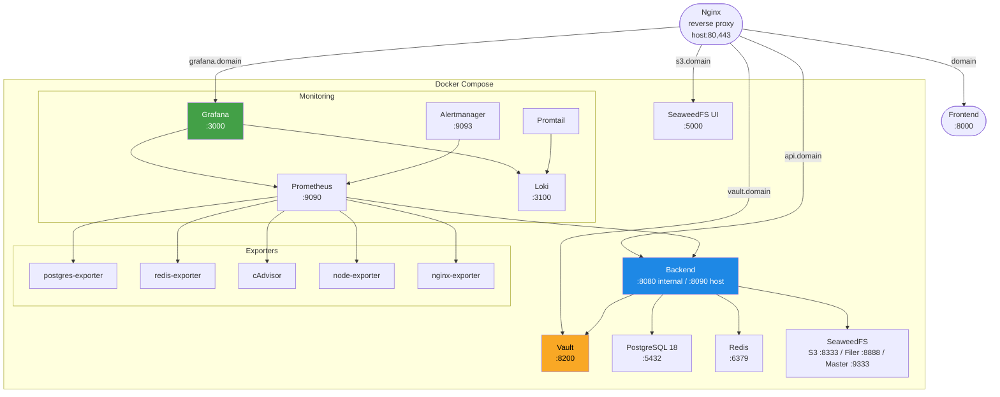
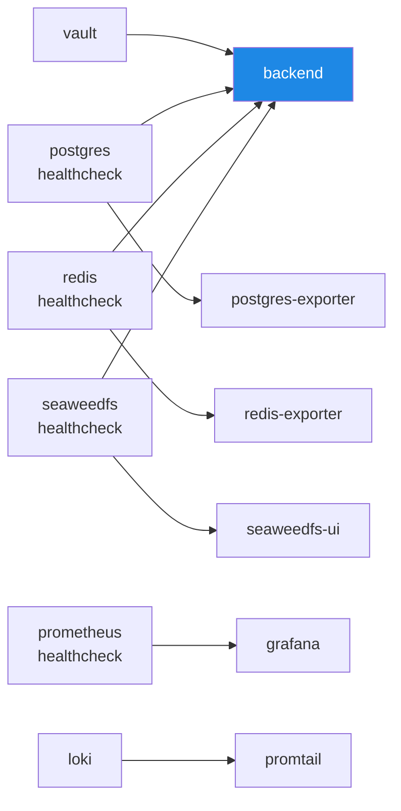
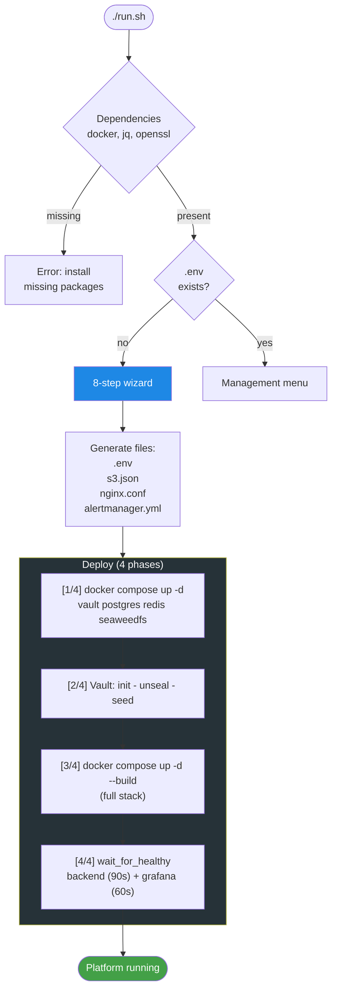
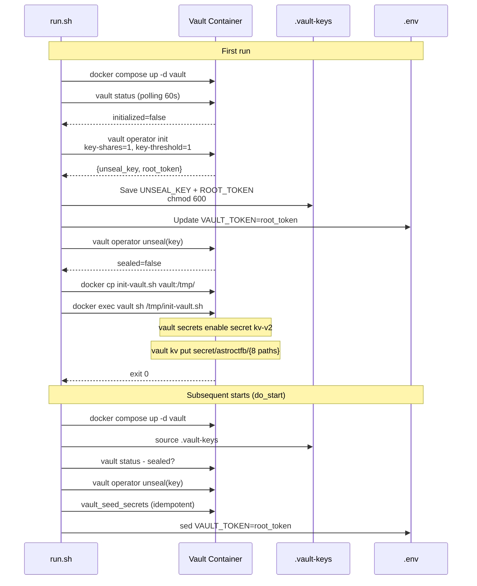
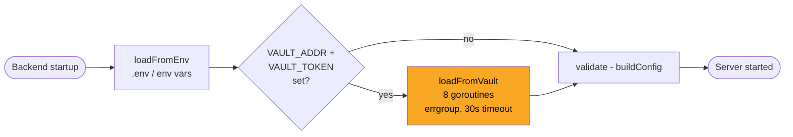
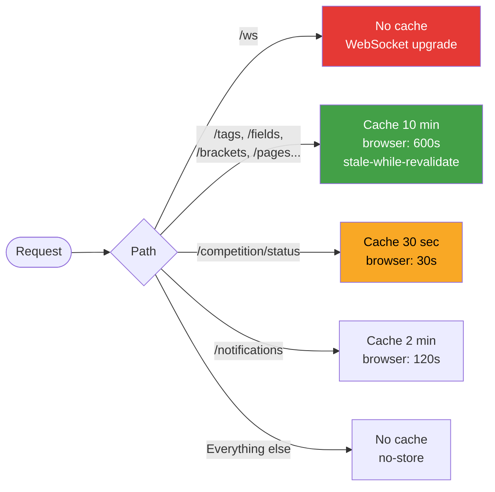
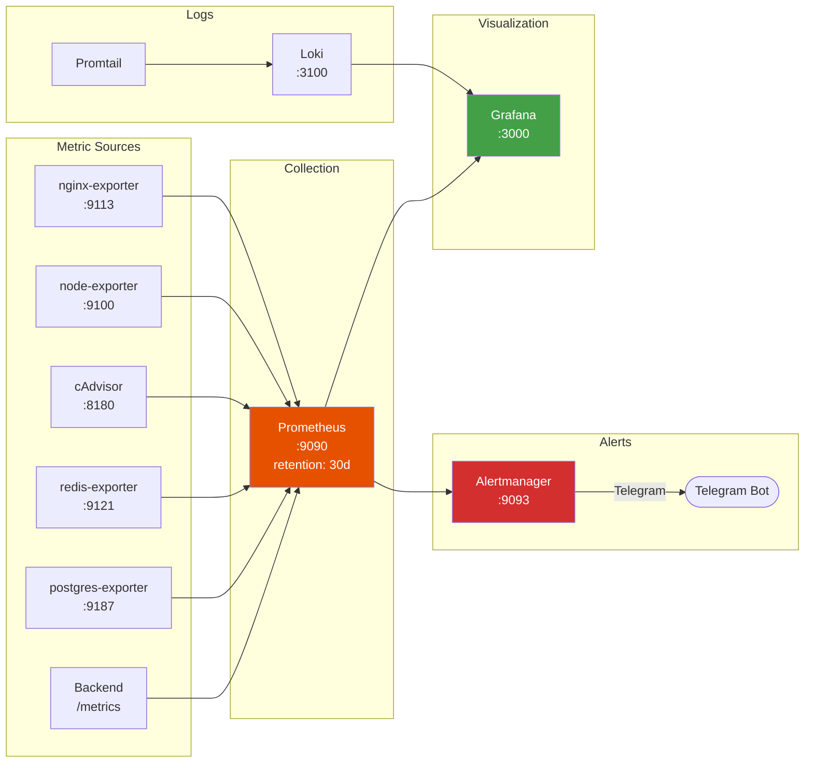

# Deployment

This document describes the full deployment lifecycle of the AstroCTFb platform: from initial setup to daily operations. All steps are normative unless marked as optional.

---

## Table of Contents

- [Requirements](#1-requirements)
- [Deployment Architecture](#2-deployment-architecture)
- [First Run (CLI Wizard)](#3-first-run-cli-wizard)
- [Vault Lifecycle](#4-vault-lifecycle)
- [Service Management](#5-service-management)
- [Configuration Files](#6-configuration-files)
- [Nginx (Reverse Proxy)](#7-nginx-reverse-proxy)
- [SSL/TLS Certificates](#8-ssltls-certificates)
- [Monitoring](#9-monitoring)
- [Maintenance](#10-maintenance)
- [Troubleshooting](#11-troubleshooting)

---

## 1. Requirements

| Component      | Version | Purpose                                                 |
| -------------- | ------- | ------------------------------------------------------- |
| Docker Engine  | 20.10+  | Container runtime                                       |
| Docker Compose | 2.0+    | Stack orchestration                                     |
| jq             | any     | JSON parsing (Vault init)                               |
| openssl        | any     | Cryptographic secret generation                         |
| Nginx          | 1.18+   | Reverse proxy (installed on host, outside Docker)       |
| Certbot        | any     | SSL certificates (optional if providing certs manually) |

### Domain & DNS

A domain pointed to your server is required. The following DNS records (A or CNAME) must resolve to the server IP:

| Record                | Purpose                   | Nginx route target    |
| --------------------- | ------------------------- | --------------------- |
| `example.com`         | Frontend (competition UI) | Frontend static / SPA |
| `api.example.com`     | Backend REST API          | `backend:8090`        |
| `grafana.example.com` | Grafana dashboards        | `grafana:3000`        |
| `vault.example.com`   | Vault UI (IP-restricted)  | `vault:8200`          |
| `s3.example.com`      | SeaweedFS management UI   | `seaweedfs-ui:5000`   |

All five records must point to the same server IP. During the wizard (step 2/8), you provide the base domain - all subdomains and URLs are derived automatically:

```
DOMAIN=ctfleague.ru
  -> API_BASE_URL=https://api.ctfleague.ru
  -> FRONTEND_URL=https://ctfleague.ru
  -> GF_SERVER_ROOT_URL=https://grafana.ctfleague.ru
  -> STORAGE_S3_PUBLIC_ENDPOINT=https://s3.ctfleague.ru
```

---

## 2. Deployment Architecture

### Service Stack



### Startup Order (Docker Compose Dependencies)



### Resource Limits

| Service    | RAM       | CPU       |
| ---------- | --------- | --------- |
| PostgreSQL | 2 GB      | 2.0       |
| Redis      | 512 MB    | 1.0       |
| Backend    | 512 MB    | 2.0       |
| Others     | unlimited | unlimited |

---

## 3. First Run (CLI Wizard)

### Quick Start

```bash
git clone <repo-url> && cd AstroCTFb
./run.sh
```

When `.env` does not exist, the interactive wizard starts automatically.

### Full First-Run Flow



### Wizard Steps

| Step                        | Prompts                                                       | Auto-derived                                         |
| --------------------------- | ------------------------------------------------------------- | ---------------------------------------------------- |
| **[1/8]** Platform Identity | CTF name, version                                             | `JWT_ISSUER` = lowercase name                        |
| **[2/8]** Domain & URLs     | Domain, server IP                                             | 9 URLs (API, frontend, S3, Grafana, OAuth callbacks) |
| **[3/8]** Database          | User, password, DB name                                       | ---                                                  |
| **[4/8]** Redis             | Password                                                      | ---                                                  |
| **[5/8]** Admin Account     | Username, email, password                                     | ---                                                  |
| **[6/8]** Object Storage    | S3 access key, secret key                                     | ---                                                  |
| **[7/8]** Monitoring        | Grafana password, Telegram (opt.)                             | ---                                                  |
| **[8/8]** Integrations      | Email/Resend (opt.), GitHub OAuth (opt.), Google OAuth (opt.) | ---                                                  |

After all steps, cryptographic secrets are generated automatically:

| Secret                | Format       | Length                      |
| --------------------- | ------------ | --------------------------- |
| `FLAG_ENCRYPTION_KEY` | hex          | 64 chars (32 bytes AES-256) |
| `JWT_ACCESS_SECRET`   | alphanumeric | 64 chars                    |
| `JWT_REFRESH_SECRET`  | alphanumeric | 64 chars                    |
| `OAUTH_STATE_SECRET`  | alphanumeric | 64 chars                    |

---

## 4. Vault Lifecycle

Vault stores **all platform secrets**. The backend reads them at startup rather than from environment variables directly.

### Init, Unseal, and Seed



### 8 Secret Paths in Vault

All secrets are stored under `secret/astroctfb/` (KV v2):

| Path       | Keys                                                                                                   | Source (.env)                                            |
| ---------- | ------------------------------------------------------------------------------------------------------ | -------------------------------------------------------- |
| `database` | `user`, `password`, `dbname`                                                                           | `POSTGRES_USER`, `POSTGRES_PASSWORD`, `POSTGRES_DB`      |
| `redis`    | `password`                                                                                             | `REDIS_PASSWORD`                                         |
| `jwt`      | `access_secret`, `refresh_secret`                                                                      | `JWT_ACCESS_SECRET`, `JWT_REFRESH_SECRET`                |
| `app`      | `flag_encryption_key`                                                                                  | `FLAG_ENCRYPTION_KEY`                                    |
| `resend`   | `api_key`                                                                                              | `RESEND_API_KEY`                                         |
| `storage`  | `access_key`, `secret_key`                                                                             | `SEAWEED_S3_ACCESS_KEY`, `SEAWEED_S3_SECRET_KEY`         |
| `admin`    | `username`, `email`, `password`                                                                        | `ADMIN_USERNAME`, `ADMIN_EMAIL`, `ADMIN_PASSWORD`        |
| `oauth`    | `state_secret`, `github_client_id`, `github_client_secret`, `google_client_id`, `google_client_secret` | `OAUTH_STATE_SECRET`, `OAUTH_GITHUB_*`, `OAUTH_GOOGLE_*` |

### How the Backend Reads Secrets



The backend launches 8 parallel goroutines to fetch secrets from Vault. If Vault is unavailable or a path is missing, env values are used as fallback (graceful degradation).

### Important Notes

- `.vault-keys` contains the unseal key and root token. **Never commit it** (listed in `.gitignore`).
- `vault_seed_secrets` is called on every `start` - it is idempotent (`kv put` overwrites existing values).
- If `.env` is changed (e.g. database password), the next `./run.sh start` will propagate the new values to Vault.

---

## 5. Service Management

### CLI Interface

```bash
./run.sh              # Wizard (first run) or management menu
./run.sh start        # Start services + auto-unseal Vault
./run.sh stop         # Stop all services
./run.sh restart      # Restart (stop + start)
./run.sh status       # Container status
./run.sh logs         # Backend logs (follow)
```

### Interactive Menu (when .env exists)

```
[1] Start / Restart services
[2] Stop services
[3] Show status
[4] Show logs (backend)
[5] Reconfigure (run wizard again)
[6] Exit
```

### Command Flows


---

## 6. Configuration Files

### Generated by run.sh at Deploy Time

| File                                       | Template                   | Generation Method                                                |
| ------------------------------------------ | -------------------------- | ---------------------------------------------------------------- |
| `.env`                                     | Hardcoded heredoc          | Wizard values + auto-generated secrets                           |
| `deployment/seaweedfs/s3.json`             | Hardcoded heredoc          | S3 access/secret key from wizard                                 |
| `deployment/nginx/nginx.conf`              | `nginx.conf.example`       | `sed` substitution of `REPLACE_DOMAIN`, `REPLACE_VAULT_ADMIN_IP` |
| `monitoring/alertmanager/alertmanager.yml` | `alertmanager.yml.example` | `sed` substitution of Telegram tokens, or null-receiver          |

### Template Files (in repository, do not edit at deploy time)

| File                                               | Placeholders                                             |
| -------------------------------------------------- | -------------------------------------------------------- |
| `deployment/nginx/nginx.conf.example`              | `REPLACE_DOMAIN`, `REPLACE_VAULT_ADMIN_IP`               |
| `deployment/seaweedfs/s3.json.example`             | `REPLACE_S3_ACCESS_KEY`, `REPLACE_S3_SECRET_KEY`         |
| `monitoring/alertmanager/alertmanager.yml.example` | `REPLACE_TELEGRAM_BOT_TOKEN`, `REPLACE_TELEGRAM_CHAT_ID` |

### Env Files

| File                 | Purpose                                           | Tracked in Git |
| -------------------- | ------------------------------------------------- | -------------- |
| `.env.example`       | Production template (manual setup without run.sh) | yes            |
| `.env.local.example` | Local development template                        | yes            |
| `.env`               | Production config (generated by run.sh)           | no             |
| `.env.local`         | Local developer config                            | no             |
| `.vault-keys`        | Unseal key + root token                           | no             |

### Manual Setup (without run.sh)

If the wizard is not suitable:

```bash
cp .env.example .env
# Edit all values in .env
# Generate secrets manually:
#   FLAG_ENCRYPTION_KEY: openssl rand -hex 32
#   JWT_ACCESS_SECRET:   openssl rand -base64 48 | tr -dc 'a-zA-Z0-9' | head -c 64
#   JWT_REFRESH_SECRET:  openssl rand -base64 48 | tr -dc 'a-zA-Z0-9' | head -c 64
#   OAUTH_STATE_SECRET:  openssl rand -base64 48 | tr -dc 'a-zA-Z0-9' | head -c 64
```

Then start the stack manually:

```bash
docker compose --env-file .env -f deployment/docker/docker-compose.yml up -d vault postgres redis seaweedfs
# Initialize Vault manually (see section 4)
docker compose --env-file .env -f deployment/docker/docker-compose.yml up -d --build
```

Full environment variable reference: [ENVIRONMENT.md](ENVIRONMENT.md).

---

## 7. Nginx (Reverse Proxy)

Nginx runs **on the host** (outside Docker), proxying requests to containers via `127.0.0.1`.

### Virtual Hosts

| Host             | Upstream                                                 | Port | Features                             |
| ---------------- | -------------------------------------------------------- | ---- | ------------------------------------ |
| `vault.DOMAIN`   | `127.0.0.1:8200`                                         | 443  | IP whitelist (`VAULT_ADMIN_IP`), TLS |
| `api.DOMAIN`     | `127.0.0.1:8090`                                         | 443  | WebSocket, caching, security headers |
| `grafana.DOMAIN` | `127.0.0.1:3000`                                         | 443  | WebSocket (live dashboards)          |
| `s3.DOMAIN`      | `127.0.0.1:5000` (UI), `:8888` (Filer), `:9333` (Master) | 443  | Multi-path proxy                     |
| `DOMAIN`         | `127.0.0.1:8000`                                         | 443  | Frontend SPA                         |
| `localhost`      | ---                                                      | 8080 | `stub_status` for nginx-exporter     |

### API Caching Strategy (nginx proxy cache)



### Security Headers (API Backend)

```
X-Frame-Options: DENY
X-Content-Type-Options: nosniff
Strict-Transport-Security: max-age=63072000; includeSubDomains
Referrer-Policy: strict-origin-when-cross-origin
```

### Applying nginx.conf

`run.sh` automatically generates `deployment/nginx/nginx.conf` from the template. To apply:

```bash
sudo cp deployment/nginx/nginx.conf /etc/nginx/sites-available/astroctfb
sudo ln -sf /etc/nginx/sites-available/astroctfb /etc/nginx/sites-enabled/
sudo nginx -t && sudo systemctl reload nginx
```

---

## 8. SSL/TLS Certificates

The nginx config expects a wildcard certificate in `/etc/letsencrypt/live/DOMAIN/`.

### Option 1: Wildcard via DNS Challenge

```bash
sudo certbot certonly --manual --preferred-challenges=dns \
  -d "*.example.com" -d "example.com"
```

Covers: `api.example.com`, `grafana.example.com`, `vault.example.com`, `s3.example.com`, `example.com`.

### Option 2: Individual Certificates

```bash
sudo certbot certonly --standalone \
  -d example.com \
  -d api.example.com \
  -d grafana.example.com \
  -d vault.example.com \
  -d s3.example.com
```

### Auto-renewal

```bash
sudo certbot renew --dry-run
# Add to cron:
# 0 3 * * * certbot renew --quiet && systemctl reload nginx
```

---

## 9. Monitoring

### Stack



### Grafana Dashboards

Auto-provisioned from `monitoring/grafana/`:

| Folder      | Dashboards                         |
| ----------- | ---------------------------------- |
| `system`    | Node exporter, cAdvisor            |
| `backend`   | HTTP requests, latency, Go runtime |
| `postgres`  | Connections, queries, locks        |
| `redis`     | Memory, keys, commands             |
| `vault`     | Tokens, secrets, audit             |
| `seaweedfs` | Volumes, S3 operations             |

### Alertmanager

- **Telegram enabled**: alerts sent to chat (bot token + chat ID from wizard)
- **Telegram disabled**: null-receiver (alerts collected in Prometheus but not dispatched)

Configuration: `monitoring/alertmanager/alertmanager.yml` (generated by run.sh).
Alert rules: `monitoring/prometheus/alerts.yml`.

See also: [MONITORING.md](MONITORING.md).

---

## 10. Maintenance

### Update Images

```bash
docker compose --env-file .env -f deployment/docker/docker-compose.yml pull
./run.sh restart
```

### Database Backup

```bash
docker exec postgres pg_dump -U admin -d board > backup_$(date +%Y%m%d).sql
```

### Database Restore

```bash
docker exec -i postgres psql -U admin -d board < backup.sql
```

### Inspect Vault Secrets

```bash
docker exec vault vault kv list secret/astroctfb/
docker exec vault vault kv get secret/astroctfb/database
```

### Secret Rotation

1. Update the value in `.env`
2. Run `./run.sh start` - Vault is automatically reseeded
3. Backend picks up the new values from Vault on restart

### Automated Cleanup (cron)

`run.sh` automatically installs a cron job at `/etc/cron.d/astroctfb-cleanup` during deploy and start. Source file: `deployment/cron-jobs/cleanup-cron`.

| Schedule       | Task                              | Log file                          |
|----------------|-----------------------------------|-----------------------------------|
| Daily at 02:00 | `astroctfb-cleanup` binary        | `/var/log/astroctfb-cleanup.log`  |
| Daily at 03:00 | `docker system prune -f --volumes`| `/var/log/docker-prune.log`       |

The cleanup binary removes:
- Soft-deleted teams older than 30 days (hard delete)
- Orphaned files in S3 storage (`tasks/` prefix with no DB record)
- Orphaned avatar files (`users/`, `teams/` prefixes with no DB record)
- Tracking data older than 90 days (`tracking`, `challenge_opens` tables)

Manual run:

```bash
docker exec backend /usr/local/bin/astroctfb-cleanup
```

---

## 11. Troubleshooting

### Vault Does Not Initialize

```bash
docker logs vault --tail 30
# Check: vault.hcl syntax, port 8200 available
```

### Vault Cannot Be Unsealed (Keys Lost)

If `.vault-keys` is lost, **Vault data is unrecoverable**. Recreate from scratch:

```bash
docker volume rm astroctfb_vault_data
./run.sh start   # Vault will re-initialize with new keys
```

### Backend Does Not Start

```bash
docker logs backend --tail 30
```

Common causes:

- Vault sealed or unreachable: check `docker exec vault vault status`
- PostgreSQL not ready: check `docker logs postgres`
- Secrets not seeded: run `./run.sh start` (triggers `vault_seed_secrets`)

### SeaweedFS 403 on S3 Operations

Credentials in `s3.json` do not match credentials in Vault (`secret/astroctfb/storage`):

```bash
# Check s3.json:
cat deployment/seaweedfs/s3.json

# Check Vault:
docker exec vault vault kv get secret/astroctfb/storage

# They must match. If not: ./run.sh start reseeds Vault.
# For s3.json: option [5] Reconfigure regenerates the file.
```

### Nginx: Certificate Not Found

```
nginx: [emerg] cannot load certificate "/etc/letsencrypt/live/DOMAIN/fullchain.pem"
```

Certificate has not been obtained yet. See [section 8](#8-ssltls-certificates).

### Grafana Not Becoming Healthy

```bash
docker logs grafana --tail 20
# Check: Prometheus healthy (dependency), port 3000 available
```

### Typical Startup Timeline

```
T+0s    ./run.sh start
T+2s    vault container up
T+8s    vault responds to status checks
T+10s   unseal + seed secrets
T+15s   compose up -d --build (full stack)
T+35s   postgres, redis, seaweedfs healthy
T+50s   backend healthy (connected to Vault, DB, Redis)
T+70s   grafana healthy
T+80s   all exporters running
```
