# AstroCTFb - Application Workflow

Полный флоу взаимодействий пользователей с платформой: от регистрации до решения задач и просмотра скорборда.

---

## Общая карта маршрутов

```mermaid
graph TD
    Client([Client])

    subgraph PUBLIC["Public (no auth)"]
        REG[POST /auth/register]
        LOGIN[POST /auth/login]
        VERIFY[POST /auth/verify-email]
        STATUS[GET /competition/status]
    end

    subgraph AUTH_ONLY["Auth only (no team/ban check)"]
        RESEND[POST /auth/resend-verification]
    end

    subgraph BASIC_AUTH["Auth + verified"]
        ME_GET[GET /auth/me]
        ME_UPD[PATCH /auth/me]
        USERS[GET /users]
        TEAMS_LIST[GET /teams]
        TEAM_CREATE[POST /teams]
        TEAM_JOIN[POST /teams/join]
        TEAM_LEAVE[POST /teams/leave]
        TEAM_SOLO[POST /teams/solo]
        CAPTAIN[POST /teams/me/captain]
        DISBAND[DELETE /teams/me]
    end

    subgraph PROTECTED["Auth + verified + team + not banned"]
        CHALLENGES[GET /challenges]
        CHALLENGE_GET[GET /challenges/:id]
        SUBMIT[POST /challenges/:id/submit]
        HINT[POST /challenges/:id/hints/:hintId/unlock]
        SCOREBOARD[GET /scoreboard]
        SB_GRAPH[GET /scoreboard/graph]
        STATS[GET /statistics/*]
        FB[GET /challenges/:id/first-blood]
        NOTIF[GET /notifications]
        WS[WS /ws]
    end

    subgraph ADMIN["Admin only"]
        ADMIN_COMP[/admin/competition]
        ADMIN_CHALL[/admin/challenges]
        ADMIN_USERS[/admin/users]
        ADMIN_TEAMS[/admin/teams]
        ADMIN_BACKUP[/admin/backup]
    end

    Client --> PUBLIC
    Client --> AUTH_ONLY
    Client --> BASIC_AUTH
    Client --> PROTECTED
    Client --> ADMIN
```

---

## Middleware Stack (порядок применения)

```mermaid
graph LR
    REQ([Request]) --> AUTH

    AUTH["Auth()\nJWT / API Token"] --> INJECT
    INJECT["InjectUser()\nload *domain.User"] --> BAN
    BAN["RequireNotBanned()\nuser.IsBanned"] --> VER
    VER["RequireVerified()\nuser.IsEmailVerified"] --> TEAM
    TEAM["RequireTeam()\nuser.TeamID != nil"] --> TBAN
    TBAN["RequireTeamNotBanned()"] --> VIS
    VIS["ChallengeVisibility()\ncomp state"] --> RATE
    RATE["RateLimit()\nRedis sliding window"] --> HANDLER

    HANDLER([Handler])

    style AUTH fill:#f9a825
    style BAN fill:#e53935
    style RATE fill:#1e88e5
```

Для публичных роутов - нет middleware.
Для auth-only роутов - только `Auth` + `InjectUser`.
Для защищённых - полный стек выше.

---

## Регистрация и вход

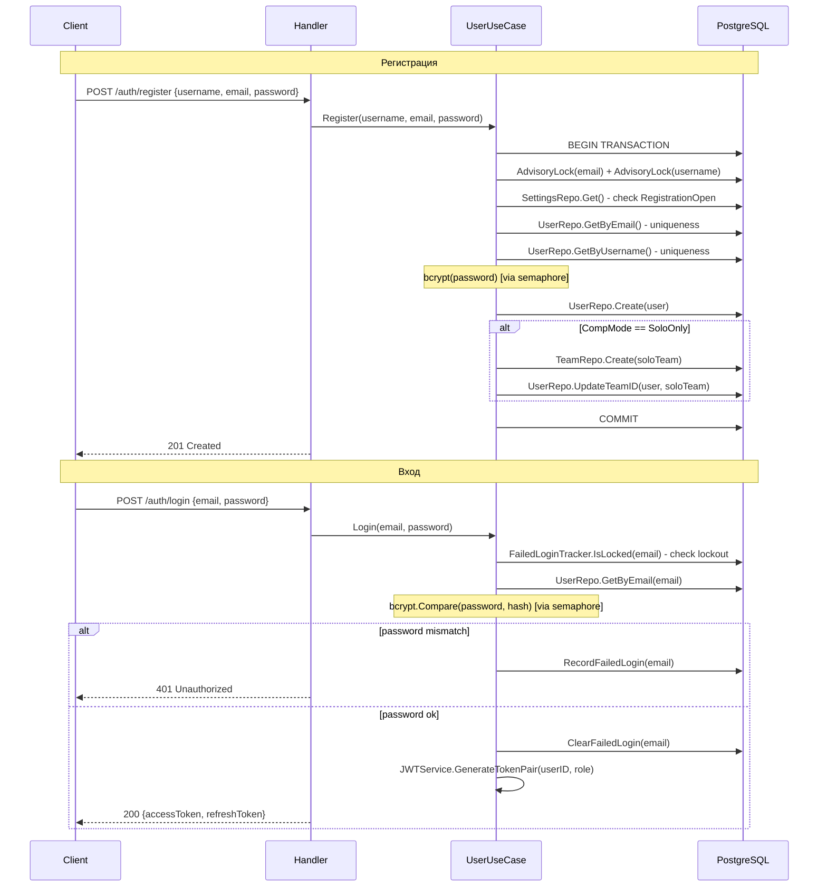

---

## OAuth вход (GitHub / Google)

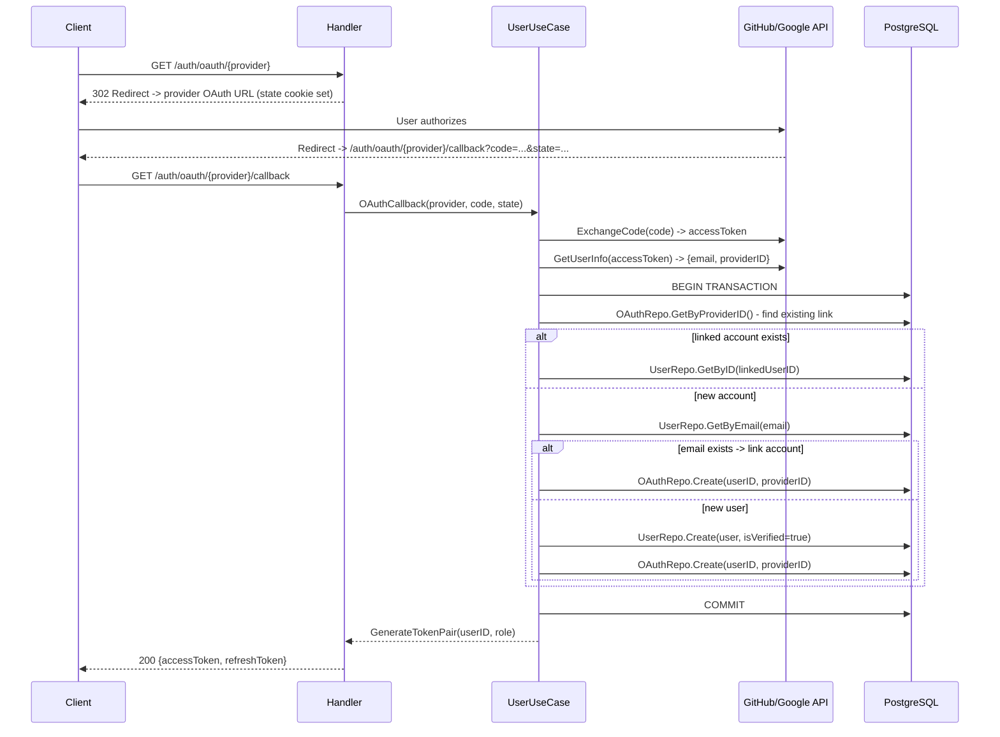

---

## Управление командой

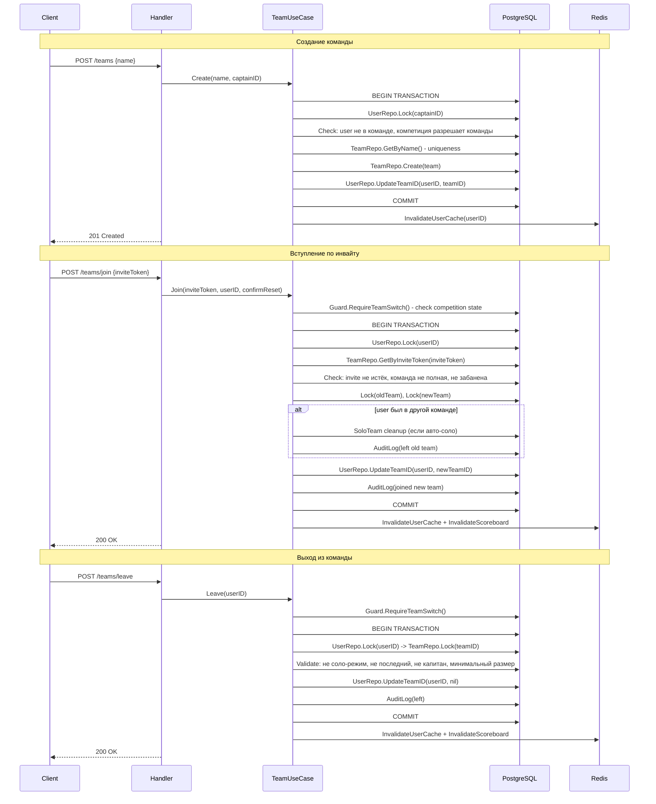

---

## Решение задачи (submit флага)

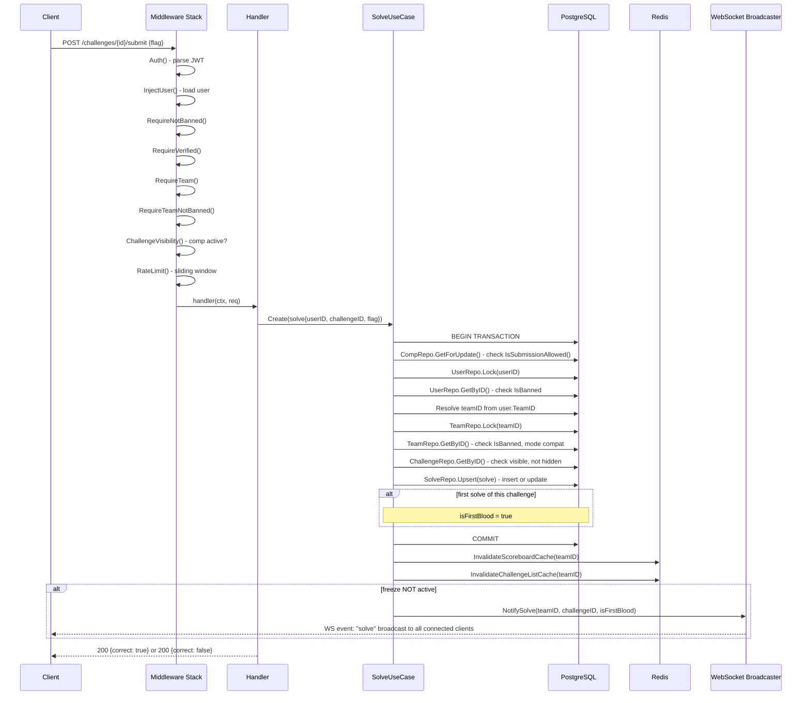

---

## Скорборд и заморозка

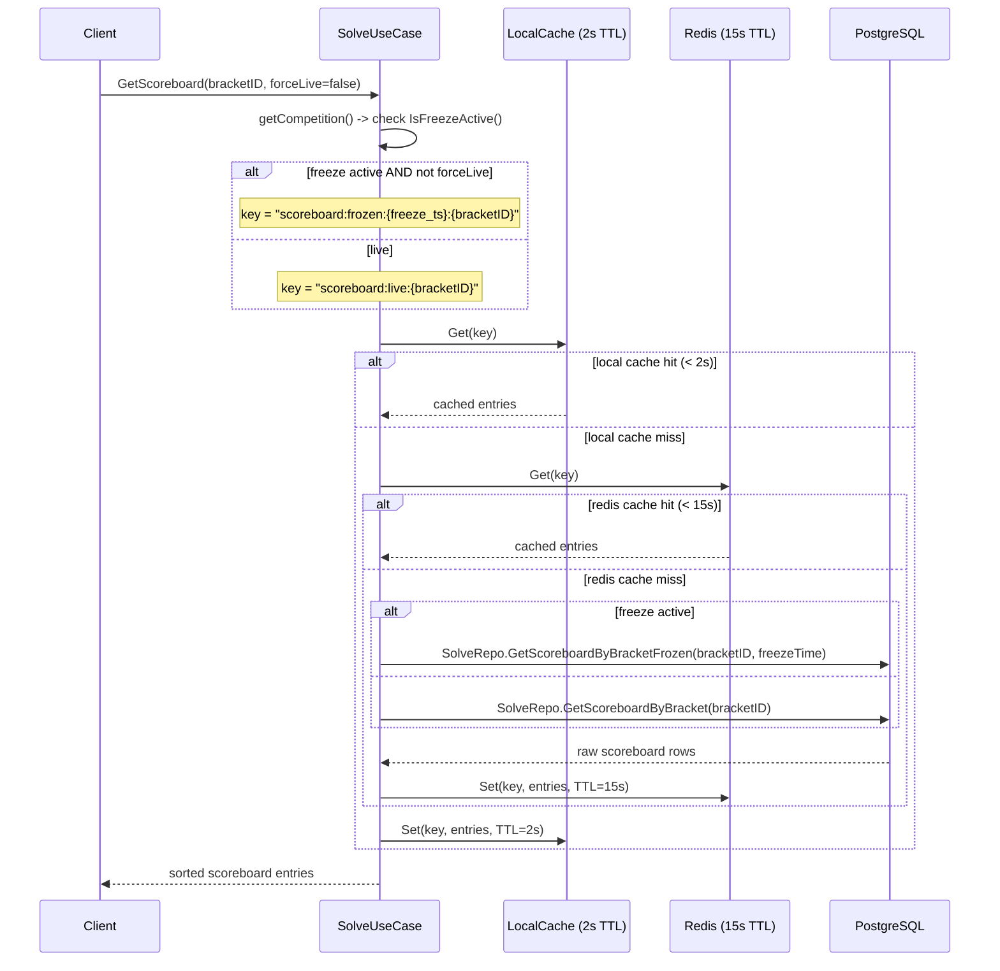

---

## Покупка подсказки

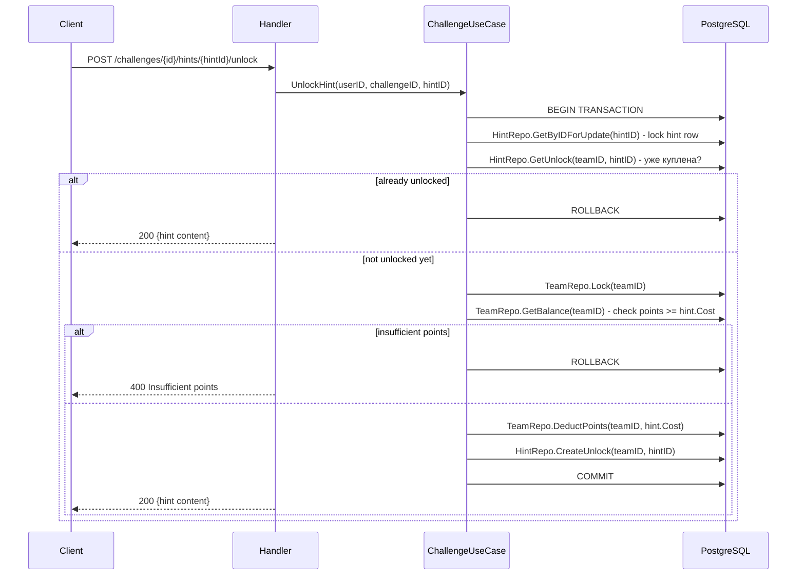

---

## WebSocket соединение

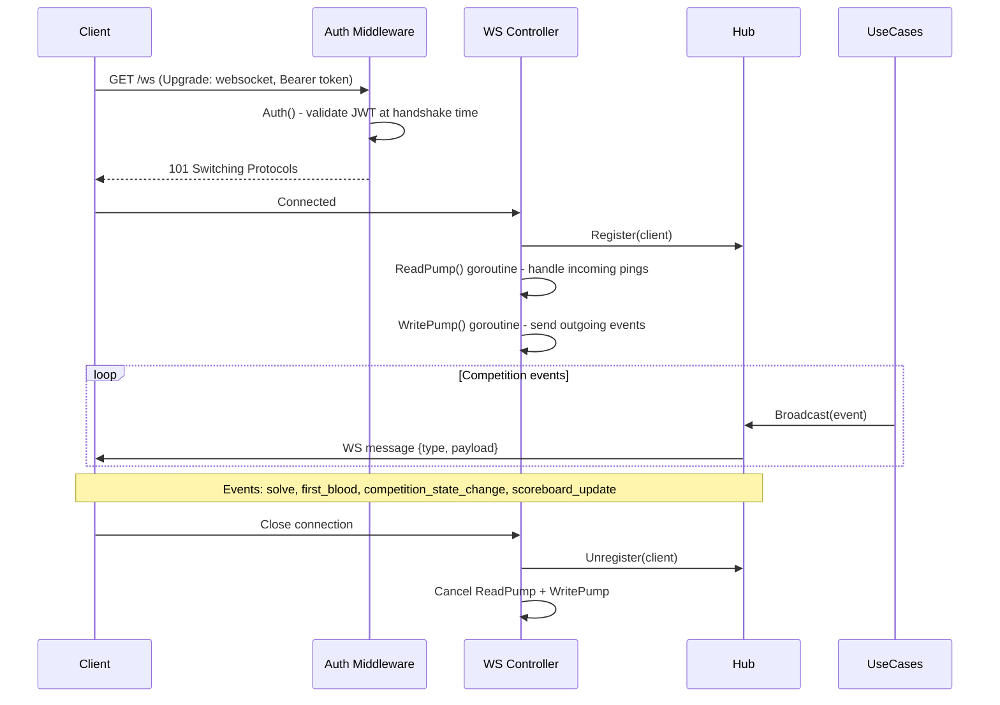

---

## Бан пользователя / команды

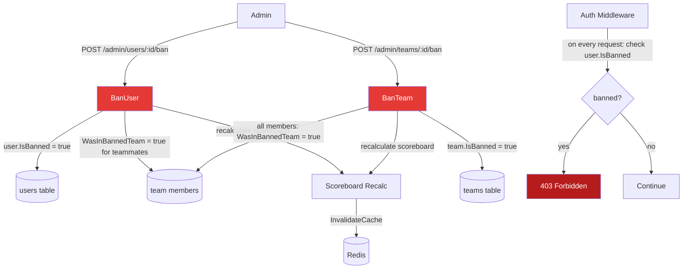

---

## Бэкап / Экспорт / Импорт

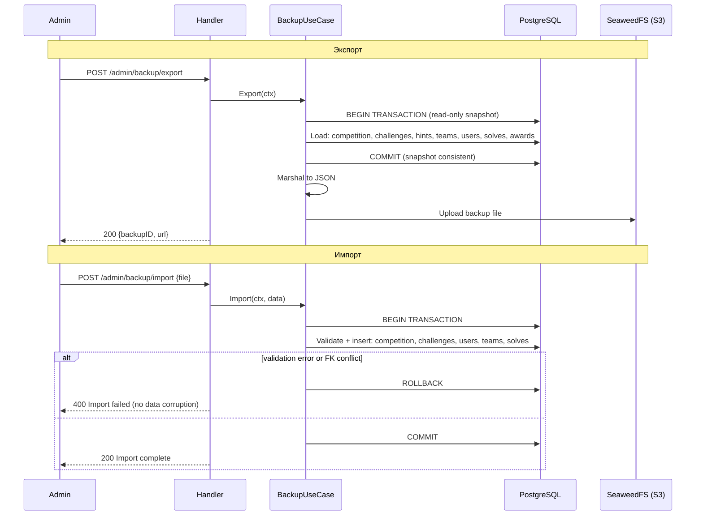

---

## Аватар пользователя

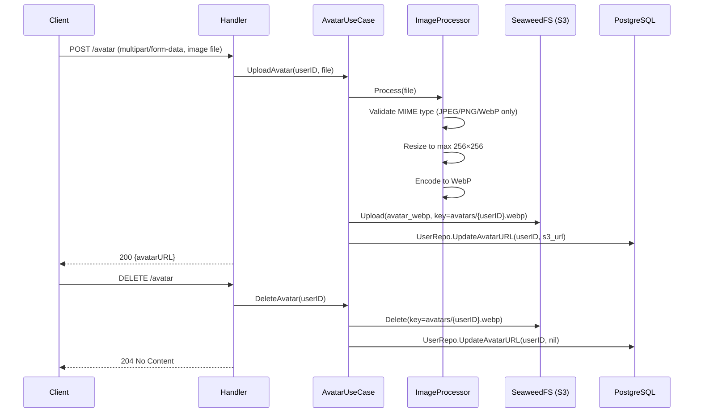

---

## Динамический скоринг

```mermaid
graph LR
    SOLVE[Новый solve] --> RECALC[RecalcScores]
    RECALC --> LOCK_COMP[Lock competition row]
    LOCK_COMP --> FETCH[Fetch all solves for challenge]
    FETCH --> FORMULA["score = max + (min-max) × (N-1)² / (D-1)²"]
    FORMULA --> UPDATE[Update solve.Points for all teams]
    UPDATE --> INVALIDATE[Invalidate scoreboard cache]
    INVALIDATE --> WS_NOTIFY[WS: scoreboard_update]

    style SOLVE fill:#43a047,color:#fff
    style RECALC fill:#1e88e5,color:#fff
    style WS_NOTIFY fill:#8e24aa,color:#fff
```

**Формула:** `score = max_score + (min_score - max_score) × ((solves-1)² / (decay-1)²)`

При каждом новом solve пересчитываются очки для **всех** предыдущих решений этой задачи.

---

## Полная карта зависимостей слоёв

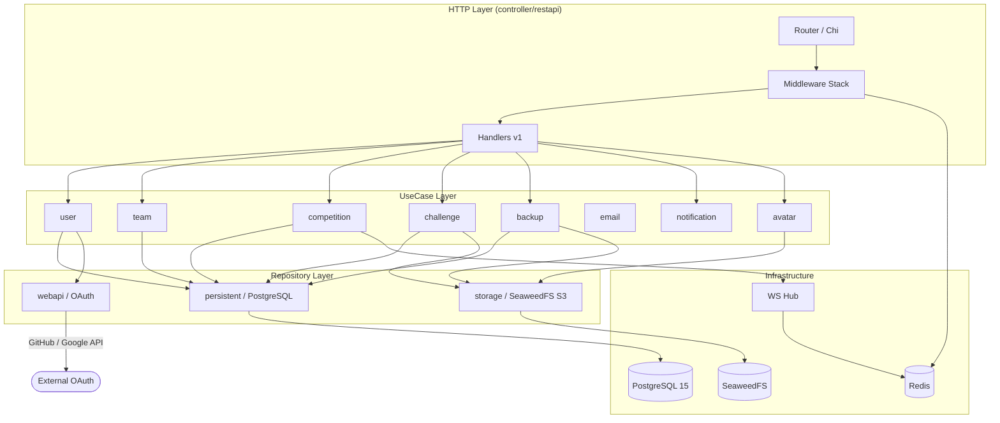
