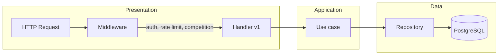

# Project structure

<!-- markdownlint-disable MD060 -->

This document specifies the layout and responsibilities of the AstroCTFb codebase. The backend is implemented in Go and follows a layered (clean) architecture with separate presentation, application, domain, and data layers.

## 1. Architecture

The codebase SHALL be organised as follows:

| Layer | Path | Role |
|-------|------|------|
| Presentation | controller/restapi, websocket | Handlers |
| Application | usecase | Use cases |
| Domain | entity | Entities |
| Data | repo | Repositories |

Shared utilities SHALL reside in `pkg/`. Dependency wiring SHALL be defined in `internal/wire/` and generated where applicable.

## 2. Directory layout

### 2.1 Backend

```text
backend/
├── cmd/
│   ├── app/                    # Application entry point (HTTP server)
│   └── cleanup/                # Cleanup job entry point (e.g. soft-deleted teams)
├── codegen/                    # Code generation configuration
│   ├── .mockery_*.yml          # Mockery configs per package
│   ├── oapi-codegen-*.yml      # OpenAPI client/server/types
│   └── sqlc.yaml               # sqlc (SQL --> Go) config
├── config/                     # Configuration loading (env, Vault)
├── internal/
│   ├── app/                    # Application bootstrap and wiring
│   ├── controller/
│   │   ├── restapi/
│   │   │   ├── middleware/     # Auth, logging, metrics, rate limit, etc.
│   │   │   └── v1/             # Handlers, request/response helpers
│   │   └── websocket/v1/       # WebSocket handler
│   ├── entity/                 # Domain layer
│   ├── openapi/                # Generated OpenAPI client, server, types
│   ├── repo/
│   │   ├── contract.go         # Repository interfaces
│   │   └── persistent/         # PostgreSQL implementations (sqlc + adapters)
│   ├── storage/                # File storage interface (S3, filesystem)
│   ├── usecase/                # Application layer (per-domain packages)
│   │   └── .../mocks/          # Generated mocks for tests
│   └── wire/                   # Dependency injection (Wire)
├── pkg/                        # Shared packages
│   ├── cache/                  # Redis-backed cache, scoreboard cache
│   ├── crypto/                 # Encryption (e.g. AES)
│   ├── httperr/                # HTTP error types and predefined errors
│   ├── httputil/               # HTTP helpers (render, decode, error)
│   ├── jwt/                    # JWT service
│   ├── logger/                 # Logging interface and implementation
│   ├── mailer/                 # Email (e.g. Resend)
│   ├── migrator/               # SQL migrations runner
│   ├── postgres/               # PostgreSQL connection and pool
│   ├── scoring/                # Scoring logic (e.g. dynamic score)
│   ├── seed/                   # Database seeding (e.g. admin user)
│   ├── validator/              # Request validation
│   ├── vault/                  # HashiCorp Vault client
│   └── websocket/              # WebSocket hub and client
├── migrations/                 # SQL migrations (versioned)
├── queries/                    # SQL queries for sqlc
├── schema/                     # Full SQL schema (reference)
├── e2e-test/                   # End-to-end tests and helpers
└── integration-test/           # Integration tests (repositories, DB)
```

### 2.2 Deployment

```text
deployment/
├── docker/                      # Docker and Compose
│   ├── docker-compose.yml
│   ├── docker-compose.local.yml
│   └── init-vault.sh
├── nginx/                       # Nginx configuration
├── vault/                       # Vault configuration
├── cron-jobs/                   # Cron job definitions (e.g. cleanup)
├── scripts/                     # Deployment scripts
└── seaweedfs/                   # S3-compatible storage config (optional)
```

### 2.3 Monitoring

```text
monitoring/
├── grafana/
│   ├── dashboards/              # JSON dashboards by component
│   │   ├── backend/
│   │   ├── postgres/
│   │   ├── redis/
│   │   ├── root/
│   │   ├── seaweedfs/
│   │   ├── ui/
│   │   └── vault/
│   └── provisioning/            # Datasources and dashboard provisioning
├── loki/                        # Loki configuration
├── prometheus/                  # Prometheus config and alerts
├── promtail/                    # Promtail configuration
└── alertmanager/                # Alertmanager configuration
```

## 3. Main components

### 3.1 Entry points

- **`cmd/app/main.go`** - Loads configuration, initialises logger and dependencies, starts the HTTP server.
- **`cmd/cleanup/main.go`** - Standalone job for cleanup operations (e.g. hard-delete of soft-deleted teams).

### 3.2 Application bootstrap

- **`internal/app/app.go`** - Wires dependencies: PostgreSQL, Redis, migrations, repositories, use cases, router, middleware, HTTP server.

### 3.3 Controllers

- **`internal/controller/restapi/v1/`** - REST handlers: user, challenge, competition, scoreboard, statistics, team, award, email, hint, file, backup, settings, notification, page, bracket, tag, field, config, submission; WebSocket upgrade.
- **`internal/controller/restapi/middleware/`** - Authentication (JWT/API token), logging, metrics, rate limiting, competition guards, require team/verified.
- **`internal/controller/websocket/v1/`** - WebSocket connection handling and real-time updates.

### 3.4 Use cases

- **`internal/usecase/`** - Business logic by domain: `user` (auth, profile, API tokens), `challenge` (challenges, hints, files, tags, comments), `competition` (competition state, solve, scoreboard, statistics, backup, bracket, dynamic config, submission), `team` (teams, awards), `email`, `settings` (app settings, fields, validator), `notification`, `page`, `cleanup`.

### 3.5 Entities and API errors

- **`internal/entity/`** - Domain types: user, challenge, team, solve, hint, competition, app_settings, verification_token, audit_log, and related.
- **`pkg/httperr`** - API error types and predefined errors used by use cases and controllers (e.g. `ErrUserNotFound`, `NewValidationErrorf`). Use cases may wrap or return these; controllers use them via `v1/helper`.

### 3.6 Repositories

- **`internal/repo/contract.go`** - Repository interfaces. Implementations in **`internal/repo/persistent/`** (PostgreSQL via sqlc and adapter layer). Repositories SHALL exist for users, teams, challenges, solves, hints, competition, brackets, awards, settings, audit log, backup, notifications, pages, tags, fields, configs, statistics, submissions, API tokens, verification tokens, and app settings.

### 3.7 Configuration

- **`config/config.go`** - Loads configuration from environment variables and from HashiCorp Vault (see [ENVIRONMENT.md](ENVIRONMENT.md)).

### 3.8 Shared packages (`pkg/`)

- **`pkg/cache`** - Redis-backed cache, scoreboard cache service.
- **`pkg/crypto`** - Encryption (e.g. AES for flag encryption).
- **`pkg/httperr`** - HTTP error types (`*HTTPError`), predefined errors (e.g. `ErrUserNotFound`), and `NewValidationErrorf`.
- **`pkg/httputil`** - HTTP rendering, decoding, error handling.
- **`pkg/jwt`** - JWT creation and validation.
- **`pkg/logger`** - Logging interface and implementation.
- **`pkg/mailer`** - Transactional email (e.g. Resend).
- **`pkg/migrator`** - Execution of SQL migrations.
- **`pkg/postgres`** - PostgreSQL connection and pool.
- **`pkg/scoring`** - Scoring logic (e.g. dynamic score calculation).
- **`pkg/seed`** - Database seeding (e.g. default admin).
- **`pkg/validator`** - Request validation.
- **`pkg/vault`** - HashiCorp Vault client for secrets.
- **`pkg/websocket`** - WebSocket hub and client handling.

### 3.9 Controller layer and pkg usage

- **REST handlers** (`internal/controller/restapi/v1/`) SHALL use `internal/controller/restapi/v1/helper` only. Handlers MUST NOT import `pkg/httputil` or `pkg/httperr` directly; `v1/helper` re-exports the error sentinels and constructors (e.g. `helper.ErrUserNotFound`, `helper.NewValidationErrorf`) needed for `helper.HandleError`.
- **WebSocket controller** and **middleware** MAY use `pkg/httputil` and `pkg/httperr` directly.
- **`v1/response`** MAY import `pkg` (e.g. `pkg/jwt`) for mapping types to openapi; handlers SHALL NOT import `pkg` directly.
- **Error wrapping in usecases** SHALL use `fmt.Errorf("UseCaseName - Method - step: %w", err)`.

### 3.10 Request flow

A typical HTTP request passes through middleware, then a v1 handler, which calls a use case; the use case uses repositories and other shared services. The following diagram summarises the flow:



Middleware includes authentication (JWT/API token), logging, metrics, rate limiting, and guards (competition, require team, require verified). Handlers map requests to use-case calls and use `v1/helper` for rendering and errors.

## 4. Testing

### 4.1 End-to-end tests

- **Directory:** `backend/e2e-test/`
- **Purpose:** Exercise the system via the HTTP API (and WebSocket) against a running or in-process backend. Test helpers SHALL reside in `backend/e2e-test/helper/` and SHALL be used for setup, API calls, and assertions. Each test file SHALL target a specific area (auth, challenges, teams, scoreboard, etc.).

### 4.2 Integration tests

- **Directory:** `backend/integration-test/`
- **Purpose:** Run against a real database (e.g. Testcontainers). Repository behaviour, transactions, and race conditions (where applicable) SHALL be verified. One test file per repository or cross-repo scenario is RECOMMENDED.

### 4.3 Unit tests

- **Locations:** Unit tests SHALL accompany production code in the same package. The following SHALL have unit tests:
  - **`config/`** - Configuration and helpers.
  - **`internal/entity/`** - Domain logic (e.g. competition status, modes).
  - **`internal/usecase/*/`** - Use cases with mocked repositories (and helpers in `*_helper_test.go`).
  - **`internal/repo/persistent/`** - Pure helper functions where applicable.
  - **`pkg/*`** - Cache, crypto, httperr, httputil, jwt, logger, mailer, scoring, validator, vault, websocket.

Test file names SHALL follow the pattern `*_test.go`. Mocks SHALL be generated (e.g. via mockery) and SHALL NOT be edited by hand except when regenerated.
