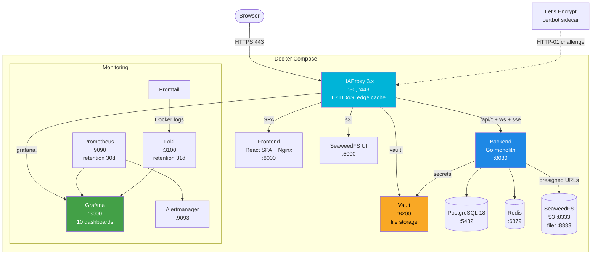
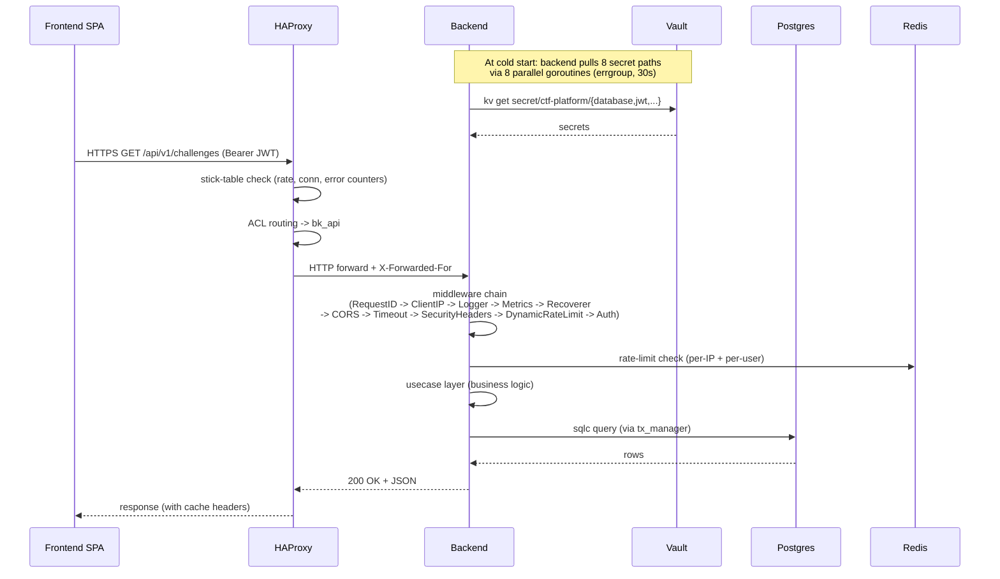
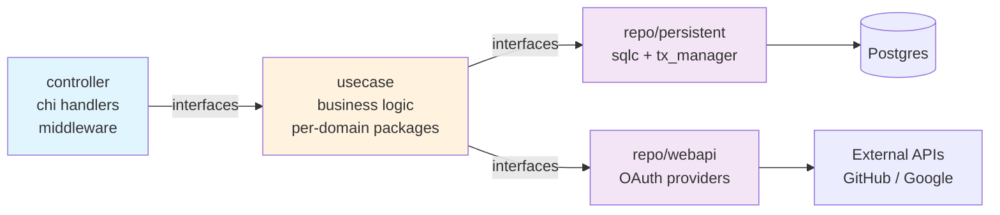
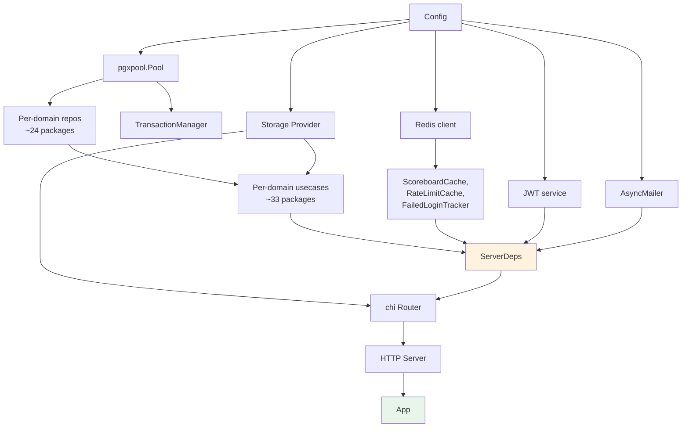
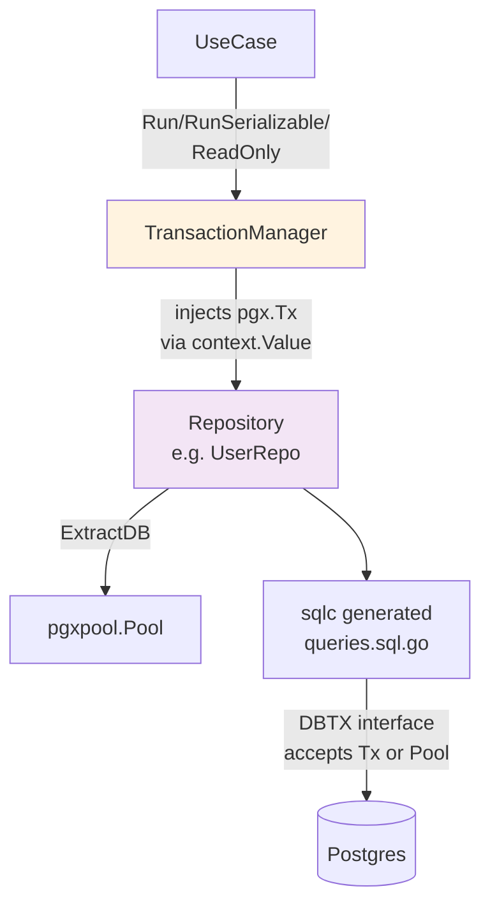
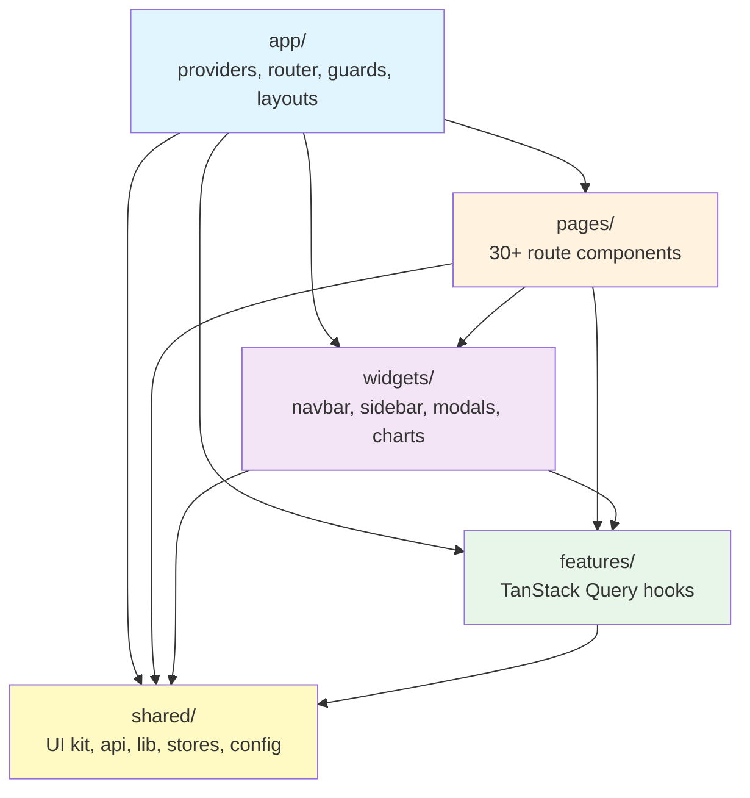
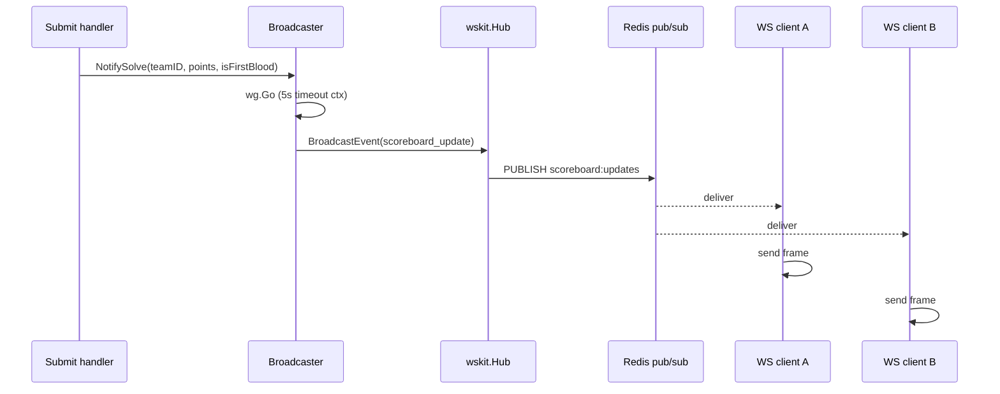

# Architecture

> Read this in: **English** · [Русский](../ru/ARCHITECTURE.md)

AstroCTFb is a self-hosted CTF platform composed of a Go monolith backend, a React 19 SPA frontend, and a curated infrastructure stack (HAProxy, Vault, Postgres, Redis, SeaweedFS, Prometheus/Grafana/Loki). This document describes how the pieces fit together: layers, dependencies, conventions, and the request lifecycle.

---

## Table of Contents

- [System overview](#system-overview)
- [Request lifecycle](#request-lifecycle)
- [Backend (Go 1.26)](#backend-go-126)
  - [Clean Architecture layers](#clean-architecture-layers)
  - [`internal/` packages](#internal-packages)
  - [`pkg/` shared utilities](#pkg-shared-utilities)
  - [Dependency injection (google/wire)](#dependency-injection-googlewire)
  - [Configuration](#configuration)
  - [Persistence layer](#persistence-layer)
  - [Conventions](#conventions)
- [Frontend (React 19 + Vite + FSD)](#frontend-react-19--vite--fsd)
  - [FSD layers](#fsd-layers)
  - [Routing](#routing)
  - [API client](#api-client)
  - [State management](#state-management)
  - [WebSocket / SSE](#websocket--sse)
  - [Build pipeline](#build-pipeline)
- [Infrastructure](#infrastructure)
- [Cross-cutting concerns](#cross-cutting-concerns)

---

## System overview



**Trust boundaries:**

- **Public:** HAProxy (`:80`, `:443`), certbot ACME challenge endpoint.
- **IP-restricted (admin):** `grafana.${DOMAIN}` and `s3.${DOMAIN}` - gated by `ADMIN_ALLOWED_IPS` allowlist.
- **IP-restricted (operator only):** `vault.${DOMAIN}` - gated by `VAULT_ADMIN_IP`.
- **Intra-network:** all backend ↔ infrastructure traffic on the `ctf_platform_network` Docker bridge. TLS deliberately disabled inside this network.

---

## Request lifecycle

A typical authenticated API request from the SPA:



**Middleware chain order** (`internal/wire/providers_http.go:173–337`):

1. `RequestID` - generates unique X-Request-ID
2. `ClientIP` - resolves real client IP from XFF (trusts `TRUSTED_PROXY_CIDRS`)
3. `Logger` - structured request log
4. `Metrics` - Prometheus RED histogram
5. `Recoverer` - panic guard
6. `CORS` - when `CORS_ORIGINS` non-empty (allowCredentials, MaxAge 300)
7. `Timeout` - 60s, except `/ws` and `/sse`
8. `SecurityHeaders` - strict CSP for app; relaxed for `/swagger/*`
9. `DynamicRateLimit` - per-IP, dynamically configurable via Redis-cached settings
10. `Auth` - Bearer JWT validation, populates user context
11. `SetupRequired` - gates non-`/setup` routes until first-run wizard completes

---

## Backend (Go 1.26)

### Clean Architecture layers

The backend follows strict layer separation - dependencies always point inward (controller -> usecase -> repo). Layers never reach across (controllers cannot touch repos directly).



Interfaces are defined on the **consumer side** - usecases declare repo interfaces that the persistent layer implements. This decouples domain logic from sql/Vault implementations and makes mocking trivial.

### `internal/` packages

| Package                 | Files                                                                                                                                                                | Role                                                                                                                                                                                                                                                             |
| ----------------------- | -------------------------------------------------------------------------------------------------------------------------------------------------------------------- | ---------------------------------------------------------------------------------------------------------------------------------------------------------------------------------------------------------------------------------------------------------------- |
| `app/`                  | `app.go`                                                                                                                                                             | Application bootstrap. `Run(cfg, l)` initializes pgx pool -> Redis -> goose migrations -> `reconcileSettings()` -> storage -> JWT (with Redis revocation) -> wskit.Hub -> AsyncMailer -> `wire.InitializeApp` -> seed -> oklog/run group (HTTP + signal cancel). |
| `apperr/`               | `user.go`, `challenge.go`, `team.go`, `competition.go`, `misc.go`, `validation.go`, …                                                                                | ~80 sentinel errors grouped by domain. `ValidationError` type for human-readable bad-request messages.                                                                                                                                                           |
| `cache/`                | `key.go`, `redis.go`, `scoreboard.go`, `subscriber.go`                                                                                                               | Redis abstractions. Key constants (`KeyScoreboard`, `KeyUser(id)`, etc.), pub/sub on `scoreboard:updates`, freeze-aware scoreboard invalidator (`InvalidateWithFreezeAwareness`).                                                                                |
| `controller/restapi/`   | `server.go`, `router.go`, `v1/*.go`, `errmap/`, `middleware/`                                                                                                        | chi handlers, middleware (auth, ratelimit, errmap, security headers), v1 endpoints per domain (user.go, team.go, challenge.go, …).                                                                                                                               |
| `controller/websocket/` | `v1/controller.go`                                                                                                                                                   | WebSocket handler. Origin validation (`""` or `"*"` -> 403). Upgrade via `wskit.Accept`, separate read/write goroutines.                                                                                                                                         |
| `domain/`               | `competition.go`, `challenge.go`, `user.go`, `team.go`, `settings.go`, `solve.go`, `config_registry.go`                                                              | Pure domain types. No infrastructure dependencies. `OAuthOnlyPasswordSentinel = "__oauth_only__"`, `Role` enum, `IsSubmissionAllowed()`, `IsFreezeActive()`.                                                                                                     |
| `loginlockout/`         | `loginlockout.go`                                                                                                                                                    | Redis-backed failed-login tracker. `IsLocked`, `RecordFailed` (INCR + TTL), `ClearFailed`. Defaults: max 5 attempts, 1 min TTL.                                                                                                                                  |
| `openapi/`              | `openapi.yml`, `routes/*.yml`, `components/schemas/*.yml`, `*.gen.go`                                                                                                | OpenAPI 3.0 source (27 route files + 27 schema files), bundled via redocly. oapi-codegen produces `server.gen.go`, `types.gen.go`, `client.gen.go`, `spec.gen.go`.                                                                                               |
| `repo/persistent/`      | `tx_manager.go`, `helper.go`, `*_postgres.go`, `sqlc/*`                                                                                                              | PostgreSQL repos via pgx + sqlc. `tx_manager.Run` / `RunSerializable` (retry on SQLSTATE 40001), `GetOrNotFound[T]` generic, advisory locks.                                                                                                                     |
| `repo/webapi/`          | `client*.go`, `*_oauth.go`, `oauth_gateway.go`, `contract.go`                                                                                                        | HTTP adapters for OAuth providers, implement OAuth provider ports behind explicit client timeouts and retry policy.                                                                                                                                               |
| `scoring/`              | `scoring.go`, `recalc.go`                                                                                                                                            | Dynamic scoring algorithms: `CalculateDynamicScore` (logarithmic decay), `CalculateLinearDynamicScore`, `RecalculatePoints`, `FilterSolvesByFreeze`, `DefaultSolveMapper`.                                                                                       |
| `seed/`                 | `admin.go`                                                                                                                                                           | Idempotent default-admin creation at startup.                                                                                                                                                                                                                    |
| `storage/`              | `contract.go`, `s3.go`, `filesystem.go`                                                                                                                              | Storage `Provider` interface. `S3Provider` (minio-go, no Upload retry, GetPresignedURL with backoff), `FilesystemProvider` for dev.                                                                                                                              |
| `usecase/`              | `user/`, `team/`, `challenge/`, `competition/`, `settings/`, `email/`, `notification/`, `avatar/`, `backup/`, `page/`, `setup/`, `cacheutil/`, `computil/`, `guard/` | Business logic. One package per domain. Cross-cutting helpers in `cacheutil` (invalidation), `computil` (competition state resolution), `guard` (eligibility checks).                                                                                            |
| `websocket/`            | `broadcaster.go`, `event.go`                                                                                                                                         | Event types and `Broadcaster` (wraps `wskit.Hub`). Async dispatch via `wg.Go(...)` with 5s context timeout. `NotifySolve` emits `scoreboard_update` (+ optional `first_blood`).                                                                                  |
| `wire/`                 | `providers*.go`, `wire_gen.go`, `sets.go`, `wire.go`                                                                                                                 | google/wire dependency injection, grouped by repo, usecase, HTTP, OAuth, storage, cache, and runtime providers.                                                                                                                                                   |

### `pkg/` shared utilities

| Package      | Role                                                                                                                                           |
| ------------ | ---------------------------------------------------------------------------------------------------------------------------------------------- |
| `crypto/`    | AES-256-GCM (encrypted regex flags), HMAC, secure random hex, flag-input normalization                                                         |
| `mailer/`    | Resend integration (`ResendMailer`) + `AsyncMailer` (buffered channel + worker pool)                                                           |
| `validator/` | Custom `go-playground/validator` tags: `strong_password`, `custom_email`, `team_name`, `challenge_*`, `hint_content`, `hex_color`, `page_slug` |
| `vault/`     | Vault client wrapper, exponential backoff with permanent-error detection                                                                       |

### Dependency injection (google/wire)

Compile-time DI graph defined in `internal/wire/`. Generated `wire_gen.go` is regenerated with `make wire`; do not hand-edit generated DI code.



Wire provider groups are split by responsibility:

- `providers_repo.go` - repository providers and interface bindings.
- `providers_usecase_{user,team,challenge,competition,content,media}.go` - usecase constructors and domain-level bindings.
- `providers_http.go` - router, middleware chain, server, and HTTP helpers.
- `providers_oauth.go`, `providers_storage.go`, `providers_cache.go`, `providers_runtime.go` - infrastructure-specific providers.
- `sets.go` - Wire sets (`RepoSet`, `UseCaseSet`, `InfraSet`, `HTTPSet`) that assemble those providers.

### Configuration

`backend/config/config.go` - single `New()` pipeline:

1. Bootstrap logger (Info, ConsoleOutput).
2. `loadFromEnv` - godotenv from `.env` / `../.env` / `/app/.env`, then `cleanenv.ReadEnv(&rawConfig)`. Parses comma-separated lists (`CORS_ORIGINS`, `TRUSTED_PROXY_CIDRS`, `METRICS_ALLOWED_IPS`).
3. Recreate logger with level from `LOG_LEVEL`.
4. `loadFromVault` - context with 30s timeout, `errgroup.WithContext`, **8 parallel goroutines** for `secret/ctf-platform/{database,redis,jwt,resend,storage,app,admin,oauth}`. Mutex-protected writes to `raw`. Failures log warn and return nil (graceful degradation).
5. `validate(raw)` - cross-field checks: `FLAG_ENCRYPTION_KEY` exactly 64 hex, JWT secrets ≥ `jwtkit.MinSecretLength`, `OAUTH_STATE_SECRET` required if any OAuth client configured, `COMPETITION_MODE` ∈ allowed set, `MIN_TEAM_SIZE ≤ MAX_TEAM_SIZE`, etc.
6. `buildConfig(raw, l)` - assembles `*Config`. Builds Postgres DSN via `url.URL` (no string concat). `SECURE_COOKIES` forced to `true` if `API_BASE_URL` starts with `https://`.

JWT key rotation: `JWT_ACCESS_KEYS` / `JWT_REFRESH_KEYS` env vars accept JSON array `[{"kid":"0","secret":"..."}]`. If unset, primary secret is wrapped as `kid="0"`. `JWT_DOWNLOAD_SECRET` is HMAC-derived from access secret if not provided.

### Persistence layer



Key elements:

- **`tx_manager.Run`** (ReadCommitted, ReadWrite). If context already has a `pgx.Tx` (key `txKey{}`) - reuse without nesting. Otherwise open new tx with deferred panic-safe rollback (`context.WithoutCancel(ctx)` so cancellation doesn't suppress rollback).
- **`tx_manager.RunSerializable`** (Serializable). Up to 3 retries on SQLSTATE `40001`. Jitter: `cryptoRandN(10ms) + attempt * 5ms` (anti-thundering-herd via `crypto/rand`).
- **`tx_manager.ReadOnly`** (ReadCommitted, ReadOnly). Used for scoreboard, statistics queries.
- **`GetOrNotFound[T]`** (`helper.go:23`) - generic helper that maps `pgx.ErrNoRows` to a domain not-found sentinel. Used in every `Get*` repo method.
- **Advisory locks** (`pg_advisory_xact_lock`):
  - registration email + username (FNV-1a hash, deterministic order);
  - OAuth registration (same);
  - max-teams check (key `0x4354467465616D73`);
  - submission max-attempts (per teamID + challengeID).
- **sqlc** generates `models.go`, `db.go`, and `*.sql.go` from `backend/queries/*.sql`. The `DBTX` interface accepts both `pgxpool.Pool` and `pgx.Tx`, so the same generated code works in and out of transactions.

Migrations: 3 SQL files in `backend/migrations/` driven by goose. `000001_init.sql` defines the full schema (33+ tables), `000002_indexes.sql` adds btree + GIN indexes, `000003_seed.sql` seeds `competition`, `app_settings`, and 35 rows in `configs` (CTF name, theme, scoring policy, mail templates, social/legal links, advanced settings).

### Conventions

- **Error format:** `"Layer - Method - Step: %w"` (when receiver exists), `"FuncName - Step: %w"` (standalone). Wrapped via `fmt.Errorf` and inspected via `errors.Is`/`errors.As`.
- **Error mapping:** `errmap.MapAppError` (`controller/restapi/errmap/errmap.go:210`) - first `errors.As(*httperr.HTTPError)` (pass-through), then `*ValidationError` -> 400 `VALIDATION_ERROR`, then O(1) lookup in `table[err]`, then O(n) `errors.Is` scan, finally 500 `INTERNAL_ERROR`.
- **`context.Context` always first parameter**, propagated through every layer.
- **`context.WithoutCancel(ctx)`** for post-commit operations (JWT revocation after password reset, profile lookups inside singleflight bodies).
- **bcrypt under semaphore** - `runtime.NumCPU()*2` capacity (min 2). Prevents CPU starvation under registration/login spikes.
- **Goroutine leak prevention:** every `defer rows.Close()`, `defer resp.Body.Close()`. WaitGroup drainage on shutdown.
- **Singleflight** for cacheable read paths: 8 instances on `ChallengeUseCase`, `UserUseCase`, `SolveUseCase`, `CompetitionParamUseCase`. Prevents thundering herd when cache expires.
- **errgroup** for parallel I/O: 8 Vault fetches, parallel user/team/solve/award fetches in `GetMyTeam` and `GetProfile`.

### Observability

| Concern                                     | Implementation                                                                                                                |
| ------------------------------------------- | ----------------------------------------------------------------------------------------------------------------------------- |
| HTTP RED metrics (rate / errors / duration) | `kitMiddleware.Metrics(prometheus.DefaultRegisterer, ...)` per-route histogram                                                |
| Custom counters                             | `rate_limit_redis_errors_total{limiter}`, `tracking_dropped_total`                                                            |
| Structured logging                          | `go-logkit` (slog wrapper). JSON output when `STRUCTURED_LOGGER=true`, fields via `logkit.Fields{}`                           |
| `/metrics` endpoint                         | `promhttp.HandlerFor` with OpenMetrics, gated by `METRICS_ALLOWED_IPS`                                                        |

### Submission logging

Flag submission logging stays synchronous through `SubmissionUseCase` so max-attempt checks, solve creation, and scoreboard invalidation remain in one explicit request flow.

### Cleanup binary

`backend/cmd/cleanup/main.go` - separate one-shot executable (not a daemon). Invoked via cron (`/etc/cron.d/ctf-platform-cleanup`, daily 02:00). Performs:

1. Delete soft-deleted teams older than 30 days.
2. Delete orphaned S3 files (`tasks/` prefix without DB record).
3. Delete orphaned avatar files (`users/`, `teams/` prefixes).
4. Delete `tracking` and `challenge_opens` rows older than 90 days.

Uses the same `config.New()` pipeline as the main app.

---

## Frontend (React 19 + Vite + FSD)

### FSD layers



Boundary enforcement: `eslint-plugin-boundaries` (`eslint.config.js:36-49`) treats upward imports as errors. Path alias `@/` -> `src/`.

| Layer       | Notes                                                                                                                                                                                                                                                                              |
| ----------- | ---------------------------------------------------------------------------------------------------------------------------------------------------------------------------------------------------------------------------------------------------------------------------------- |
| `app/`      | `main.tsx` (entry) -> `<ErrorBoundary><Toaster/><QueryProvider><AppRouter/></QueryProvider></ErrorBoundary>`. Calls `useAuthStore.getState().hydrate()` and `subscribeWsEvents()` before rendering. Providers (`QueryProvider`), router (`router/index.tsx`), 5 guards, 5 layouts. |
| `pages/`    | 30+ route components, each `export function XxxPage()`, all lazy-loaded via `lazy()`. Groups: auth, competition, team, users, static, setup, banned, errors (4 codes), admin (18 pages).                                                                                           |
| `widgets/`  | 7 composition widgets: `navbar`, `sidebar/AdminSidebar`, `challenge-modal/ChallengeModal` (6 tabs), `competition-banner` (status bar), `scoreboard-graph` (ECharts, lazy), `admin-charts` (5 ECharts in one file, lazy), `footer`.                                                 |
| `features/` | TanStack Query hooks only - no UI, no Zustand. One file per feature: `useChallenges`, `useFlagSubmit` (state machine), `useHintUnlock`, `useMyTeam`, `useAppeal`, `useCompetitionStatus`, `useScoreboard`, `useNotifications`, `useTeams`, `useUsers`, `useCompleteSetup`, etc.    |
| `entities/` | **Not present as a separate layer.** Domain types come directly from `shared/api/schema.d.ts` (auto-generated from OpenAPI) and are re-exported from features as needed.                                                                                                           |
| `shared/`   | UI kit (22 components), api (`openapi-fetch` + middleware), libs (utils, hooks, validation), stores (3 vanilla Zustand), config (`env.ts`).                                                                                                                                        |

### Routing

`react-router v7` Data Router. All non-trivial routes wrapped in guards:

| Guard                | Condition                                         | Redirect                             |
| -------------------- | ------------------------------------------------- | ------------------------------------ |
| `SetupGuard`         | `setup_complete !== true`                         | -> `/setup`                          |
| `SetupCompleteGuard` | `setup_complete === true` (only on `/setup`)      | -> `/admin`                          |
| `GuestGuard`         | `isAuthenticated`                                 | -> `/challenges`                     |
| `AuthGuard`          | `!isAuthenticated` (or `isBanned && !on /banned`) | -> `/login` (preserves `state.from`) |
| `AdminGuard`         | `!isAdmin`                                        | inline 403 page                      |
| `TeamGuard`          | `!user?.team_id`                                  | -> `/team/enroll`                    |

All guards render `<Spinner size="lg">` while `hydrating === true` to prevent flash-of-redirect.

Lazy loading: every page is `lazy(() => import(...).then(m => ({default: m.XxxPage})))`. Suspense boundary in `<Routes>` with centered `<PageFallback>`.

URL-driven modals: `/challenges/:id` opens `<ChallengeModal>`; closing navigates back to `/challenges` with `replace: true`.

### API client

`shared/api/client.ts` - `openapi-fetch` v0.17 typed via `paths` from auto-generated `schema.d.ts`.

Two clients:

- `baseClient` - no auth middleware (used for `/auth/refresh` and `/auth/logout`).
- `api` - with `authMiddleware` (everything else).

`authMiddleware`:

- `onRequest` clones the original `Request` (`WeakMap<Request, Request>`) **before** fetch and adds `Authorization: Bearer <token>`.
- `onResponse` for 401 with active session: triggers `doRefresh()` (singleflight via module-level `refreshPromise`). On success, retries via the cached clone (raw `fetch`, bypassing middleware to avoid loops). On failure, returns response with `__httpStatus: 401` embedded.
- For non-401 (or 401 without session): returns response with `__httpStatus` injected into JSON body via `withEmbeddedStatus`.

`extractStatus(error)` (`QueryProvider.tsx:12-22`) reads `error.__httpStatus`. This lets any consumer know the HTTP status without unwrapping `Response`.

Schema generation: `scripts/codegen.sh` runs `make openapi-bundle` (backend redocly) -> `bunx openapi-typescript backend/.../openapi.yaml -o src/shared/api/schema.d.ts`.

### State management

**TanStack Query** is the single source for server state.

`QueryProvider.tsx:25-62` configures global error handling:

- `QueryCache.onError`: if `extractStatus(err) === 401` -> `useAuthStore.getState().logout()`.
- `defaultOptions.queries.retry`: no retries on 4xx, up to 3 on 5xx/network.
- `defaultOptions.queries.staleTime`: 30 s default. `staleTime` presets: `live: 30 s`, `user: 60 s`, `static: 10 min`.
- `defaultOptions.queries.refetchOnWindowFocus`: `false`.
- `defaultOptions.mutations.onError`: 401 -> `logout()`.

QueryKey convention: `['challenges', tagId|'all']`, `['challenge', id]`, `['my-team']`, `['scoreboard', bracketId|'all']`, `['notifications', 'personal'|'global']`, `['competition-status']`, etc.

**Zustand** (vanilla, no `persist` middleware):

| Store       | State                                                                        |
| ----------- | ---------------------------------------------------------------------------- |
| `authStore` | `user`, `accessToken`, `isAdmin`, `isAuthenticated`, `isBanned`, `hydrating` |
| `wsStore`   | `connected`, `lastEvent`, `reconnectAttempt`, `usingSse`                     |
| `uiStore`   | `sidebarCollapsed`, `mobileMenuOpen`                                         |

Persistence is implemented manually via httpOnly refresh cookie + `localStorage` flag `ctf_has_session`. `logout()` is async: POST `/auth/logout` (best-effort) -> `queryClient.clear()` (dynamic import to avoid circular dep) -> reset state.

Token store registration uses dependency injection (`registerTokenStore` in `client.ts:30-35`) to avoid a circular import between `client.ts` and `authStore.ts`.

### WebSocket / SSE

`shared/stores/wsStore.ts`:

| Constant                 | Value |
| ------------------------ | ----- |
| `BASE_DELAY_MS`          | 1000  |
| `MAX_DELAY_MS`           | 30000 |
| `SSE_FALLBACK_THRESHOLD` | 3     |
| `MAX_WS_ATTEMPTS`        | 10    |

Reconnect backoff: `min(BASE * 2^attempt, MAX)`.

JWT is sent via `Sec-WebSocket-Protocol: ['bearer', token]` rather than query string (avoids logging). After `SSE_FALLBACK_THRESHOLD` consecutive failures, the store falls back to SSE. SSE is implemented manually via `fetch` + `ReadableStream` (not the `EventSource` API, which doesn't support custom auth headers).

`wsHadOpen` flag: cleared before `openSocket()`. If `onclose` fires before `onopen` on the very first attempt (`attempt=0`), this is treated as a handshake rejection -> immediate `refreshTokens()` without backoff.

Token rotation: `useAuthStore.subscribe` watches `accessToken`. On change, the open socket is closed with code 1001 (`'token refresh'`); `reconnectAttempt` resets to 0 so the bounce isn't counted as a failure.

### Build pipeline

`frontend/board/Dockerfile` (multi-stage):

```
oven/bun:1 (builder)
  bun install --frozen-lockfile
  ARG VITE_API_BASE_URL, VITE_WS_URL, VITE_SSE_URL, VITE_APP_NAME
  bun run build  (= tsc -b && vite build)

nginxinc/nginx-unprivileged:alpine (runner)
  COPY dist/ -> /usr/share/nginx/html
  COPY nginx.conf -> /etc/nginx/conf.d/default.conf
  EXPOSE 8000
```

Vite manual chunks (long-term caching): `vendor-react`, `vendor-router`, `vendor-query`, `vendor-ui`, `vendor-api`, `vendor-markdown`, `vendor-echarts`. Each page is its own lazy chunk.

Nginx serves SPA on port 8000 (unprivileged), proxies `/api/`, `/api/v1/ws` (with WebSocket upgrade + 3600 s timeout), `/avatars/` to `backend:8080`. Sets strict CSP, HSTS, X-Frame-Options DENY, X-Content-Type-Options nosniff.

Theme: dark only (cosmic palette). Tailwind v4 via `@theme {}` block in `global.css`. Fonts: Inter, Space Grotesk, JetBrains Mono.

Tests: Vitest + `@testing-library/react` (~17 files), Playwright e2e (`e2e/specs`).

---

## Infrastructure

| Service          | Image                                                      | Purpose                                                                                                      |
| ---------------- | ---------------------------------------------------------- | ------------------------------------------------------------------------------------------------------------ |
| **HAProxy**      | `haproxy:3.2-alpine`                                       | TLS termination, L7 DDoS (4 stick tables), edge cache (3 caches), routing by path + Host                     |
| **Vault**        | `hashicorp/vault:latest`                                   | Secret store (8 KV-v2 paths), file storage `/vault/file`, TLS off (intra-net only), `IPC_LOCK` cap for mlock |
| **Postgres**     | `postgres:18-alpine`                                       | `max_connections=400`, `shared_buffers=256MB`, `effective_cache_size=1GB`                                    |
| **Redis**        | `redis:alpine`                                             | `requirepass`, persistence enabled                                                                           |
| **SeaweedFS**    | `chrislusf/seaweedfs:latest`                               | S3 gateway `:8333`, filer `:8888`, master `:9333`                                                            |
| **SeaweedFS UI** | built locally                                              | management UI                                                                                                |
| **Backend**      | built locally (Go 1.26)                                    | the monolith                                                                                                 |
| **Frontend**     | built locally (Bun + Nginx)                                | SPA                                                                                                          |
| **certbot**      | `certbot/certbot:v3.1.0` + socat                           | ACME, multi-SAN cert, hot-reload via HAProxy Runtime API                                                     |
| **Prometheus**   | `prom/prometheus:latest`                                   | metrics, retention 30d, 10 scrape jobs                                                                       |
| **Loki**         | `grafana/loki:latest` + busybox wget                       | log aggregation, retention 31d                                                                               |
| **Promtail**     | `grafana/promtail:latest`                                  | docker_sd -> Loki, per-service pipelines                                                                     |
| **Alertmanager** | `prom/alertmanager:latest`                                 | Telegram receiver template, inhibit rules                                                                    |
| **Grafana**      | `grafana/grafana:latest`                                   | 10 dashboards across 6 folders (system / backend / postgres / redis / vault / seaweedfs)                     |
| **Exporters**    | postgres-exporter, redis-exporter, cAdvisor, node-exporter | per-source metrics                                                                                           |

12 named volumes total (postgres, redis, vault, prometheus, loki, promtail, grafana, seaweed, haproxy_certs, haproxy_runtime, certbot_data, certbot_webroot). 1 network: `ctf_platform_network` bridge.

Resource limits enforced on hot-path services: postgres `2G/2.0CPU`, redis/backend/haproxy `512M`, with 1.0–2.0 CPU.

HAProxy stick tables (in-memory, 4 counters):

| Counter           | Window | Threshold                 | Action                  |
| ----------------- | ------ | ------------------------- | ----------------------- |
| `st_per_ip_rate`  | 60 s   | > 300 req/min             | HTTP 429                |
| `st_per_ip_conn`  | 10 s   | > 20 conns/10 s           | HTTP 429                |
| `st_per_ip_err`   | 30 s   | > 30 errors/30 s          | HTTP 403 (10 min block) |
| `st_submit_abuse` | 60 s   | > 30 req/min on `/submit` | HTTP 429                |

Edge caches: `short_cache` 64 MB (public API responses, 120 s), `avatar_cache` 128 MB (1 h), `scoreboard_cache` 32 MB (5 s micro-cache).

Vault initialization is fully automated: `setup.sh` calls `vault operator init -key-shares=1 -key-threshold=1`, captures the JSON output, persists `UNSEAL_KEY` and `ROOT_TOKEN` to `.vault-keys` (chmod 600), unseals, and runs `init-vault.sh` inside the container to seed the 8 secret paths. See [DEPLOYMENT.md](DEPLOYMENT.md) for the full lifecycle.

---

## Cross-cutting concerns

### Security

- TLS via Let's Encrypt multi-SAN cert at HAProxy. Internal traffic intentionally unencrypted (single host, Docker bridge).
- HAProxy injects `X-Frame-Options: DENY`, `X-Content-Type-Options: nosniff`, `Strict-Transport-Security: max-age=63072000; includeSubDomains; preload`, `Referrer-Policy: strict-origin-when-cross-origin`, COOP, CORP, Permissions-Policy.
- Backend strict CSP for app routes; relaxed for `/swagger/*` and `/openapi.json` (UI needs `unsafe-inline`).
- AES-256-GCM for encrypted regex flags (`pkg/crypto/aes.go`). Wire format `[version_byte][nonce|ciphertext]`.
- Login lockout: 5 failures/min per email (Redis-backed).
- Timing-attack mitigation on login: dummy bcrypt for missing user, padded check duration (≥75 ms).
- HMAC-signed OAuth state with constant-time comparison.
- bcrypt under semaphore (cap = `NumCPU * 2`) - prevents CPU starvation.
- Advisory locks for race-free uniqueness (registration, max teams, max submission attempts).

### Real-time

`websocket/broadcaster.go` wraps `wskit.Hub`. Async dispatch:



Events: `connected`, `scoreboard_update` (subtypes: `solve`, `first_blood`), `notification` (with `level` ∈ info/warning/error/success).

### Testing

- **Integration tests** (`backend/integration-test/`) - testcontainers-go boots Postgres + SeaweedFS once per process (`sync.Once`), goose migrations, `TRUNCATE CASCADE` between tests. ~26 files including race tests for advisory-lock contention.
- **End-to-end tests** (`backend/e2e-test/`) - 45+ tests against full backend stack (testcontainers Postgres + Redis). Helper module under `e2e-test/helper/`.
- **Load tests** (`backend/load-test/`) - vegeta-style. `profile_test.go` notes that load tests are incompatible with `-race` (bcrypt 400× slowdown, testcontainers 5× slowdown).
- **Frontend** - Vitest + `@testing-library/react` (~17 unit/integration test files). Playwright e2e under `frontend/board/e2e/specs`.

### Graceful shutdown

`oklog/run` group orchestrates shutdown order in `app.go`:

1. `server.Shutdown(ctx)` with `cfg.ShutdownTimeout`.
2. `RatelimitAuditWG.Wait()` (5 s timeout).
3. `AvatarUC.Wait()` - async avatar operations.
4. `Broadcaster.Wait()` - in-flight WS dispatches.
5. `asyncMailer.Stop()` - drain email queue.
6. `SolveUseCase.StopLocalScoreboardCache()` - stop ttlcache.

For end-user workflows (registration, OAuth, flag submission, scoreboard propagation, admin actions), see [WORKFLOW.md](WORKFLOW.md).
For configuration values, see [ENVIRONMENT.md](ENVIRONMENT.md).
For deploy and troubleshooting, see [DEPLOYMENT.md](DEPLOYMENT.md) and [MONITORING.md](MONITORING.md).
