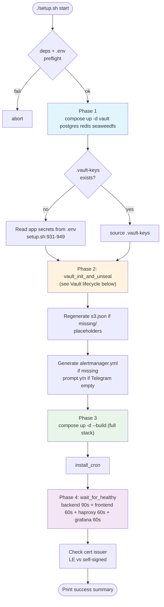
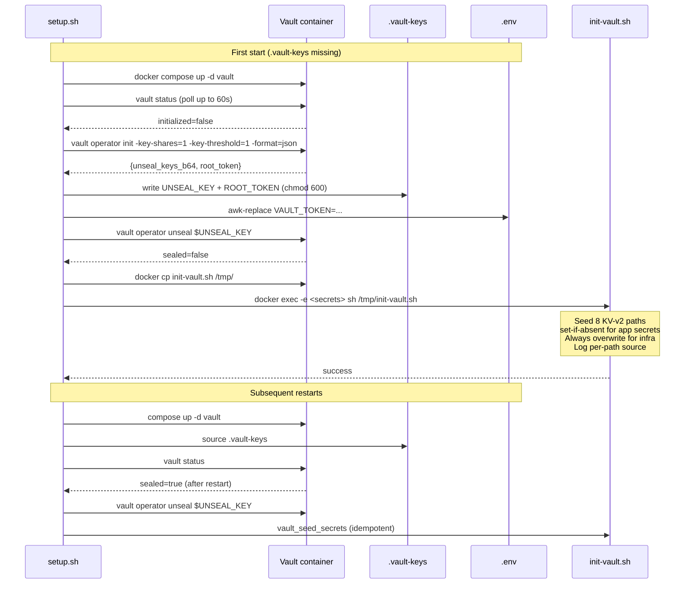

# Deployment

> Read this in: **English** · [Русский](../ru/DEPLOYMENT.md)

This is the operator-facing guide for running AstroCTFb in production. It covers prerequisites, the `setup.sh` lifecycle, Vault initialization, TLS provisioning, post-deploy verification, secret rotation, disaster recovery, and troubleshooting.

---

## Table of Contents

- [Prerequisites](#prerequisites)
- [Domain & DNS](#domain--dns)
- [External services](#external-services)
- [Step-by-step deploy](#step-by-step-deploy)
- [What `setup.sh start` does](#what-setupsh-start-does)
- [Vault lifecycle](#vault-lifecycle)
- [TLS lifecycle](#tls-lifecycle)
- [Post-deploy verification](#post-deploy-verification)
- [Service management](#service-management)
- [Secrets management](#secrets-management)
- [Disaster recovery](#disaster-recovery)
- [Reset / uninstall](#reset--uninstall)
- [Cron job](#cron-job)
- [Troubleshooting](#troubleshooting)

---

## Prerequisites

### Server

| Resource   | Minimum             | Recommended              |
| ---------- | ------------------- | ------------------------ |
| OS         | Linux (kernel 5.x+) | Ubuntu 22.04 / Debian 12 |
| CPU        | 2 vCPU              | 4 vCPU                   |
| RAM        | 4 GB                | 8 GB                     |
| Disk       | 30 GB SSD           | 50 GB SSD                |
| Open ports | 80, 443 (inbound)   | + 22 SSH                 |

The platform runs entirely in Docker - nothing is installed on the host except the runtime.

### Host dependencies

```bash
sudo apt-get update
sudo apt-get install -y docker.io docker-compose-plugin jq openssl dnsutils
sudo systemctl enable --now docker
# If running as non-root, add yourself to the docker group:
sudo usermod -aG docker "$USER"
newgrp docker
```

`setup.sh` will refuse to proceed without `docker`, `docker compose`, `jq`, `openssl`, and `dig`.

---

## Domain & DNS

You need a domain you control plus the ability to add DNS A-records.

**Five A-records** must point to the server's public IP - Let's Encrypt issues a single multi-SAN certificate covering all of them, and missing any one makes the whole request fail:

| Record                | Purpose                                   | Required        |
| --------------------- | ----------------------------------------- | --------------- |
| `example.com`         | SPA frontend                              | **Yes**         |
| `api.example.com`     | Backend REST API + WebSocket + SSE        | **Yes**         |
| `grafana.example.com` | Grafana (admin-only via IP allowlist)     | **Yes** for TLS |
| `vault.example.com`   | Vault UI (operator-only via IP allowlist) | **Yes** for TLS |
| `s3.example.com`      | SeaweedFS UI + public S3 endpoint         | **Yes** for TLS |

Verify propagation before deploying:

```bash
for sub in example.com api.example.com grafana.example.com vault.example.com s3.example.com; do
  echo -n "$sub -> "; dig +short @1.1.1.1 "$sub" | tail -n1
done
```

The wizard's `check_dns_preflight` (`setup.sh:225`) does this automatically. Mismatches issue a non-blocking warning - it's still your decision whether to proceed with a self-signed bootstrap certificate.

---

## External services

These are optional but typically wanted in production.

### Resend (transactional email)

Sign up at [resend.com](https://resend.com), verify your sender domain (`noreply@example.com`), copy the API key. Without it, registrations don't send verification emails and password reset doesn't work.

### GitHub OAuth App

[https://github.com/settings/developers](https://github.com/settings/developers) -> **New OAuth App**. Authorization callback URL: `https://api.example.com/api/v1/auth/oauth/github/callback`. Copy `Client ID` and `Client Secret`.

### Google OAuth

[Google Cloud Console](https://console.cloud.google.com/) -> **APIs & Services** -> **Credentials** -> **OAuth 2.0 Client IDs**. Authorized redirect URIs: `https://api.example.com/api/v1/auth/oauth/google/callback`. Copy `Client ID` and `Client Secret`.

### Telegram bot (alerts)

Talk to [@BotFather](https://t.me/BotFather), `/newbot`, copy token. Create a group/channel, add the bot, send a test message, then:

```bash
curl "https://api.telegram.org/bot<TOKEN>/getUpdates" | jq '.result[].message.chat.id'
```

The chat ID changes when a group is upgraded to a supergroup - recheck via `getUpdates` if alerts stop arriving.

---

## Step-by-step deploy

There are two paths to a running platform: the **interactive wizard** (`./setup.sh`) and the **manual `.env` + `./setup.sh start`** path. Both end up calling the same `init-vault.sh` and `compose up` flow.

### Path A - interactive wizard

```bash
git clone https://github.com/TakuyaYagam1/AstroCTFb.git
cd AstroCTFb
./setup.sh
```

When `.env` does not exist, the script enters the 8-step wizard:

| Step | What it asks                                                                  |
| ---- | ----------------------------------------------------------------------------- |
| 1/8  | CTF platform name (1–80 chars, ASCII letter/digit required) + version         |
| 2/8  | Domain, server IP (`VAULT_ADMIN_IP`), 4 admin subdomains, LE staging y/N      |
| 3/8  | Postgres user / password (≥12 chars) / db name                                |
| 4/8  | Redis password (≥12 chars)                                                    |
| 5/8  | Admin username / email / password (≥12 chars, upper + lower + digit)          |
| 6/8  | SeaweedFS S3 access key (≥12) and secret key (≥16) - `Enter` to auto-generate |
| 7/8  | Grafana admin password (≥12) + optional Telegram (token + chat_id)            |
| 8/8  | Resend (optional) + GitHub OAuth (optional) + Google OAuth (optional)         |

After confirmation, `setup.sh`:

1. Writes `.env` (preserves comments and structure via `env_set`).
2. Generates `deployment/seaweedfs/s3.json` from `s3.json.example`.
3. Generates `monitoring/alertmanager/alertmanager.yml` (Telegram-enabled or null-receiver).
4. Calls `deploy_fresh` -> see [What `setup.sh start` does](#what-setupsh-start-does).

### Path B - manual `.env`

For unattended deploys (CI, copy `.env` from staging, etc.):

```bash
git clone https://github.com/TakuyaYagam1/AstroCTFb.git
cd AstroCTFb
cp .env.example .env
chmod 600 .env
$EDITOR .env  # fill the REQUIRED block (see ENVIRONMENT.md)
./setup.sh start
```

`do_start` (`setup.sh:919`) detects there's no `.vault-keys` and reads app-level secrets directly from `.env` (`setup.sh:931–949`) before calling `init-vault.sh`. The Vault `set-if-absent` semantics ensure subsequent restarts don't rotate values.

> **Required fields for Path B:** see the [REQUIRED block in ENVIRONMENT.md](ENVIRONMENT.md#required--fill-before-first-start). Missing any of them causes `setup.sh start` to fail (Postgres/Grafana/HAProxy enforce passwords with `:?` in compose).

If you prefer auto-generated cryptographic secrets, leave `FLAG_ENCRYPTION_KEY`, `JWT_*_SECRET`, `OAUTH_STATE_SECRET`, `ADMIN_PASSWORD` empty in `.env` - `init-vault.sh` will generate them and log per-path source markers (`[seeded from env]` vs `[auto-generated]`).

---

## What `setup.sh start` does



Total time on first deploy: **3–8 minutes** (most of it is `docker build` for backend + frontend).

---

## Vault lifecycle

`vault_init_and_unseal` (`setup.sh:716–786`) and `init-vault.sh` (`deployment/docker/init-vault.sh`) handle the entire lifecycle without operator input - there is **no unseal key to enter manually**. The key is generated by Vault itself on first init and persisted to `./.vault-keys`.



### The 8 secret paths (KV v2, mount `secret/`)

| Path                    | Fields                                                                                                 | Sourced from                                                                      |
| ----------------------- | ------------------------------------------------------------------------------------------------------ | --------------------------------------------------------------------------------- |
| `ctf-platform/database` | `user`, `password`, `dbname`                                                                           | `POSTGRES_USER/PASSWORD/DB` (always overwritten)                                  |
| `ctf-platform/redis`    | `password`                                                                                             | `REDIS_PASSWORD` (always overwritten)                                             |
| `ctf-platform/storage`  | `access_key`, `secret_key`                                                                             | `SEAWEED_S3_ACCESS_KEY/SECRET_KEY` (always overwritten)                           |
| `ctf-platform/jwt`      | `access_secret`, `refresh_secret`                                                                      | `JWT_ACCESS_SECRET / JWT_REFRESH_SECRET` (set-if-absent, autogen 64 alnum)        |
| `ctf-platform/app`      | `flag_encryption_key`                                                                                  | `FLAG_ENCRYPTION_KEY` (set-if-absent, autogen 64 hex)                             |
| `ctf-platform/resend`   | `api_key`                                                                                              | `RESEND_API_KEY` (set-if-absent, default `placeholder`)                           |
| `ctf-platform/admin`    | `username`, `email`, `password`                                                                        | `ADMIN_USERNAME/EMAIL/PASSWORD` (set-if-absent, autogen 16 alnum - printed once!) |
| `ctf-platform/oauth`    | `state_secret`, `github_client_id`, `github_client_secret`, `google_client_id`, `google_client_secret` | `OAUTH_*` (state_secret set-if-absent, client IDs/secrets always overwritten)     |

`init-vault.sh` emits a per-path log on each run:

```
[seeded from env]    secret/ctf-platform/database
[seeded from env]    secret/ctf-platform/redis
[seeded from env]    secret/ctf-platform/storage
[updated from env]   secret/ctf-platform/jwt
[kept existing]      secret/ctf-platform/app
[auto-generated]     secret/ctf-platform/admin
                     admin password = aB3xK9mQp2N7vR5L   <-- WRITE THIS DOWN
[seeded from env]    secret/ctf-platform/oauth

Auto-generated paths (replace if you want your own values):
    secret/ctf-platform/admin   (change: ./setup.sh secrets edit)
```

Inspect a path:

```bash
docker exec -e VAULT_ADDR=http://127.0.0.1:8200 \
            -e VAULT_TOKEN=$(grep ^ROOT_TOKEN= .vault-keys | cut -d= -f2) \
  vault vault kv get secret/ctf-platform/admin
```

### `.vault-keys` - back it up

This file is the **single point of failure** for the entire platform's secret state. Lose it -> Vault stays sealed forever after the next container restart -> no JWT signing key -> no flag decryption -> unrecoverable.

```bash
# Immediately after first deploy:
scp user@server:/path/to/AstroCTFb/.vault-keys ~/secure-backup/vault-keys-$(date +%Y%m%d).txt
chmod 600 ~/secure-backup/vault-keys-*.txt
```

Store in an encrypted volume / 1Password / KeePass - anywhere off-server.

---

## TLS lifecycle

HAProxy terminates TLS using a Let's Encrypt multi-SAN certificate covering all 5 domains. Certbot runs as a sidecar; on first start it requests the cert via HTTP-01 challenge (port 80 -> HAProxy -> `certbot_webroot` volume), then installs it into HAProxy via the Runtime API for hot reload (no HAProxy restart needed).

```
HTTP-01 challenge flow:
  Client (Let's Encrypt) -> http://example.com/.well-known/acme-challenge/<token>
  -> HAProxy serves token from certbot_webroot volume
  -> certbot validates -> receives signed certificate
  -> renewal-hook.sh writes cert atomically + signals HAProxy via socat
  -> HAProxy hot-reloads cert (no downtime)
```

### Staging-first deploys (recommended)

Set `USE_LE_STAGING=true` in `.env` for the very first deploy. Staging certs are not trusted by browsers (you'll see a warning) but they:

- Don't count against the production rate limit (5 duplicate certs/week).
- Are nearly identical in path/format, so flushing failures is safe.

After verifying the site loads in browser:

```bash
sed -i 's/^USE_LE_STAGING=true/USE_LE_STAGING=false/' .env
docker volume rm docker_certbot_data 2>/dev/null || true
docker compose --env-file .env -f deployment/docker/docker-compose.yml up -d --force-recreate certbot
docker logs certbot -f   # wait for "Successfully received certificate"
```

Hot-reload propagates within ~30 s; refresh the browser to see the trusted cert.

### Renewal

Certbot runs `sleep 12h ; certbot renew` in a loop. `renewal-hook.sh` (`/etc/letsencrypt/renewal-hooks/post/haproxy-reload.sh`) is invoked on successful renewal:

1. Concatenate `fullchain.pem + privkey.pem` -> write to `${PEM_FILE}.new` (chmod 600).
2. Send `set ssl cert <path> << \n<payload>\n` + `commit ssl cert <path>` to HAProxy via `socat /var/run/haproxy/haproxy.sock`.
3. Atomically rename `${PEM_FILE}.new -> ${PEM_FILE}`.

If the Runtime API socket is unavailable, the cert is still on disk for HAProxy to pick up on next restart.

### CDN-terminated TLS

Set `HAPROXY_BEHIND_CDN=true` and `TRUSTED_CDN_CIDRS=<cdn-ranges>` if you put Cloudflare / DDoS-Guard in front. HAProxy stops binding `:443` and trusts `X-Forwarded-For` from the CDN ranges for rate limiting. Certbot is unnecessary in this mode.

---

## Post-deploy verification

```bash
# 1. All containers running and healthy
docker compose --env-file .env -f deployment/docker/docker-compose.yml ps
# Expected: all "Up X minutes (healthy)"; alertmanager OK without Telegram

# 2. Vault unsealed
docker exec vault vault status
# Expected: Sealed: false, Initialized: true, HA Enabled: false

# 3. All 8 secret paths seeded
docker exec -e VAULT_ADDR=http://127.0.0.1:8200 \
            -e VAULT_TOKEN=$(grep ^ROOT_TOKEN= .vault-keys | cut -d= -f2) \
  vault vault kv list secret/ctf-platform/
# Keys: admin, app, database, jwt, oauth, redis, resend, storage

# 4. HTTP healthchecks
curl -kI https://api.example.com/api/v1/healthcheck   # 200 OK
curl -kI https://example.com                           # 200 OK

# 5. WebSocket
wscat -c wss://api.example.com/api/v1/ws \
  -H "Authorization: Bearer $TOKEN"                   # connected event

# 6. TLS issuer
docker compose -f deployment/docker/docker-compose.yml exec haproxy \
  openssl x509 -in /etc/haproxy/certs/example.com.pem -noout -issuer
# Expected after staging->prod swap: "Let's Encrypt"

# 7. Backend logs free of ERROR
./setup.sh logs | grep -E '(ERROR|FATAL)' | head
# (empty output is good)

# 8. Login as admin
# Open https://example.com -> /login -> admin@example.com / <password from .env or .vault-keys>
```

---

## Service management

```bash
./setup.sh start         # start (auto-unseal + seed)
./setup.sh stop          # stop all containers
./setup.sh restart       # stop + start
./setup.sh status        # docker compose ps
./setup.sh logs          # tail backend logs (ctrl+C to exit)
./setup.sh reconfigure   # re-run wizard (Vault secrets PRESERVED, .env backed up)
```

Without arguments, `./setup.sh` shows an interactive menu (when `.env` exists) or runs the wizard (when not).

---

## Secrets management

| Command                          | Effect                                                                 | Requires confirmation         |
| -------------------------------- | ---------------------------------------------------------------------- | ----------------------------- |
| `./setup.sh secrets edit`        | Interactive: change admin pw / Resend API key / OAuth client secrets   | menu choice                   |
| `./setup.sh secrets rotate`      | Rotate JWT access+refresh + OAuth state                                | type `ROTATE`                 |
| `./setup.sh secrets rotate-flag` | Rotate `FLAG_ENCRYPTION_KEY` - **destroys all encrypted regex flags**  | type `YES I ACCEPT DATA LOSS` |
| `./setup.sh secrets rotate-s3`   | Rotate SeaweedFS S3 credentials (briefly restarts seaweedfs + backend) | type `ROTATE`                 |

After secret rotation:

- `secrets edit` -> admin must re-login if password changed.
- `secrets rotate` -> **all users logged out** (refresh tokens invalidated; OAuth state cookies invalidated).
- `secrets rotate-flag` -> admins must re-enter every regex-encrypted flag (decrypt key changed).
- `secrets rotate-s3` -> backend transparently picks up new credentials; seaweedfs reload is automatic.

For non-secret config (rate limits, TTLs, CTF name from admin UI), edit `.env` directly and `./setup.sh restart`.

---

## Disaster recovery

| Scenario                                                 | Recovery                                                                                                                                                                      |
| -------------------------------------------------------- | ----------------------------------------------------------------------------------------------------------------------------------------------------------------------------- |
| Lost `.vault-keys` after first deploy                    | Unrecoverable. `docker volume rm docker_vault_data` -> `./setup.sh start` (re-init from scratch). Encrypted regex flags lost; admins must re-enter them.                      |
| Lost server, have `.vault-keys` + `.env` + Postgres dump | Spin up new server with same DOMAIN. `git clone`, `cp .env`, `cp .vault-keys`, `pg_restore`, `./setup.sh start`. Vault reopens with the same unseal key; backend re-attaches. |
| Postgres corrupted                                       | Daily `pg_dump`. Restore: `docker compose down`, restore `postgres_data` volume, `up -d`.                                                                                     |
| Lost SeaweedFS volume                                    | Files lost (avatars, uploads, challenge attachments). Backup `seaweed_data` volume periodically if file uploads are critical.                                                 |
| Compromised admin password                               | `./setup.sh secrets edit` -> choice 1 -> set new.                                                                                                                             |
| Compromised JWT secret                                   | `./setup.sh secrets rotate` -> all sessions invalidated.                                                                                                                      |
| Compromised flag encryption key                          | `./setup.sh secrets rotate-flag` -> all regex flags need re-entry.                                                                                                            |

> Schedule `pg_dump` and `tar czf` of `vault_data + seaweed_data + grafana_data` daily. Keep at least 7 days of backups off-server.

---

## Reset / uninstall

| Command                                           | What it deletes                                                      | Volumes preserved? | Data preserved? |
| ------------------------------------------------- | -------------------------------------------------------------------- | ------------------ | --------------- |
| `./setup.sh reset config`                         | `.env`, `.vault-keys`, `s3.json`, `alertmanager.yml`, `deploy.log`   | Yes                | Yes             |
| `./setup.sh reset data` (type `WIPE DATA`)        | All of the above + all docker volumes (DB, Vault, Grafana, LE certs) | No                 | No              |
| `./setup.sh uninstall` (type `DELETE EVERYTHING`) | All of the above + locally built images + host cron                  | No                 | No              |

Use `reset config` if you want to redo the wizard but keep all data (e.g. change branding or domains). Use `reset data` for a clean slate. Use `uninstall` to fully remove the platform from the host.

---

## Cron job

`install_cron` (`setup.sh:661`) installs `/etc/cron.d/ctf-platform-cleanup` (root:root, 644) on `setup.sh start`. Requires `EUID=0` to install automatically; otherwise prints the manual `sudo cp` command.

```cron
# 02:00 - backend cleanup binary (orphaned files, old tracking, soft-deleted teams)
0 2 * * * root /usr/bin/docker exec backend /usr/local/bin/ctf-platform-cleanup >> /var/log/ctf-platform-cleanup.log 2>&1

# 03:00 - docker image prune
0 3 * * * root docker image prune -f --filter "until=168h" >> /var/log/docker-prune.log 2>&1
```

The cleanup binary (`backend/cmd/cleanup/main.go`) deletes:

- Soft-deleted teams older than 30 days.
- Orphaned S3 files (no DB record under `tasks/`).
- Orphaned avatar files (`users/`, `teams/` prefixes).
- `tracking` and `challenge_opens` rows older than 90 days.

In GitLab CI, `deploy:cron` runs separately (`/.gitlab-ci.yml:362`) - `scp` binary + cron file -> `sudo install` -> `systemctl reload cron`.

Manual run:

```bash
docker exec backend /usr/local/bin/ctf-platform-cleanup
```

---

## Troubleshooting

### Vault won't initialize / unseal

```bash
docker logs vault --tail 30
docker exec vault vault status
```

Common causes:

- **Port 8200 conflict:** another process binding it (rare, intra-net only).
- **Disk full:** check `df -BG /var/lib/docker`.
- **Pre-existing `vault_data` from another deploy:** `setup.sh start` refuses to re-init if `.vault-keys` exists but Vault thinks `initialized=false` (volume wiped without removing keys file). Solution: delete `.vault-keys`, then re-run.
- **Lost unseal key:** see [Disaster recovery](#disaster-recovery).

### Backend container in restart loop

```bash
docker logs backend --tail 50
```

Common causes:

- **Vault sealed:** `docker exec vault vault status` -> `Sealed: true`. `./setup.sh restart` triggers re-unseal.
- **Postgres not ready:** check `docker logs postgres`; usually resolved within 30 s of start.
- **Missing secret in Vault:** `init-vault.sh` failed for some reason. Re-run: `./setup.sh start` (idempotent).
- **Wrong `FLAG_ENCRYPTION_KEY` length:** must be exactly 64 hex chars. Backend fails fast on validation (`config.go:153`).

### SeaweedFS 403 on S3 operations

Credentials in `s3.json` differ from those in Vault (`secret/ctf-platform/storage`).

```bash
cat deployment/seaweedfs/s3.json
docker exec vault vault kv get secret/ctf-platform/storage

# If they don't match: ./setup.sh start re-seeds Vault from .env.
# To regenerate s3.json: ./setup.sh reconfigure (or edit + restart seaweedfs).
```

### HAProxy: "certificate not found"

```bash
docker logs certbot --tail 30
```

Look for ACME HTTP-01 challenge errors (DNS not pointing to server, port 80 blocked, etc.). After fixing DNS:

```bash
docker compose --env-file .env -f deployment/docker/docker-compose.yml up -d --force-recreate certbot
```

The bootstrap self-signed cert keeps HAProxy alive until the real cert arrives.

### HAProxy: config validation failure

```bash
docker logs haproxy --tail 30
```

The entrypoint runs `haproxy -c -f haproxy.cfg -f /tmp/fe_main.cfg` (dry-run) before exec'ing the real process. Errors are printed at startup. Most common cause: malformed env-substituted value (e.g. unquoted IP with spaces in `ADMIN_ALLOWED_IPS`).

### Grafana not healthy

```bash
docker logs grafana --tail 20
```

Common causes:

- **Missing `GRAFANA_ADMIN_PASSWORD`:** compose enforces it via `:?` (`docker-compose.yml:558`).
- **Prometheus not healthy:** Grafana depends on it; check `docker logs prometheus`.

### "Server returned 429" right after deploy

HAProxy stick tables learn slowly - initial flood of requests during testing can trigger rate limits. Tables expire in 2–10 minutes. Or restart `haproxy` to wipe them.

### Cookie not persisting / login loop

Browser DevTools -> Application -> Cookies. The refresh cookie should be set on `*.example.com`, `httpOnly`, `Secure`, `SameSite=Strict`.

If not set:

- **Mixed-content blocked:** `API_BASE_URL` is `https://...` but you opened the SPA on `http://...`.
- **`SECURE_COOKIES=true` + invalid TLS:** browser silently drops the cookie. Use staging cert with the cert proxy switch enabled, then reload after fixing.

### Typical startup timeline

```
T+0s    ./setup.sh start
T+2s    vault container up
T+8s    vault status reachable
T+12s   unseal + seed (8 paths)
T+15s   compose up -d --build (full stack)
T+35s   postgres / redis / seaweedfs healthy
T+50s   backend healthy (Vault, DB, Redis connected)
T+70s   grafana healthy
T+80s   alertmanager / promtail / prometheus healthy
T+90s+  certbot starts ACME challenge (1–3 attempts × 60s)
```

For all environment variables and their resolution order, see [ENVIRONMENT.md](ENVIRONMENT.md).
For monitoring, alerts, and dashboards, see [MONITORING.md](MONITORING.md).
For internal architecture, see [ARCHITECTURE.md](ARCHITECTURE.md).
