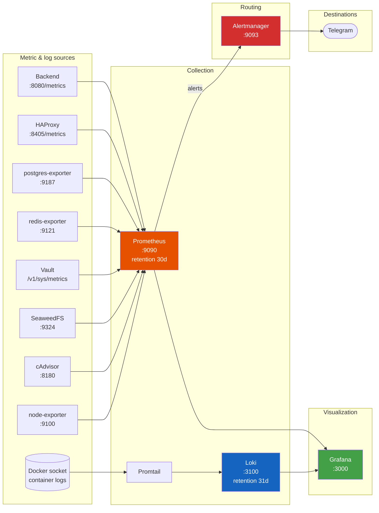

# Monitoring

> Read this in: **English** · [Русский](../ru/MONITORING.md)

The platform ships with a complete observability stack: Prometheus for metrics, Loki for logs, Promtail for log shipping, Alertmanager for routing, and Grafana for visualization. All components are containerized, auto-provisioned, and isolated on the `ctf_platform_network` bridge.

---

## Table of Contents

- [Overview](#overview)
- [Metric sources](#metric-sources)
- [Prometheus](#prometheus)
- [Alert rules](#alert-rules)
- [Alertmanager](#alertmanager)
- [Loki & Promtail](#loki--promtail)
- [Grafana](#grafana)
- [Access](#access)
- [Best practices](#best-practices)

---

## Overview



**Retention defaults:**

- Prometheus: 30 days (`--storage.tsdb.retention.time=30d`).
- Loki: 31 days (`limits_config.retention_period: 744h`).

---

## Metric sources

10 scrape targets are configured in `monitoring/prometheus/prometheus.yml`.

| Job                 | Target                   | Path                                | What it exposes                                                                                                                                                                              |
| ------------------- | ------------------------ | ----------------------------------- | -------------------------------------------------------------------------------------------------------------------------------------------------------------------------------------------- |
| `prometheus`        | `localhost:9090`         | `/metrics`                          | Self-metrics                                                                                                                                                                                 |
| `backend`           | `backend:8080`           | `/metrics`                          | HTTP RED histogram (`kitMiddleware.Metrics`), custom counters: `rate_limit_redis_errors_total{limiter}`, `submission_batcher_{dropped,flushed,flush_errors}_total`, `tracking_dropped_total` |
| `postgres-exporter` | `postgres-exporter:9187` | `/metrics`                          | `pg_up`, `pg_stat_activity_count`, `pg_stat_database_*`, deadlocks                                                                                                                           |
| `redis-exporter`    | `redis-exporter:9121`    | `/metrics`                          | `redis_up`, memory, key counts, hit ratio, ops/sec                                                                                                                                           |
| `vault`             | `vault:8200`             | `/v1/sys/metrics?format=prometheus` | `vault_core_unsealed`, audit, KV ops                                                                                                                                                         |
| `seaweedfs`         | `seaweedfs:9324`         | `/metrics`                          | volume ops, S3 request rates, file count                                                                                                                                                     |
| `seaweedfs-ui`      | `seaweedfs-ui:5000`      | `/metrics`                          | (placeholder for nginx)                                                                                                                                                                      |
| `node-exporter`     | `node-exporter:9100`     | `/metrics`                          | host-level (CPU, memory, disk, network, filesystem)                                                                                                                                          |
| `cadvisor`          | `cadvisor:8180`          | `/metrics`                          | per-container metrics (CPU, memory working-set, network, FS)                                                                                                                                 |
| `haproxy`           | `haproxy:8405`           | `/metrics`                          | frontend/backend request rates, queue depths, stick-table sizes                                                                                                                              |

> The backend `/metrics` endpoint is gated by `METRICS_ALLOWED_IPS` (defaults to empty = deny all). Add the docker bridge CIDR to allow Prometheus to scrape: `METRICS_ALLOWED_IPS=172.16.0.0/12`. Inside compose this works automatically since both containers share the network.

### Backend custom metrics

| Metric                                  | Type      | Labels                | Notes                                                           |
| --------------------------------------- | --------- | --------------------- | --------------------------------------------------------------- |
| `rate_limit_redis_errors_total`         | Counter   | `limiter`             | Redis failures during rate-limit checks (fallback to in-memory) |
| `submission_batcher_dropped_total`      | Counter   | -                     | Submissions dropped due to full buffer                          |
| `submission_batcher_flushed_total`      | Counter   | -                     | Successfully flushed submissions                                |
| `submission_batcher_flush_errors_total` | Counter   | -                     | Failed flushes                                                  |
| `tracking_dropped_total`                | Counter   | -                     | Tracking events dropped under load                              |
| `http_requests_total`                   | Counter   | route, method, status | RED standard                                                    |
| `http_request_duration_seconds`         | Histogram | route, method, status | RED standard                                                    |

---

## Prometheus

Configuration: `monitoring/prometheus/prometheus.yml`.

```yaml
global:
  scrape_interval: 15s
  evaluation_interval: 15s
  external_labels:
    monitor: ctf-platform

rule_files:
  - /etc/prometheus/alerts.yml

alerting:
  alertmanagers:
    - static_configs:
        - targets: ["alertmanager:9093"]
```

Storage:

- Volume: `prometheus_data` (named volume in compose).
- Path: `/prometheus`.
- Retention: 30 days.
- Lifecycle API enabled (`--web.enable-lifecycle`) - `curl -X POST http://prometheus:9090/-/reload` to reload rules without restart.

---

## Alert rules

Defined in `monitoring/prometheus/alerts.yml` under group `ctf_platform_alerts`. **12 rules** total:

| Alert                       | Expr                                                                                               | For  | Severity | Means                                           |
| --------------------------- | -------------------------------------------------------------------------------------------------- | ---- | -------- | ----------------------------------------------- |
| `InstanceDown`              | `up == 0`                                                                                          | 30 s | critical | Any scrape target unreachable                   |
| `HighCpuUsage`              | `sum(rate(container_cpu_usage_seconds_total{name!=""}[5m])) by (name) * 100 > 80`                  | 5 m  | warning  | Container above 80% of one core for 5 min       |
| `HighMemoryUsage`           | `container_memory_working_set_bytes{name!=""} > 1.5e+9`                                            | 5 m  | warning  | Working set > 1.5 GB                            |
| `RedisDown`                 | `redis_up == 0`                                                                                    | 1 m  | critical | Redis exporter reports down                     |
| `PostgreSQLDown`            | `pg_up == 0`                                                                                       | 1 m  | critical | Postgres exporter reports down                  |
| `PostgreSQLHighConnections` | `pg_stat_activity_count > 300`                                                                     | 2 m  | warning  | > 300 of 400 max connections                    |
| `PostgreSQLDeadLocks`       | `increase(pg_stat_database_deadlocks[1m]) > 0`                                                     | 1 m  | warning  | Any deadlock in the last minute                 |
| `APIDown`                   | `up{job="backend"} == 0`                                                                           | 1 m  | critical | Backend unreachable from Prometheus             |
| `HighDiskUsage`             | `(node_filesystem_avail_bytes{mountpoint="/"} / node_filesystem_size_bytes{mountpoint="/"}) < 0.1` | 5 m  | critical | < 10% root filesystem free                      |
| `HighHTTPErrorRate`         | `sum(rate(http_requests_total{status=~"5.."}[5m])) / sum(rate(http_requests_total[5m])) > 0.05`    | 2 m  | warning  | > 5% 5xx responses                              |
| `HighLatencyP95`            | `histogram_quantile(0.95, sum(rate(http_request_duration_seconds_bucket[5m])) by (le)) > 2`        | 5 m  | warning  | P95 latency > 2 s                               |
| `VaultSealed`               | `vault_core_unsealed == 0`                                                                         | 1 m  | critical | Vault sealed (catastrophic - backend will fail) |

To add custom rules, edit `monitoring/prometheus/alerts.yml` and reload Prometheus:

```bash
curl -X POST http://localhost:9090/-/reload
# or restart: docker compose restart prometheus
```

---

## Alertmanager

Configuration: `monitoring/alertmanager/alertmanager.yml` (generated by `setup.sh` from `alertmanager.yml.example`).

```yaml
global:
  resolve_timeout: 5m

route:
  group_by: ["alertname"]
  group_wait: 30s
  group_interval: 5m
  repeat_interval: 4h
  receiver: "telegram-notifications"

inhibit_rules:
  - source_matchers: [alertname = "InstanceDown"]
    target_matchers: [severity = "critical"]
    equal: ["instance"]

receivers:
  - name: "telegram-notifications"
    telegram_configs:
      - bot_token: ${TELEGRAM_BOT_TOKEN}
        chat_id: ${TELEGRAM_CHAT_ID}
        parse_mode: HTML
        message: |
          <b>{{ .Status | toUpper }}</b>: {{ .GroupLabels.alertname }}
          {{ range .Alerts }}
          <b>Instance:</b> {{ .Labels.instance }}
          <b>Description:</b> {{ .Annotations.description }}
          {{ end }}
```

`docker-compose.yml:517` enables env expansion (`--config.expand-env=true`) so `${TELEGRAM_BOT_TOKEN}` and `${TELEGRAM_CHAT_ID}` are substituted at runtime from container env.

### Inhibit rule

When `InstanceDown` fires for an `instance`, **all other critical alerts** for the same instance are suppressed. This avoids flooding Telegram with noise when an entire service goes down (the InstanceDown alert is sufficient).

### Null-receiver fallback

If Telegram is disabled (`TELEGRAM_BOT_TOKEN` empty in `.env`), `setup.sh` writes a stripped config with a null receiver:

```yaml
route:
  receiver: "null"
receivers:
  - name: "null"
```

Alerts still go to Prometheus (visible in Grafana -> Alerting tab) but nothing is dispatched externally.

### Chat ID gotcha

When a Telegram group is upgraded to a supergroup, its `chat_id` changes (becomes a 13-digit negative number). If Telegram alerts stop arriving:

```bash
curl "https://api.telegram.org/bot<TOKEN>/getUpdates" | jq '.result[].message.chat'
```

Update `TELEGRAM_CHAT_ID` in `.env` and `./setup.sh restart`.

---

## Loki & Promtail

### Loki

Configuration: `monitoring/loki/loki-config.yml`.

- HTTP: `:3100`, gRPC: `:9096`.
- Storage: filesystem (`/loki/chunks`, `/loki/rules`).
- Schema: `tsdb`, v13, 24h index period.
- Retention: 31 days (`744h`).
- Compactor: enabled, runs every 10 minutes.
- Ruler: pushes alerts to Alertmanager (`http://alertmanager:9093`).
- Auth: disabled (intra-network only).

Backend image is built from a custom Dockerfile (`deployment/docker/loki.Dockerfile`):

```dockerfile
FROM busybox:1.37-musl AS busybox
FROM grafana/loki:latest
COPY --from=busybox /bin/busybox /usr/bin/wget
```

The base `grafana/loki` image lacks `wget`, which the docker healthcheck requires. The multi-stage build copies just the busybox `wget` binary without bloating the image.

### Promtail

Configuration: `monitoring/promtail/promtail-config.yml`.

- HTTP: `:9080`.
- Client: `http://loki:3100/loki/api/v1/push`.
- Positions file: `/data/positions.yaml` (persisted via `promtail_data` volume).
- Source: `docker_sd_configs` reads container metadata via `/var/run/docker.sock` (refresh 5 s).

### Pipeline stages (per service)

Each container's logs go through a service-specific pipeline that extracts labels and rewrites the log line:

| Service                     | Pipeline                                                      | Output labels        |
| --------------------------- | ------------------------------------------------------------- | -------------------- |
| `backend`                   | JSON parse -> extract `level`, `msg`, `trace_id`, `component` | `level`, `component` |
| `postgres`                  | regex parse PostgreSQL log format                             | `level`, `pid`       |
| `postgres-exporter`         | regex `level=(\w+) msg="([^"]*)"`                             | `level`              |
| `seaweedfs` / `seaweedfs-*` | regex `YYYY/MM/DD HH:MM:SS LEVEL message`                     | `level`              |

All entries also get standard relabel labels: `container`, `stream`, `compose_service`, `container_id`.

### Querying logs

In Grafana -> Explore -> Loki:

```logql
{compose_service="backend"} |= "ERROR"
{compose_service="backend"} | json | level="error"
{compose_service="backend", component="usecase.user"} | json | line_format "{{.msg}}"
{compose_service=~"postgres.*"} | regex "deadlock"
```

---

## Grafana

Auto-provisioned via `monitoring/grafana/provisioning/`:

### Datasources (`provisioning/datasources/datasources.yml`)

- **Prometheus** (uid: `prometheus`, default, proxy mode, `http://prometheus:9090`, `timeInterval: 15s`).
- **Loki** (uid: `loki`, proxy mode, `http://loki:3100`, `maxLines: 1000`).

### Dashboard provider (`provisioning/dashboards/dashboards.yml`)

6 providers configured with `disableDeletion: true`, `updateIntervalSeconds: 10`, `allowUiUpdates: false`. Dashboard files are read from `/var/lib/grafana/dashboards/<folder>/*.json`, mounted from the host via compose.

### Dashboards (10 files in 6 folders)

| Folder         | Dashboards                                                   | Source                           |
| -------------- | ------------------------------------------------------------ | -------------------------------- |
| **System**     | `system-overview.json`, `node-exporter.json`, `haproxy.json` | host CPU/RAM/disk, HAProxy stats |
| **Backend**    | `backend-metrics.json`, `backend-logs.json`                  | HTTP RED, Go runtime, error logs |
| **PostgreSQL** | `postgresql-details.json`                                    | connections, query stats, locks  |
| **Redis**      | `redis-overview.json`                                        | memory, ops/sec, keys, hit ratio |
| **Vault**      | `vault-health.json`                                          | seal status, token ops, audit    |
| **SeaweedFS**  | `seaweedfs.json`, `seaweedfs-ui.json`                        | volume ops, S3 metrics           |

To add a custom dashboard:

1. Drop the JSON file into `monitoring/grafana/dashboards/<folder>/`.
2. Restart grafana: `docker compose restart grafana` (or wait 10 s for the auto-reload tick).

### Login

- URL: `https://grafana.${DOMAIN}` (admin-IP-restricted) or SSH tunnel `localhost:3000`.
- User: value of `GRAFANA_ADMIN_USER` (default `admin`).
- Password: value of `GRAFANA_ADMIN_PASSWORD` (mandatory; container fails to start without it).

`GF_USERS_ALLOW_SIGN_UP=false` - only the admin can log in. Use Grafana's user management UI to create read-only viewers for support staff.

---

## Access

Admin subdomains (`grafana.`, `s3.`, `vault.`) are gated by IP allowlists at HAProxy. From outside the allowlist, you have three options:

### SSH tunnel (recommended for occasional access)

```bash
# Grafana
ssh -L 3000:grafana:3000 user@server
# open http://localhost:3000

# Vault UI
ssh -L 8200:vault:8200 user@server
# open http://localhost:8200

# HAProxy stats
ssh -L 8405:haproxy:8405 user@server
# open http://localhost:8405/stats
```

### Add IP to allowlist

Edit `.env`:

```env
ADMIN_ALLOWED_IPS=10.0.0.0/8 172.16.0.0/12 192.168.0.0/16 127.0.0.1/32 203.0.113.42/32
VAULT_ADMIN_IP=203.0.113.42
```

Then `./setup.sh restart` (HAProxy entrypoint regenerates `admin_ips.txt` and `vault_ips.txt` on start).

### CDN-only access

If you front the platform with Cloudflare Access or similar, you can use IP-restricted access at the CDN layer and remove HAProxy IP gating by setting `ADMIN_ALLOWED_IPS` to your CDN ranges and ensuring `HAPROXY_BEHIND_CDN=true`.

### HAProxy stats

Real-time per-frontend / per-backend dashboard at `:8405/stats`:

- Auth: `HAPROXY_STATS_USER` / `HAPROXY_STATS_PASSWORD`.
- Refresh: 5 s.
- Shows: stick-table sizes, request rates, queue depths, server health.

---

## Best practices

### Alert hygiene

- **One Telegram channel per environment.** Don't mix dev and prod alerts.
- **Snooze noisy alerts during incidents.** Use Alertmanager's silences (UI at `:9093` via SSH tunnel) for planned maintenance.
- **Tune thresholds for your scale.** `PostgreSQLHighConnections` at 300/400 may be too tight if your CTF runs at < 100 RPS - lower the limit _and_ the threshold proportionally.
- **Add runbooks.** When a new alert fires for the first time, document the response in `docs/runbooks/<alert-name>.md` (not currently versioned - start it).

### Dashboards

- **Keep system dashboards read-only.** Auto-provisioning (`allowUiUpdates: false`) prevents accidental edits - clone to a "personal" folder if you want to experiment.
- **Lazy-load expensive panels.** Long time-range queries on `histogram_quantile` can hammer Prometheus - use `$__rate_interval` and avoid `[1d]` lookups on heavily-cardinal histograms.

### Logs

- **Use structured logging in the backend.** `STRUCTURED_LOGGER=true` (default) emits JSON so Promtail can index `level`, `component`, `trace_id`. Don't downgrade to console output in prod.
- **Avoid logging high-cardinality fields.** Per-user IDs and per-team IDs are okay; per-request UUIDs in label position are not (Loki indexes labels, and high cardinality kills performance).

### Capacity planning

- **Prometheus disk:** ~3 GB per day at default scrape intervals with this stack. Plan ≥ 100 GB for the 30-day retention.
- **Loki disk:** depends on log volume. Backend at INFO level with structured logging produces ~500 MB/day. SeaweedFS access logs can be much higher.
- **Grafana:** stateless except for dashboard customizations / users. Backup `grafana_data` volume if you do meaningful UI work.

For full configuration of every monitoring-related variable, see [ENVIRONMENT.md](ENVIRONMENT.md). For deployment and operator commands, see [DEPLOYMENT.md](DEPLOYMENT.md).
