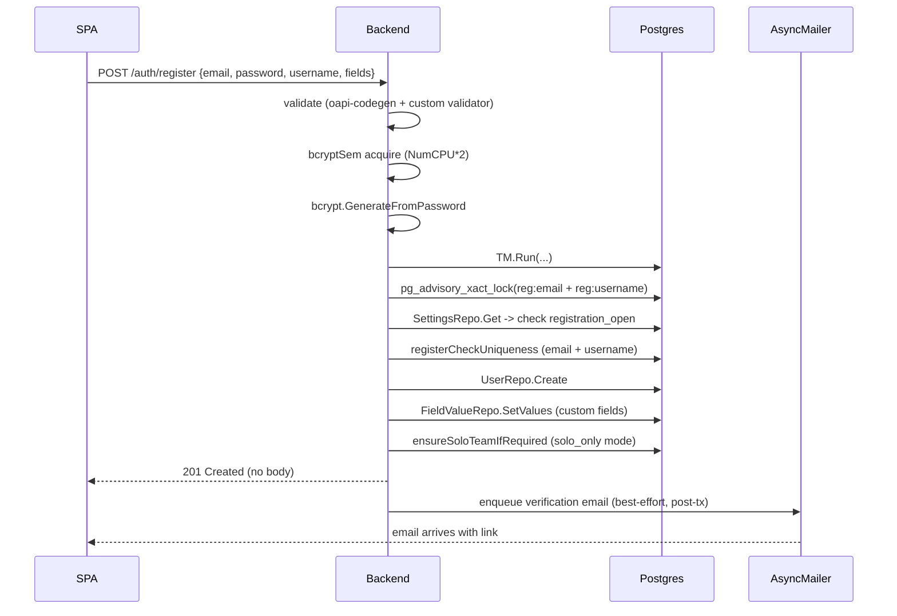
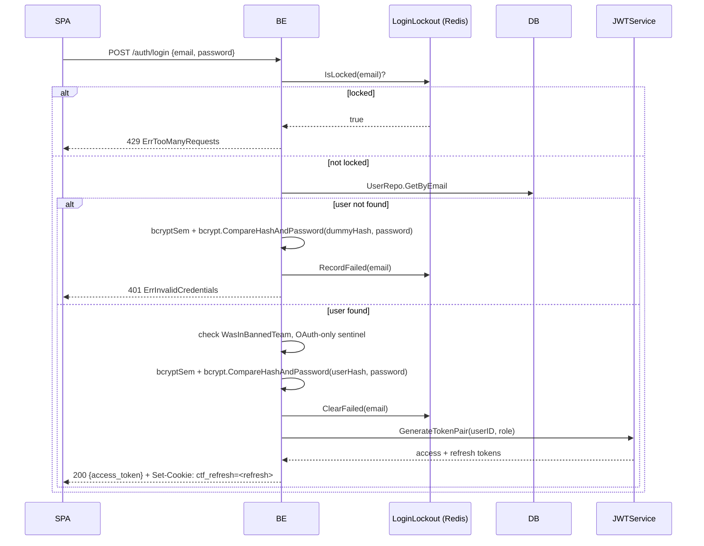
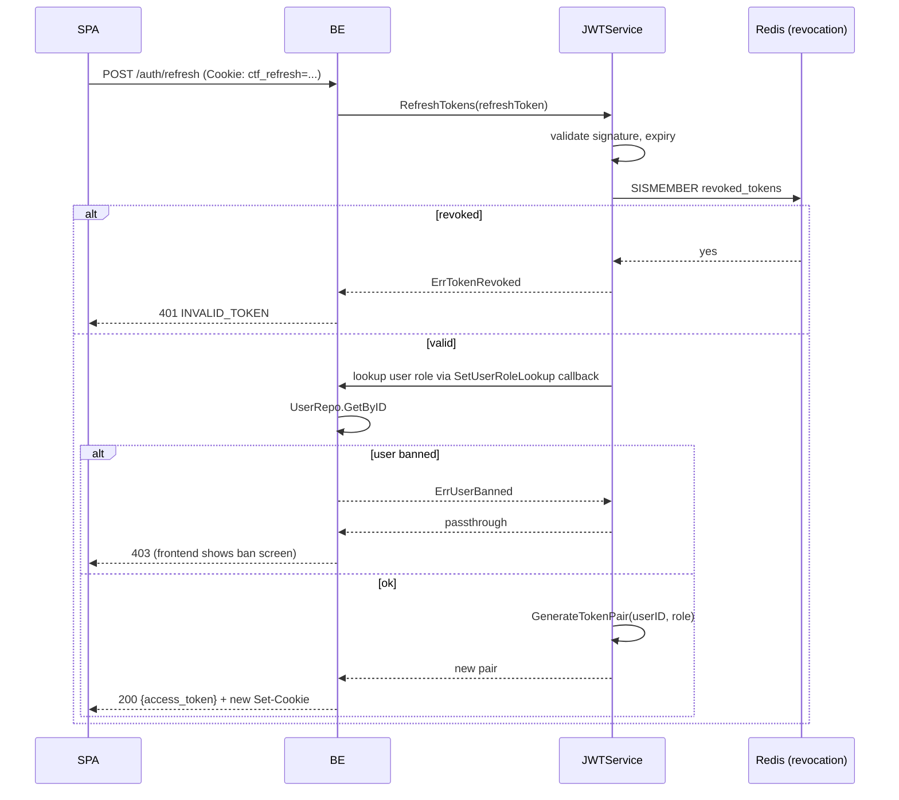
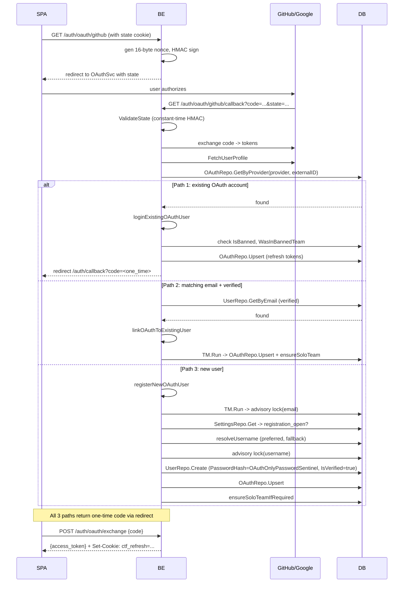
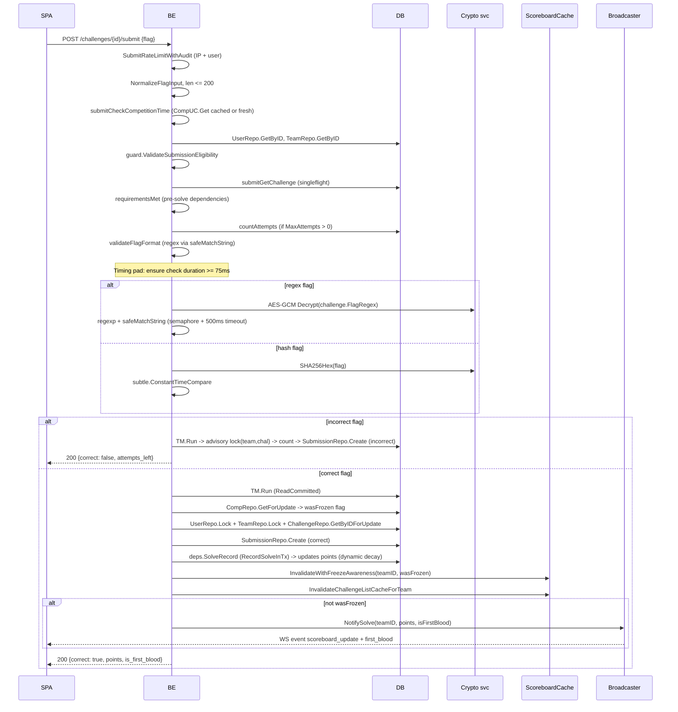
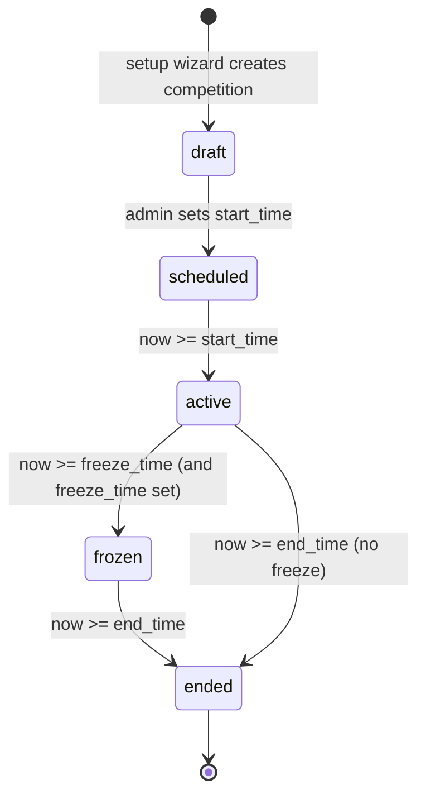
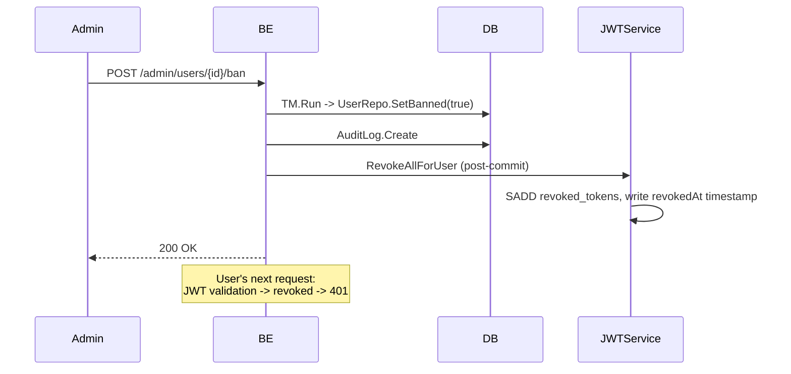
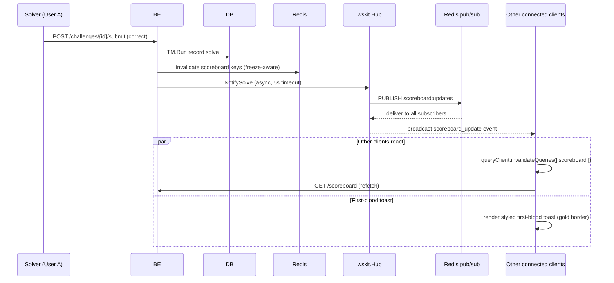

# Workflow & API Reference

> Read this in: **English** · [Русский](../ru/WORKFLOW.md)

This document describes user-facing flows (registration, OAuth, team formation, flag submission, scoreboard propagation, admin actions) and the HTTP/WebSocket API surface that backs them. Sequence diagrams trace the path from browser through HAProxy and the backend down to PostgreSQL/Redis/Vault, citing the responsible source files.

---

## Table of Contents

- [API route map](#api-route-map)
- [Authentication flows](#authentication-flows)
  - [Email registration](#email-registration)
  - [Login](#login)
  - [Refresh](#refresh)
  - [Logout](#logout)
  - [Password reset](#password-reset)
  - [OAuth (3 paths)](#oauth-3-paths)
- [Team flows](#team-flows)
- [Challenge flows](#challenge-flows)
  - [Browse](#browse)
  - [Flag submission](#flag-submission)
  - [Hint unlock](#hint-unlock)
  - [File download](#file-download)
- [Competition lifecycle](#competition-lifecycle)
- [Admin flows](#admin-flows)
- [Real-time](#real-time)

---

## API route map

All API routes are mounted under `/api/v1`. Auth column: **public** = no auth, **user** = Bearer JWT, **admin** = Bearer JWT + admin role. Rate limits are enforced both at HAProxy edge (stick tables) and in the backend (`middleware/ratelimit.go`).

`challenge_visibility` and `account_visibility` do not make challenge, user, or team pages available to guests: these read-only endpoints always require `user` auth, and visibility settings restrict already-authenticated non-admin users. `score_visibility` is the separate public-facing flow: scoreboard/statistics may be visible to guests when set to `public`.

### Auth

| Method | Path                              | Auth                            | Backing usecase                               |
| ------ | --------------------------------- | ------------------------------- | --------------------------------------------- |
| POST   | `/auth/register`                  | public                          | `UserUseCase.Register`                        |
| POST   | `/auth/login`                     | public                          | `UserUseCase.Login`                           |
| POST   | `/auth/refresh`                   | cookie                          | `JWTService.RefreshTokens`                    |
| POST   | `/auth/logout`                    | user                            | revokes refresh token                         |
| POST   | `/auth/verify-email`              | public (token in body)          | `EmailUseCase.Verify`                         |
| POST   | `/auth/resend-verification`       | public (rate-limited per email) | `EmailUseCase.ResendVerification`             |
| POST   | `/auth/forgot-password`           | public (rate-limited per email) | `EmailUseCase.ForgotPassword`                 |
| POST   | `/auth/reset-password`            | public (token in body)          | `EmailUseCase.ResetPassword`                  |
| GET    | `/auth/me`                        | user                            | `UserUseCase.GetMe`                           |
| PATCH  | `/auth/me`                        | user                            | `UserUseCase.UpdateMe`                        |
| GET    | `/auth/oauth/providers`           | public                          | enabled-providers listing                     |
| GET    | `/auth/oauth/{provider}`          | public                          | `OAuthUseCase.GetAuthURL` (sets state cookie) |
| GET    | `/auth/oauth/{provider}/callback` | public (HMAC state)             | `OAuthUseCase.HandleCallback`                 |
| POST   | `/auth/oauth/exchange`            | public (one-time code)          | issues JWT after backend redirect             |

### Challenges

| Method | Path                                        | Auth                | Backing usecase                    |
| ------ | ------------------------------------------- | ------------------- | ---------------------------------- |
| GET    | `/challenges`                               | user                | `ChallengeUseCase.List`            |
| GET    | `/challenges/{id}`                          | user                | `ChallengeUseCase.GetDetail`       |
| GET    | `/challenges/{id}/requirements`             | user                | `ChallengeUseCase.GetRequirements` |
| POST   | `/challenges/{id}/submit`                   | user (rate-limited) | `ChallengeUseCase.SubmitFlag`      |
| GET    | `/challenges/{id}/hints`                    | user                | `HintUseCase.List`                 |
| POST   | `/challenges/{id}/hints/{hint_id}/unlock`   | user                | `HintUseCase.Unlock`               |
| GET    | `/challenges/{id}/comments`                 | user                | `CommentUseCase.List`              |
| POST   | `/challenges/{id}/comments`                 | user                | `CommentUseCase.Create`            |
| GET    | `/challenges/{id}/files/{file_id}/download` | user                | `FileUseCase.GeneratePresigned`    |
| POST   | `/challenges/{id}/ratings`                  | user                | `RatingUseCase.Rate`               |
| GET    | `/tags`                                     | user                | `TagUseCase.List`                  |
| GET    | `/challenge-types`                          | user                | enum                               |

### Teams

| Method | Path                            | Auth                | Backing usecase                    |
| ------ | ------------------------------- | ------------------- | ---------------------------------- |
| GET    | `/teams`                        | user                | `TeamUseCase.List` (paginated)     |
| GET    | `/teams/{id}`                   | user                | `TeamUseCase.GetProfile`           |
| GET    | `/teams/{id}/solves`            | user                | `TeamUseCase.GetSolves`            |
| GET    | `/teams/{id}/awards`            | user                | `AwardUseCase.GetForTeam`          |
| GET    | `/teams/{id}/fails`             | user                | `TeamUseCase.GetFailedSubmissions` |
| POST   | `/teams`                        | user                | `TeamUseCase.Create`               |
| POST   | `/teams/{id}/join`              | user (invite token) | `TeamUseCase.Join`                 |
| POST   | `/teams/{id}/leave`             | user (member)       | `TeamUseCase.Leave`                |
| POST   | `/teams/{id}/disband`           | user (captain)      | `TeamUseCase.Disband`              |
| PATCH  | `/teams/{id}`                   | user (captain)      | `TeamUseCase.Rename`               |
| POST   | `/teams/{id}/kick/{user_id}`    | user (captain)      | `TeamUseCase.KickMember`           |
| POST   | `/teams/{id}/transfer-captain`  | user (captain)      | `TeamUseCase.TransferCaptain`      |
| POST   | `/teams/{id}/regenerate-invite` | user (captain)      | `TeamUseCase.RegenerateInvite`     |
| GET    | `/team/me`                      | user (member)       | `TeamUseCase.GetMyTeam`            |

### Scoreboard / Competition

| Method | Path                        | Auth        | Notes                                                      |
| ------ | --------------------------- | ----------- | ---------------------------------------------------------- |
| GET    | `/scoreboard`               | public/user | `SolveUseCase.GetScoreboard` (gated by `score_visibility`) |
| GET    | `/scoreboard/graph`         | public/user | top-N progression for chart                                |
| GET    | `/scoreboard/brackets/{id}` | public/user | bracket-scoped scoreboard                                  |
| GET    | `/competition/status`       | public      | current state, freeze times                                |
| GET    | `/competition/params`       | user        | scoring config                                             |
| GET    | `/brackets`                 | user        | competition brackets                                       |
| GET    | `/statistics`               | user        | `StatisticsUseCase.Public`                                 |

### Users

| Method | Path                 | Auth             |
| ------ | -------------------- | ---------------- |
| GET    | `/users`             | user (paginated) |
| GET    | `/users/{id}`        | user             |
| GET    | `/users/{id}/solves` | user             |
| GET    | `/users/{id}/awards` | user             |

### Notifications

| Method | Path                            | Auth                     |
| ------ | ------------------------------- | ------------------------ |
| GET    | `/notifications`                | user (global broadcasts) |
| GET    | `/notifications/personal`       | user                     |
| POST   | `/notifications/{id}/mark-read` | user                     |
| GET    | `/notifications/unread-count`   | user                     |

### Public configuration

| Method | Path              | Auth                                                                     |
| ------ | ----------------- | ------------------------------------------------------------------------ |
| GET    | `/configs/public` | public (CTF name, theme, social links, scoring policy, `setup_complete`) |
| GET    | `/pages`          | public                                                                   |
| GET    | `/pages/{slug}`   | public                                                                   |
| GET    | `/fields`         | public (custom registration fields)                                      |

### Setup wizard

| Method | Path            | Auth                                    | Notes                   |
| ------ | --------------- | --------------------------------------- | ----------------------- |
| GET    | `/setup/status` | public                                  | always reachable        |
| POST   | `/setup`        | public (only if `setup_complete=false`) | `SetupUseCase.Complete` |

### Real-time

| Method | Path   | Notes                                                                |
| ------ | ------ | -------------------------------------------------------------------- |
| GET    | `/ws`  | WebSocket upgrade. Auth via `Sec-WebSocket-Protocol: bearer,<token>` |
| GET    | `/sse` | Server-Sent Events fallback. `Authorization: Bearer <token>` header  |

### Admin (all under `/admin/*`, all require admin role)

| Method | Path                           | Notes                                             |
| ------ | ------------------------------ | ------------------------------------------------- |
| GET    | `/admin/users`                 | paginated                                         |
| GET    | `/admin/users/{id}`            | profile                                           |
| POST   | `/admin/users/{id}/ban`        | bans user (revokes JWTs)                          |
| POST   | `/admin/users/{id}/unban`      | unbans                                            |
| POST   | `/admin/users`                 | admin-create user (`IsVerified: true`)            |
| GET    | `/admin/teams`                 | paginated                                         |
| POST   | `/admin/teams/{id}/ban`        | bans team                                         |
| GET    | `/admin/challenges`            | full list including hidden                        |
| POST   | `/admin/challenges`            | create                                            |
| PATCH  | `/admin/challenges/{id}`       | update                                            |
| DELETE | `/admin/challenges/{id}`       | soft delete                                       |
| POST   | `/admin/challenges/{id}/files` | upload file                                       |
| GET    | `/admin/awards`                | list                                              |
| POST   | `/admin/awards`                | grant award/penalty                               |
| GET    | `/admin/audit-log`             | paginated                                         |
| GET    | `/admin/competition`           | get config                                        |
| PATCH  | `/admin/competition`           | update timers, freeze, mode                       |
| GET    | `/admin/settings`              | dynamic settings                                  |
| PATCH  | `/admin/settings`              | update (rate limits, scoreboard visibility, etc.) |
| GET    | `/admin/configs`               | static configs (CTF name, theme, mail templates)  |
| PATCH  | `/admin/configs`               | update                                            |
| GET    | `/admin/backup/export`         | JSON or CSV export                                |
| POST   | `/admin/backup/import`         | JSON or CSV import                                |
| GET    | `/admin/appeals`               | ban appeals queue                                 |
| POST   | `/admin/appeals/{id}/resolve`  | resolve appeal (unbans user if approved)          |
| GET    | `/admin/submissions`           | submission log                                    |
| GET    | `/admin/storage`               | storage stats                                     |

### Health / metrics

| Method | Path                  | Auth                                 | Notes                 |
| ------ | --------------------- | ------------------------------------ | --------------------- |
| GET    | `/healthcheck`        | public                               | container healthcheck |
| GET    | `/api/v1/healthcheck` | public                               | (alias)               |
| GET    | `/metrics`            | IP allowlist (`METRICS_ALLOWED_IPS`) | Prometheus            |
| GET    | `/openapi.json`       | public                               | spec                  |
| GET    | `/swagger/*`          | public                               | Swagger UI            |

The OpenAPI spec source lives in `backend/internal/openapi/` (27 route YAML + 27 schema YAML files). After API changes, run `make openapi` to regenerate `server.gen.go`, `types.gen.go`, `client.gen.go`, `spec.gen.go`. For validation without regeneration, run `make validate-openapi`.

---

## Authentication flows

### Email registration



Key files:

- `controller/restapi/v1/user.go:PostAuthRegister`
- `usecase/user/user.go:Register` (line ~183)
- `usecase/user/user.go:registrationAdvisoryKey` (FNV-1a hash for deterministic lock ordering)
- `pkg/mailer/async.go:Enqueue`

### Login



The dummy bcrypt on missing user defends against username enumeration via timing.

Refresh cookie: `httpOnly`, `SameSite=Strict`, path `/api/v1/auth`, `Secure` if `SECURE_COOKIES=true`.

### Refresh



Frontend `authMiddleware` automatically retries the original request after a successful refresh (singleflight via module-level `refreshPromise`).

### Logout

`POST /auth/logout` adds the current refresh-token's `jti` to a Redis revocation set with TTL = `JWT_REFRESH_TTL_HOURS`. The frontend then clears local state, drops `ctf_has_session` flag, and calls `queryClient.clear()`.

### Password reset

`POST /auth/forgot-password` rate-limited per email (10/24h via `PerKeyRateLimiter`). Generates a verification token, stores it in `verification_tokens`, sends an email with a deep link. `POST /auth/reset-password` validates the token, updates the password hash, **revokes all refresh tokens for the user** (post-commit, via `context.WithoutCancel(ctx)`).

### OAuth (3 paths)

GitHub and Google use the same code path (`usecase/user/oauth.go`). State is HMAC-SHA256 signed: `state = nonceHex + "." + sigHex`, verified with `hmac.Equal`.



**Ban-check unification:** both `loginExistingOAuthUser` and `linkOAuthToExistingUser` return `ErrInvalidCredentials` (not `ErrUserBanned`) - keeping the response identical avoids leaking ban status to brute-force probes.

---

## Team flows

### Create / solo enrollment

```
SPA -> POST /teams {name}
  TM.Run:
    guard.Check(comp)                        // competition state allows team ops?
    pg_advisory_xact_lock(0x4354467465616D73)
    CountActiveTeams (max teams check)
    UserRepo.Lock(captainID)                 // row lock
    TeamRepo.GetByName                       // uniqueness
    if captain in solo-team and confirmReset:
      handleSoloTeamCleanup
    TeamRepo.Create + AddMember
  Post-tx:
    cacheutil.InvalidateUser(captainID)
    cacheutil.InvalidateScoreboardForTeam(team)
```

### Join / leave / kick / transfer

| Operation           | Notes                                                                                                                                 |
| ------------------- | ------------------------------------------------------------------------------------------------------------------------------------- |
| Join (invite token) | Verifies signed JWT or DB token. Locks user + team. Capacity + competition constraint check. `TeamRepo.AddMember`.                    |
| Leave               | Captain cannot leave without transfer. Solo-team cannot be left (`ErrCannotLeaveSoloTeam`).                                           |
| Kick member         | Captain only. `leaveTx` returns `(uuid.UUID, error)` so post-commit invalidator can resolve teamID.                                   |
| Disband (captain)   | Solo-team cannot be disbanded (`ErrCannotDisbandSoloTeam`). `TM.RunSerializable` -> lock team + all members -> `TeamRepo.SoftDelete`. |
| Transfer captain    | New captain must be a member. `TM.Run` -> `TeamRepo.UpdateCaptain`.                                                                   |
| Roster freeze       | When competition freezes (`comp.IsFreezeActive()`), all team mutations rejected via `guard.ValidateTeamSwitchState`.                  |

---

## Challenge flows

### Browse

`GET /challenges` requires Bearer/API-token auth and returns visible-to-user challenges grouped by category, sorted by position. Visibility is determined by `challenge_visibility`, `comp.IsSubmissionAllowed()` + brackets + per-challenge state (`hidden` vs `visible` vs `locked`).

L1 cache: in-process ttlcache (TTL 2 s). L2 cache: Redis (TTL 15 s, freeze-aware key suffix). Singleflight prevents thundering herd on cache miss.

### Flag submission

The hot path. `usecase/challenge/challenge_submit.go:SubmitFlag` is ~129 lines of carefully orchestrated logic.



Key safety mechanisms:

- **Timing pad** (75 ms minimum): equalizes response time between cheap incorrect and expensive correct paths.
- **`safeMatchString`**: weighted semaphore (cap 100) + 500 ms context timeout - prevents ReDoS by malicious regex / input pairs.
- **Compiled regex cache**: LRU + singleflight (`regexSf`).
- **Advisory lock** on `(teamID, challengeID)`: ensures atomic count+insert when `MaxAttempts > 0`.
- **CompRepo.GetForUpdate**: row-level lock on competition row to read freeze status atomically with the solve insert.
- **`InvalidateWithFreezeAwareness`**: if frozen, only invalidates the live (non-frozen) cache, preserving the public frozen snapshot.

### Hint unlock

```
POST /challenges/{id}/hints/{hint_id}/unlock
  TM.Run:
    HintRepo.AcquireAdvisoryLock (per-hint)
    HintRepo.GetByID
    UserRepo.Lock + TeamRepo.Lock
    check team has enough points (with awards)
    HintRepo.RecordUnlock
    award negative points
  Post-tx:
    cache invalidation for team
```

The advisory lock prevents double-deduction race (two concurrent unlock requests on the same hint).

### File download

`GET /challenges/{id}/files/{file_id}/download`:

1. Backend issues an AES-encrypted token containing `{file_id, user_id, expires_at}`.
2. Token included in presigned S3 URL as a query parameter.
3. SeaweedFS validates presigned signature; backend verifies AES token on a redirect callback before the actual download.

`STORAGE_PRESIGNED_EXPIRY_MINUTES` controls token lifetime. `JWT_DOWNLOAD_SECRET` (HMAC-derived from `JWT_ACCESS_SECRET` if not set) signs the AES wrapper.

---

## Competition lifecycle



State derivation is purely from timestamps (`competition` row: `start_time`, `freeze_time`, `end_time`, plus `paused` boolean). Methods:

- `Competition.IsSubmissionAllowed()` - `now ∈ [start_time, end_time)` and not `paused`.
- `Competition.IsFreezeActive()` - `freeze_time != nil && now >= freeze_time && now < end_time`.

When freeze starts:

- New solves still recorded but hidden from `GET /scoreboard` (returns frozen snapshot).
- `Broadcaster.NotifySolve` skipped (no WS push).
- `InvalidateLiveOnly` keeps the frozen snapshot intact.

When competition ends, scoring recalculation runs (unbans previously banned solves, etc.) via `scoring.RecalculatePoints`.

`reconcileSettings()` runs on every backend start (`app/app.go`) and syncs `APP_NAME`, `RESEND_FROM_NAME`, `RESEND_FROM_EMAIL` from env into the `app_settings` and `configs` tables, but **only if** the DB still holds the generic default (`'CTF Platform'`). This protects admin UI edits.

---

## Admin flows

### User ban / appeal



`BanUser` writes `revokedAt = now()` (Unix seconds). If the user logs in again after unban, the new JWT's `iat > revokedAt`, so it passes validation.

Appeal flow:

- `POST /appeals` (banned user, rate-limited): writes `ban_appeals` row. Backend exposes `BanStatus.can_appeal` and `has_pending_appeal` via `GET /auth/me`.
- `POST /admin/appeals/{id}/resolve` (admin): if approved, unbans user (DB `is_banned=false` only - JWT revocation NOT cleared, user re-logins).

### Award / penalty

`POST /admin/awards` writes a row in `awards` (positive or negative point delta). Triggers `RecalculatePoints` if the bracket uses dynamic scoring.

### Audit log

Every admin mutation persists a row in `audit_logs` (admin user, action, target entity, before/after JSON). Visible at `GET /admin/audit-log` (paginated).

### Backup / restore

- `GET /admin/backup/export?format=json|csv`: streams full export of all CTF data (challenges, teams, users, solves, awards, etc.).
- `POST /admin/backup/import`: validates schema, idempotent upsert.

`BackupUseCase` lives in `usecase/backup/`. CSV uses `csv_delimiter` from configs (default `,`).

### Dynamic settings

`GET /admin/settings` exposes the `app_settings` row. Mutable fields include rate limit per endpoint (login, register, forgot, reset, scoreboard, submit, hint, etc.), `score_visibility`, `account_visibility`, `registration_open`. `account_visibility` and `challenge_visibility` are applied after auth; they do not grant guest access. Updates take effect within `RateLimitConfigCache` TTL (30 s) without restart.

---

## Real-time

### WebSocket

`GET /api/v1/ws` - upgrade via `wskit.Accept`. Auth: `Sec-WebSocket-Protocol: bearer,<token>` (not query string - avoids logging).

On connect: server sends `{"type":"connected","payload":null}`.

Keep-alive: ping every 30 s, write timeout 10 s.

Pub/sub via Redis channel `scoreboard:updates`. The hub multiplexes Redis events to all connected clients on the same instance, plus shares state across multiple backend instances if scaled horizontally.

### SSE

`GET /api/v1/sse` - fallback when WS is blocked (corporate proxy, CDN). Backend uses `pkg/sse/NewSSEHandler(wsHub, l)` to subscribe to the same hub events and stream them as `text/event-stream` chunks.

Frontend chooses: WebSocket first; after 3 consecutive failed reconnects, falls back to SSE (`wsStore.ts:SSE_FALLBACK_THRESHOLD = 3`).

### Event envelope

All events share the envelope `{type: string, payload: any}`:

| `type`              | `payload` shape                                                                                               | Source                    |
| ------------------- | ------------------------------------------------------------------------------------------------------------- | ------------------------- |
| `connected`         | `null`                                                                                                        | sent on handshake         |
| `scoreboard_update` | `{type: "solve" \| "first_blood", team_id, challenge: {id, title, category}, points: int, timestamp: ISO}`    | `Broadcaster.NotifySolve` |
| `notification`      | `{type: "notification", message: string, level: "info" \| "warning" \| "error" \| "success", timestamp: ISO}` | admin broadcast or system |

### Scoreboard propagation



Frontend handler in `shared/api/ws.ts` invalidates `['scoreboard']` query on `scoreboard_update` and shows a styled toast on `first_blood`.

For the architecture, configuration, and deployment lifecycle that backs these flows, see [ARCHITECTURE.md](ARCHITECTURE.md), [ENVIRONMENT.md](ENVIRONMENT.md), [DEPLOYMENT.md](DEPLOYMENT.md), and [MONITORING.md](MONITORING.md).
