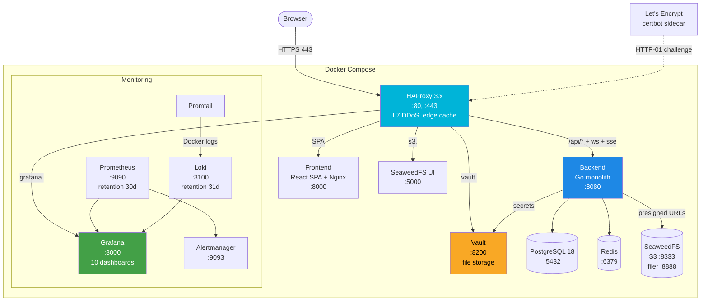
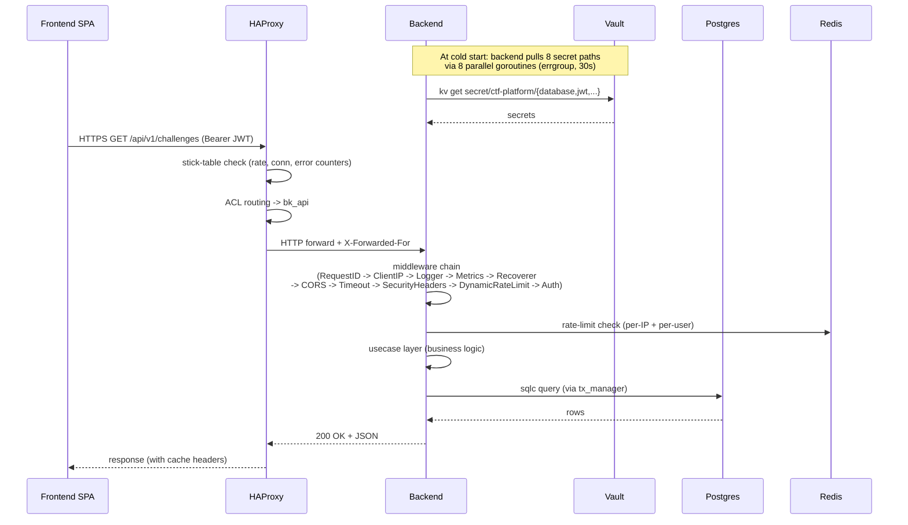
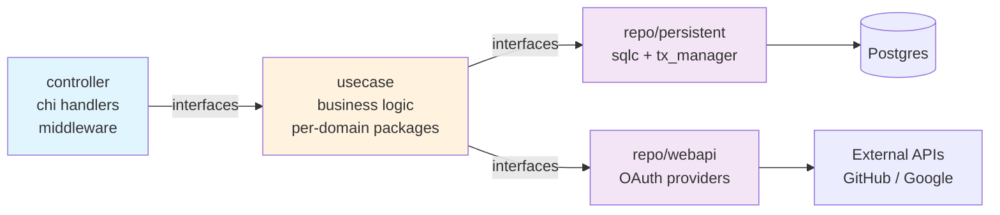
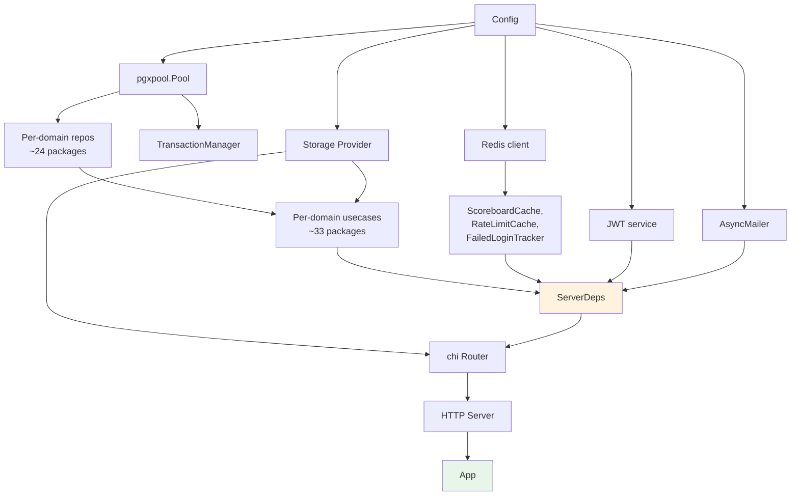
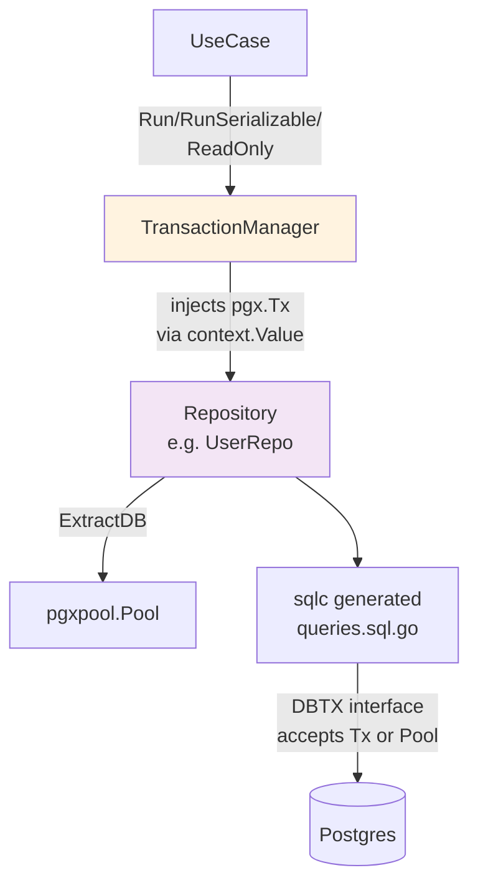
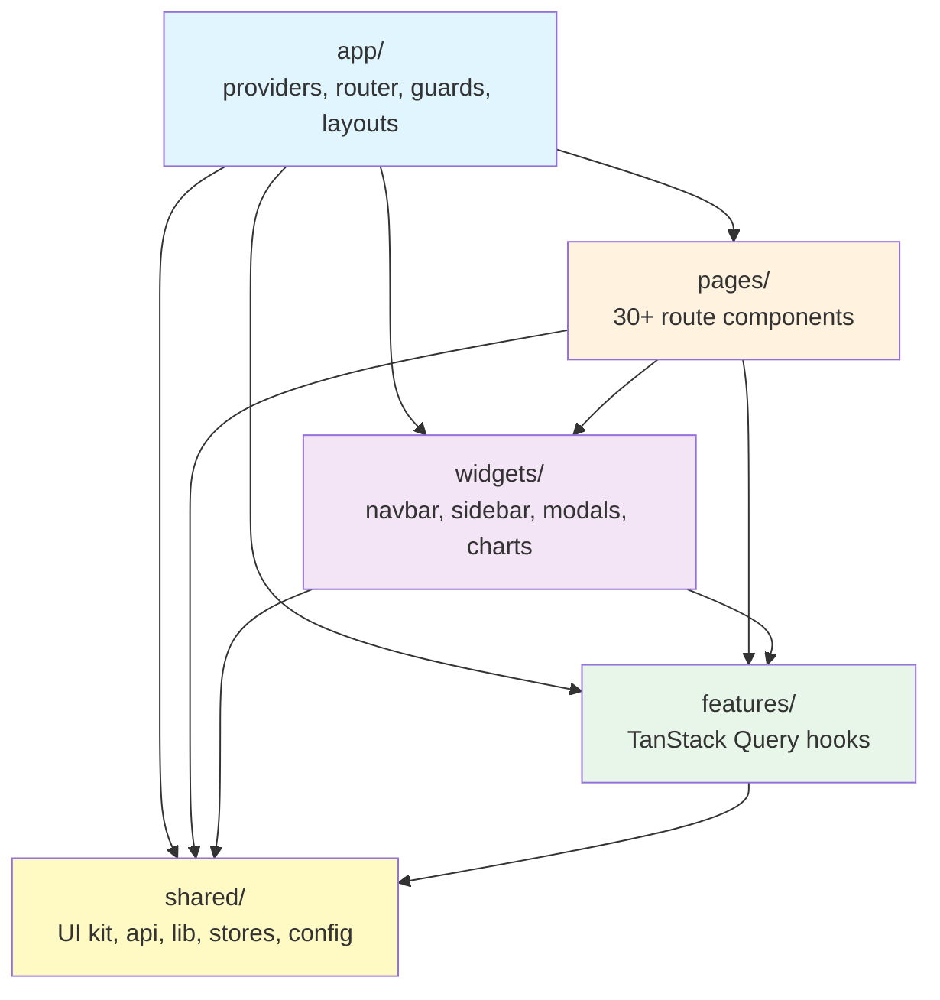
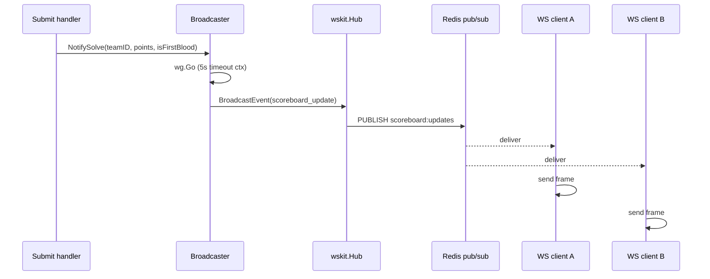

# Архитектура

> Читать на: [English](../en/ARCHITECTURE.md) · **Русский**

AstroCTFb - self-hosted CTF-платформа, состоящая из Go-монолита на backend, React 19 SPA на frontend и инфраструктурного стека (HAProxy, Vault, Postgres, Redis, SeaweedFS, Prometheus/Grafana/Loki). Этот документ описывает, как части системы связаны между собой: слои, зависимости, соглашения и жизненный цикл запроса.

---

## Содержание

- [Обзор системы](#system-overview)
- [Жизненный цикл запроса](#request-lifecycle)
- [Backend (Go 1.26)](#backend-go-126)
  - [Слои Clean Architecture](#clean-architecture-layers)
  - [Пакеты `internal/`](#internal-packages)
  - [Общие утилиты `pkg/`](#pkg-shared-utilities)
  - [Внедрение зависимостей (google/wire)](#dependency-injection-googlewire)
  - [Конфигурация](#configuration)
  - [Слой хранения данных](#persistence-layer)
  - [Соглашения](#conventions)
- [Frontend (React 19 + Vite + FSD)](#frontend-react-19--vite--fsd)
  - [Слои FSD](#fsd-layers)
  - [Роутинг](#routing)
  - [API client](#api-client)
  - [Управление состоянием](#state-management)
  - [WebSocket / SSE](#websocket--sse)
  - [Пайплайн сборки](#build-pipeline)
- [Инфраструктура](#infrastructure)
- [Сквозные аспекты](#cross-cutting-concerns)

---

<a id="system-overview"></a>

## Обзор системы



**Trust boundaries:**

- **Public:** HAProxy (`:80`, `:443`), certbot ACME challenge endpoint.
- **IP-restricted (admin):** `grafana.${DOMAIN}` и `s3.${DOMAIN}` - закрыты allowlist'ом `ADMIN_ALLOWED_IPS`.
- **IP-restricted (operator only):** `vault.${DOMAIN}` - закрыт `VAULT_ADMIN_IP`.
- **Intra-network:** весь трафик backend ↔ infrastructure идёт по Docker bridge `ctf_platform_network`. TLS внутри этой сети намеренно отключён.

---

<a id="request-lifecycle"></a>

## Жизненный цикл запроса

Типичный аутентифицированный API-запрос от SPA:



**Порядок middleware chain** (`internal/wire/providers_http.go:173–337`):

1. `RequestID` - генерирует уникальный X-Request-ID.
2. `ClientIP` - вычисляет реальный IP клиента из XFF (доверяет `TRUSTED_PROXY_CIDRS`).
3. `Logger` - структурированный request log.
4. `Metrics` - Prometheus RED histogram.
5. `Recoverer` - защита от panic.
6. `CORS` - включается, когда `CORS_ORIGINS` непустой (`allowCredentials`, `MaxAge 300`).
7. `Timeout` - 60 с, кроме `/ws` и `/sse`.
8. `SecurityHeaders` - строгий CSP для приложения, ослабленный для `/swagger/*`.
9. `DynamicRateLimit` - per-IP лимит, динамически настраиваемый через Redis-кэш настроек.
10. `Auth` - валидация Bearer JWT и заполнение user context.
11. `SetupRequired` - блокирует все не-`/setup` маршруты, пока не завершён first-run wizard.

---

<a id="backend-go-126"></a>

## Backend (Go 1.26)

<a id="clean-architecture-layers"></a>

### Слои Clean Architecture

Backend следует строгому разделению слоёв: зависимости всегда направлены внутрь (controller -> usecase -> repo). Перескакивать через слои нельзя: например, controller не должен трогать repo напрямую.



Интерфейсы определяются **со стороны потребителя**: usecase-пакеты объявляют repo-интерфейсы, которые реализует persistent layer. Это отделяет domain-логику от sql/Vault-реализаций и делает mocking тривиальным.

<a id="internal-packages"></a>

### Пакеты `internal/`

| Package                 | Files                                                                                                                                                                | Role                                                                                                                                                                                                                                                                 |
| ----------------------- | -------------------------------------------------------------------------------------------------------------------------------------------------------------------- | -------------------------------------------------------------------------------------------------------------------------------------------------------------------------------------------------------------------------------------------------------------------- |
| `app/`                  | `app.go`                                                                                                                                                             | Bootstrap приложения. `Run(cfg, l)` инициализирует pgx pool -> Redis -> goose migrations -> `reconcileSettings()` -> storage -> JWT (с Redis-based revocation) -> wskit.Hub -> AsyncMailer -> `wire.InitializeApp` -> seed -> oklog/run group (HTTP + signal cancel) |
| `apperr/`               | `user.go`, `challenge.go`, `team.go`, `competition.go`, `misc.go`, `validation.go`, …                                                                                | Около 80 sentinel errors, сгруппированных по доменам. Тип `ValidationError` для человекочитаемых bad-request сообщений                                                                                                                                               |
| `cache/`                | `key.go`, `redis.go`, `scoreboard.go`, `subscriber.go`                                                                                                               | Redis-абстракции. Константы ключей (`KeyScoreboard`, `KeyUser(id)` и т.д.), pub/sub на `scoreboard:updates`, freeze-aware invalidator scoreboard'а (`InvalidateWithFreezeAwareness`)                                                                                 |
| `controller/restapi/`   | `server.go`, `router.go`, `v1/*.go`, `errmap/`, `middleware/`                                                                                                        | chi handlers, middleware (auth, ratelimit, errmap, security headers), v1 endpoint'ы по доменам (`user.go`, `team.go`, `challenge.go` и т.д.)                                                                                                                         |
| `controller/websocket/` | `v1/controller.go`                                                                                                                                                   | WebSocket handler. Проверка Origin (`""` или `"*"` -> 403). Upgrade через `wskit.Accept`, отдельные goroutine на чтение и запись                                                                                                                                     |
| `domain/`               | `competition.go`, `challenge.go`, `user.go`, `team.go`, `settings.go`, `solve.go`, `config_registry.go`                                                              | Чистые domain-типы без инфраструктурных зависимостей. `OAuthOnlyPasswordSentinel = "__oauth_only__"`, enum `Role`, методы `IsSubmissionAllowed()`, `IsFreezeActive()`                                                                                                |
| `loginlockout/`         | `loginlockout.go`                                                                                                                                                    | Redis-backed трекер неудачных логинов. `IsLocked`, `RecordFailed` (INCR + TTL), `ClearFailed`. По умолчанию: максимум 5 попыток, TTL 1 минута                                                                                                                        |
| `openapi/`              | `openapi.yml`, `routes/*.yml`, `components/schemas/*.yml`, `*.gen.go`                                                                                                | Исходник OpenAPI 3.0 (27 route files + 27 schema files), собирается через redocly. oapi-codegen генерирует `server.gen.go`, `types.gen.go`, `client.gen.go`, `spec.gen.go`                                                                                           |
| `repo/persistent/`      | `tx_manager.go`, `helper.go`, `*_postgres.go`, `sqlc/*`                                                                                                              | PostgreSQL repo через pgx + sqlc. `tx_manager.Run` / `RunSerializable` (retry по SQLSTATE 40001), generic `GetOrNotFound[T]`, advisory locks                                                                                                                         |
| `repo/webapi/`          | `client*.go`, `*_oauth.go`, `oauth_gateway.go`, `contract.go`                                                                                                        | HTTP-адаптеры для OAuth provider'ов, реализуют OAuth provider ports за явными client timeouts и retry policy                                                                                                                                                           |
| `scoring/`              | `scoring.go`, `recalc.go`                                                                                                                                            | Алгоритмы dynamic scoring: `CalculateDynamicScore` (logarithmic decay), `CalculateLinearDynamicScore`, `RecalculatePoints`, `FilterSolvesByFreeze`, `DefaultSolveMapper`                                                                                             |
| `seed/`                 | `admin.go`                                                                                                                                                           | Идемпотентное создание дефолтного администратора при старте                                                                                                                                                                                                          |
| `storage/`              | `contract.go`, `s3.go`, `filesystem.go`                                                                                                                              | Интерфейс `Provider` для хранилища. `S3Provider` (minio-go, без retry на Upload, но с backoff для `GetPresignedURL`), `FilesystemProvider` для dev                                                                                                                   |
| `usecase/`              | `user/`, `team/`, `challenge/`, `competition/`, `settings/`, `email/`, `notification/`, `avatar/`, `backup/`, `page/`, `setup/`, `cacheutil/`, `computil/`, `guard/` | Бизнес-логика. Один пакет на домен. Вспомогательные cross-cutting пакеты: `cacheutil` (invalidations), `computil` (вывод состояния соревнования), `guard` (проверки eligibility)                                                                                     |
| `websocket/`            | `broadcaster.go`, `event.go`                                                                                                                                         | Типы событий и `Broadcaster` (обёртка над `wskit.Hub`). Асинхронная dispatch-логика через `wg.Go(...)` с timeout контекста 5 с. `NotifySolve` шлёт `scoreboard_update` и, при необходимости, `first_blood`                                                           |
| `wire/`                 | `providers*.go`, `wire_gen.go`, `sets.go`, `wire.go`                                                                                                                 | dependency injection через google/wire, сгруппированный по repo, usecase, HTTP, OAuth, storage, cache и runtime providers                                                                                                                                             |

<a id="pkg-shared-utilities"></a>

### Общие утилиты `pkg/`

| Package      | Role                                                                                                                                              |
| ------------ | ------------------------------------------------------------------------------------------------------------------------------------------------- |
| `crypto/`    | AES-256-GCM (encrypted regex flags), HMAC, secure random hex, нормализация ввода флага                                                            |
| `mailer/`    | Интеграция с Resend (`ResendMailer`) + `AsyncMailer` (buffered channel + worker pool)                                                             |
| `validator/` | Кастомные теги `go-playground/validator`: `strong_password`, `custom_email`, `team_name`, `challenge_*`, `hint_content`, `hex_color`, `page_slug` |
| `vault/`     | Обёртка над клиентом Vault, exponential backoff с детекцией permanent-error                                                                       |

<a id="dependency-injection-googlewire"></a>

### Внедрение зависимостей (google/wire)

Compile-time DI graph определён в `internal/wire/`. Сгенерированный `wire_gen.go` нужно обновлять через `make wire`; вручную generated DI code не редактируется.



Wire provider groups разделены по ответственности:

- `providers_repo.go` - repository providers и interface bindings.
- `providers_usecase_{user,team,challenge,competition,content,media}.go` - usecase constructors и domain-level bindings.
- `providers_http.go` - router, middleware chain, server и HTTP helpers.
- `providers_oauth.go`, `providers_storage.go`, `providers_cache.go`, `providers_runtime.go` - infrastructure-specific providers.
- `sets.go` - Wire sets (`RepoSet`, `UseCaseSet`, `InfraSet`, `HTTPSet`), которые собирают эти providers.

<a id="configuration"></a>

### Конфигурация

`backend/config/config.go` - единый pipeline `New()`:

1. Bootstrap logger (Info, ConsoleOutput).
2. `loadFromEnv` - godotenv из `.env` / `../.env` / `/app/.env`, затем `cleanenv.ReadEnv(&rawConfig)`. Разбирает comma-separated списки (`CORS_ORIGINS`, `TRUSTED_PROXY_CIDRS`, `METRICS_ALLOWED_IPS`).
3. Пересоздаёт logger с уровнем из `LOG_LEVEL`.
4. `loadFromVault` - контекст с timeout 30 с, `errgroup.WithContext`, **8 параллельных goroutine** для `secret/ctf-platform/{database,redis,jwt,resend,storage,app,admin,oauth}`. Запись в `raw` защищена mutex'ом. Ошибки логируются как warn и возвращают nil, то есть система деградирует мягко.
5. `validate(raw)` - кросс-полевые проверки: `FLAG_ENCRYPTION_KEY` должен быть ровно 64 hex-символа, JWT secrets не короче `jwtkit.MinSecretLength`, `OAUTH_STATE_SECRET` обязателен при включении любого OAuth client'а, `COMPETITION_MODE` должен входить в разрешённый set, `MIN_TEAM_SIZE ≤ MAX_TEAM_SIZE` и т.д.
6. `buildConfig(raw, l)` - собирает `*Config`. Postgres DSN строится через `url.URL`, а не конкатенацией строк. `SECURE_COOKIES` принудительно ставится в `true`, если `API_BASE_URL` начинается с `https://`.

JWT key rotation: env-переменные `JWT_ACCESS_KEYS` и `JWT_REFRESH_KEYS` принимают JSON-массив вида `[{"kid":"0","secret":"..."}]`. Если они не заданы, основной секрет заворачивается как `kid="0"`. `JWT_DOWNLOAD_SECRET` при отсутствии выводится через HMAC из access secret.

<a id="persistence-layer"></a>

### Слой хранения данных



Ключевые элементы:

- **`tx_manager.Run`** (ReadCommitted, ReadWrite). Если в context уже есть `pgx.Tx` (ключ `txKey{}`), он переиспользуется без вложенной транзакции. Иначе открывается новый tx с panic-safe rollback в defer; для rollback используется `context.WithoutCancel(ctx)`, чтобы отмена контекста не мешала rollback.
- **`tx_manager.RunSerializable`** (Serializable). До 3 повторов на SQLSTATE `40001`. Jitter: `cryptoRandN(10ms) + attempt * 5ms` для защиты от thundering herd через `crypto/rand`.
- **`tx_manager.ReadOnly`** (ReadCommitted, ReadOnly). Используется для scoreboard и statistics-запросов.
- **`GetOrNotFound[T]`** (`helper.go:23`) - generic helper, который мапит `pgx.ErrNoRows` в доменную not-found ошибку. Используется почти в каждом `Get*` repo method.
- **Advisory locks** (`pg_advisory_xact_lock`):
  - регистрация по email + username (FNV-1a hash, детерминированный порядок);
  - OAuth registration (по той же схеме);
  - проверка max-teams (ключ `0x4354467465616D73`);
  - max-attempts на сабмит (per teamID + challengeID).
- **sqlc** генерирует `models.go`, `db.go` и `*.sql.go` из `backend/queries/*.sql`. Интерфейс `DBTX` принимает и `pgxpool.Pool`, и `pgx.Tx`, поэтому один и тот же generated code работает и в транзакции, и вне её.

Миграции: 3 SQL-файла в `backend/migrations/`, которыми управляет goose. `000001_init.sql` создаёт всю схему (33+ таблиц), `000002_indexes.sql` добавляет btree + GIN индексы, `000003_seed.sql` заполняет `competition`, `app_settings` и 35 строк в `configs` (имя CTF, theme, scoring policy, mail templates, social/legal links, advanced settings).

<a id="conventions"></a>

### Соглашения

- **Формат ошибок:** `"Layer - Method - Step: %w"` (если есть receiver) и `"FuncName - Step: %w"` (для standalone-функций). Ошибки оборачиваются через `fmt.Errorf` и проверяются через `errors.Is` / `errors.As`.
- **Маппинг ошибок:** `errmap.MapAppError` (`controller/restapi/errmap/errmap.go:210`) сначала пытается `errors.As(*httperr.HTTPError)` (pass-through), затем `*ValidationError` -> 400 `VALIDATION_ERROR`, потом O(1) lookup в `table[err]`, затем O(n) `errors.Is` scan и в конце 500 `INTERNAL_ERROR`.
- **`context.Context` всегда первым параметром** и прокидывается через все слои.
- **`context.WithoutCancel(ctx)`** используется для post-commit операций (например, JWT revocation после password reset или profile lookup внутри singleflight body).
- **bcrypt под semaphore** с ёмкостью `runtime.NumCPU()*2` (минимум 2), чтобы пики login/register не выедали CPU целиком.
- **Защита от утечек goroutine:** везде `defer rows.Close()`, `defer resp.Body.Close()`, корректный drain WaitGroup при shutdown.
- **Singleflight** на cacheable read path'ах: 8 инстансов в `ChallengeUseCase`, `UserUseCase`, `SolveUseCase`, `CompetitionParamUseCase`. Это убирает thundering herd при истечении кэша.
- **errgroup** для параллельного I/O: 8 Vault fetch'ей, параллельные запросы user/team/solve/award в `GetMyTeam` и `GetProfile`.

### Наблюдаемость

| Concern                                     | Implementation                                                                                                                |
| ------------------------------------------- | ----------------------------------------------------------------------------------------------------------------------------- |
| HTTP RED metrics (rate / errors / duration) | `kitMiddleware.Metrics(prometheus.DefaultRegisterer, ...)` с per-route histogram                                              |
| Custom counters                             | `rate_limit_redis_errors_total{limiter}`, `tracking_dropped_total`                                                            |
| Structured logging                          | `go-logkit` (обёртка над slog). JSON output при `STRUCTURED_LOGGER=true`, поля через `logkit.Fields{}`                        |
| Endpoint `/metrics`                         | `promhttp.HandlerFor` с OpenMetrics, закрыт через `METRICS_ALLOWED_IPS`                                                       |

### Submission logging

Логирование отправок флага остается синхронным через `SubmissionUseCase`, чтобы проверки max-attempt, создание solve и инвалидация scoreboard оставались в одном явном request flow.

### Cleanup binary

`backend/cmd/cleanup/main.go` - отдельный one-shot executable, а не daemon. Вызывается из cron (`/etc/cron.d/ctf-platform-cleanup`, ежедневно в 02:00). Делает:

1. Удаление soft-deleted команд старше 30 дней.
2. Удаление orphaned S3-файлов (`tasks/` prefix без записи в БД).
3. Удаление orphaned avatar-файлов (`users/`, `teams/` prefixes).
4. Удаление строк `tracking` и `challenge_opens` старше 90 дней.

Использует тот же pipeline `config.New()`, что и основное приложение.

---

<a id="frontend-react-19--vite--fsd"></a>

## Frontend (React 19 + Vite + FSD)

<a id="fsd-layers"></a>

### Слои FSD



Контроль границ слоёв: `eslint-plugin-boundaries` (`eslint.config.js:36-49`) считает upward imports ошибкой. Path alias `@/` указывает на `src/`.

| Layer       | Notes                                                                                                                                                                                                                                                                                             |
| ----------- | ------------------------------------------------------------------------------------------------------------------------------------------------------------------------------------------------------------------------------------------------------------------------------------------------- |
| `app/`      | `main.tsx` (entry) -> `<ErrorBoundary><Toaster/><QueryProvider><AppRouter/></QueryProvider></ErrorBoundary>`. Перед рендером вызывает `useAuthStore.getState().hydrate()` и `subscribeWsEvents()`. Здесь лежат providers (`QueryProvider`), router (`router/index.tsx`), 5 guard'ов и 5 layout'ов |
| `pages/`    | 30+ route-компонентов, каждый как `export function XxxPage()`, все lazy-loaded через `lazy()`. Группы: auth, competition, team, users, static, setup, banned, errors (4 codes), admin (18 pages)                                                                                                  |
| `widgets/`  | 7 composition-widget'ов: `navbar`, `sidebar/AdminSidebar`, `challenge-modal/ChallengeModal` (6 tabs), `competition-banner` (status bar), `scoreboard-graph` (ECharts, lazy), `admin-charts` (5 ECharts в одном файле, lazy), `footer`                                                             |
| `features/` | Только TanStack Query hooks, без UI и без Zustand. Один файл на feature: `useChallenges`, `useFlagSubmit` (state machine), `useHintUnlock`, `useMyTeam`, `useAppeal`, `useCompetitionStatus`, `useScoreboard`, `useNotifications`, `useTeams`, `useUsers`, `useCompleteSetup` и т.д.              |
| `entities/` | **Отдельного слоя нет.** Domain-типы приходят напрямую из `shared/api/schema.d.ts` (автогенерация из OpenAPI) и при необходимости реэкспортируются из features                                                                                                                                    |
| `shared/`   | UI kit (22 компонента), api (`openapi-fetch` + middleware), libs (utils, hooks, validation), stores (3 vanilla Zustand store), config (`env.ts`)                                                                                                                                                  |

<a id="routing"></a>

### Роутинг

Используется `react-router v7` Data Router. Все нетривиальные маршруты обёрнуты в guard'ы:

| Guard                | Condition                                          | Redirect                             |
| -------------------- | -------------------------------------------------- | ------------------------------------ |
| `SetupGuard`         | `setup_complete !== true`                          | -> `/setup`                          |
| `SetupCompleteGuard` | `setup_complete === true` (только на `/setup`)     | -> `/admin`                          |
| `GuestGuard`         | `isAuthenticated`                                  | -> `/challenges`                     |
| `AuthGuard`          | `!isAuthenticated` (или `isBanned && !on /banned`) | -> `/login` (сохраняет `state.from`) |
| `AdminGuard`         | `!isAdmin`                                         | inline 403 page                      |
| `TeamGuard`          | `!user?.team_id`                                   | -> `/team/enroll`                    |

Все guard'ы рендерят `<Spinner size="lg">`, пока `hydrating === true`, чтобы избежать flash-of-redirect.

Lazy loading: каждая страница описывается как `lazy(() => import(...).then(m => ({default: m.XxxPage})))`. Suspense boundary в `<Routes>` рендерит центрированный `<PageFallback>`.

URL-driven модалки: маршрут `/challenges/:id` открывает `<ChallengeModal>`, а закрытие переводит назад на `/challenges` с `replace: true`.

<a id="api-client"></a>

### API client

`shared/api/client.ts` - типизированный клиент `openapi-fetch` v0.17 через `paths` из автогенерированного `schema.d.ts`.

Есть два клиента:

- `baseClient` - без auth middleware, используется для `/auth/refresh` и `/auth/logout`.
- `api` - со `authMiddleware`, используется везде остальном.

`authMiddleware`:

- `onRequest` клонирует исходный `Request` (`WeakMap<Request, Request>`) **до** fetch и добавляет `Authorization: Bearer <token>`.
- `onResponse` на 401 при активной сессии запускает `doRefresh()` (singleflight через module-level `refreshPromise`). При успехе повторяет запрос через сохранённую копию (сырым `fetch`, мимо middleware, чтобы не закольцеваться). При провале возвращает response с внедрённым `__httpStatus: 401`.
- Для всех не-401 (или 401 без сессии) response возвращается с вшитым `__httpStatus` в JSON body через `withEmbeddedStatus`.

`extractStatus(error)` (`QueryProvider.tsx:12-22`) читает `error.__httpStatus`. Благодаря этому любой consumer знает HTTP-статус без ручной распаковки `Response`.

Генерация схемы: `scripts/codegen.sh` выполняет `make openapi-bundle` (backend redocly) -> `bunx openapi-typescript backend/.../openapi.yaml -o src/shared/api/schema.d.ts`.

<a id="state-management"></a>

### Управление состоянием

**TanStack Query** - единственный источник истины для server state.

`QueryProvider.tsx:25-62` настраивает глобальную обработку ошибок:

- `QueryCache.onError`: если `extractStatus(err) === 401`, вызывает `useAuthStore.getState().logout()`.
- `defaultOptions.queries.retry`: нет повторов на 4xx, до 3 повторов на 5xx/network.
- `defaultOptions.queries.staleTime`: 30 с по умолчанию. Preset'ы: `live: 30 s`, `user: 60 s`, `static: 10 min`.
- `defaultOptions.queries.refetchOnWindowFocus`: `false`.
- `defaultOptions.mutations.onError`: 401 -> `logout()`.

Соглашение по QueryKey: `['challenges', tagId|'all']`, `['challenge', id]`, `['my-team']`, `['scoreboard', bracketId|'all']`, `['notifications', 'personal'|'global']`, `['competition-status']` и т.д.

**Zustand** (vanilla, без `persist` middleware):

| Store       | State                                                                        |
| ----------- | ---------------------------------------------------------------------------- |
| `authStore` | `user`, `accessToken`, `isAdmin`, `isAuthenticated`, `isBanned`, `hydrating` |
| `wsStore`   | `connected`, `lastEvent`, `reconnectAttempt`, `usingSse`                     |
| `uiStore`   | `sidebarCollapsed`, `mobileMenuOpen`                                         |

Persistence реализован вручную через httpOnly refresh-cookie и `localStorage` flag `ctf_has_session`. `logout()` асинхронный: POST `/auth/logout` (best-effort) -> `queryClient.clear()` (через dynamic import, чтобы не получить circular dependency) -> сброс состояния.

Регистрация token store использует dependency injection (`registerTokenStore` в `client.ts:30-35`) и тем самым избегает circular import между `client.ts` и `authStore.ts`.

<a id="websocket--sse"></a>

### WebSocket / SSE

`shared/stores/wsStore.ts`:

| Constant                 | Value |
| ------------------------ | ----- |
| `BASE_DELAY_MS`          | 1000  |
| `MAX_DELAY_MS`           | 30000 |
| `SSE_FALLBACK_THRESHOLD` | 3     |
| `MAX_WS_ATTEMPTS`        | 10    |

Reconnect backoff: `min(BASE * 2^attempt, MAX)`.

JWT отправляется через `Sec-WebSocket-Protocol: ['bearer', token]`, а не в query string, чтобы не светить его в логах. После `SSE_FALLBACK_THRESHOLD` подряд провалов store переключается на SSE. Сам SSE реализован вручную через `fetch` + `ReadableStream`, а не через `EventSource`, потому что стандартный API не даёт передать кастомные auth-заголовки.

Флаг `wsHadOpen`: очищается перед `openSocket()`. Если `onclose` срабатывает до `onopen` на самой первой попытке (`attempt=0`), это трактуется как handshake rejection, и store немедленно вызывает `refreshTokens()` без backoff.

Ротация токена: `useAuthStore.subscribe` следит за `accessToken`. При изменении открытый сокет закрывается кодом 1001 (`'token refresh'`), а `reconnectAttempt` сбрасывается в 0, чтобы такой bounce не считался неудачей.

<a id="build-pipeline"></a>

### Пайплайн сборки

`frontend/board/Dockerfile` (multi-stage):

```text
oven/bun:1 (builder)
  bun install --frozen-lockfile
  ARG VITE_API_BASE_URL, VITE_WS_URL, VITE_SSE_URL, VITE_APP_NAME
  bun run build  (= tsc -b && vite build)

nginxinc/nginx-unprivileged:alpine (runner)
  COPY dist/ -> /usr/share/nginx/html
  COPY nginx.conf -> /etc/nginx/conf.d/default.conf
  EXPOSE 8000
```

Vite manual chunks для long-term caching: `vendor-react`, `vendor-router`, `vendor-query`, `vendor-ui`, `vendor-api`, `vendor-markdown`, `vendor-echarts`. Каждая страница уходит в свой lazy chunk.

Nginx раздаёт SPA на порту 8000 (unprivileged), проксирует `/api/`, `/api/v1/ws` (с WebSocket upgrade и timeout 3600 с), `/avatars/` на `backend:8080`. Выставляет строгие `CSP`, `HSTS`, `X-Frame-Options DENY`, `X-Content-Type-Options nosniff`.

Theme: только dark (cosmic palette). Tailwind v4 через блок `@theme {}` в `global.css`. Шрифты: Inter, Space Grotesk, JetBrains Mono.

Тесты: Vitest + `@testing-library/react` (~17 файлов), Playwright e2e (`e2e/specs`).

---

<a id="infrastructure"></a>

## Инфраструктура

| Service          | Image                                                      | Purpose                                                                                                          |
| ---------------- | ---------------------------------------------------------- | ---------------------------------------------------------------------------------------------------------------- |
| **HAProxy**      | `haproxy:3.2-alpine`                                       | TLS termination, L7 DDoS (4 stick table), edge cache (3 cache), routing по path + Host                           |
| **Vault**        | `hashicorp/vault:latest`                                   | Secret store (8 KV-v2 paths), file storage `/vault/file`, TLS off (только внутренняя сеть), `IPC_LOCK` для mlock |
| **Postgres**     | `postgres:18-alpine`                                       | `max_connections=400`, `shared_buffers=256MB`, `effective_cache_size=1GB`                                        |
| **Redis**        | `redis:alpine`                                             | `requirepass`, persistence включён                                                                               |
| **SeaweedFS**    | `chrislusf/seaweedfs:latest`                               | S3 gateway `:8333`, filer `:8888`, master `:9333`                                                                |
| **SeaweedFS UI** | собирается локально                                        | интерфейс управления                                                                                             |
| **Backend**      | собирается локально (Go 1.26)                              | сам монолит                                                                                                      |
| **Frontend**     | собирается локально (Bun + Nginx)                          | SPA                                                                                                              |
| **certbot**      | `certbot/certbot:v3.1.0` + socat                           | ACME, multi-SAN cert, hot-reload через HAProxy Runtime API                                                       |
| **Prometheus**   | `prom/prometheus:latest`                                   | метрики, retention 30d, 10 scrape jobs                                                                           |
| **Loki**         | `grafana/loki:latest` + busybox wget                       | агрегация логов, retention 31d                                                                                   |
| **Promtail**     | `grafana/promtail:latest`                                  | docker_sd -> Loki, pipeline по сервисам                                                                          |
| **Alertmanager** | `prom/alertmanager:latest`                                 | Telegram receiver template, inhibit rules                                                                        |
| **Grafana**      | `grafana/grafana:latest`                                   | 10 dashboard'ов в 6 папках (system / backend / postgres / redis / vault / seaweedfs)                             |
| **Exporters**    | postgres-exporter, redis-exporter, cAdvisor, node-exporter | per-source metrics                                                                                               |

Всего: 12 named volume'ов (postgres, redis, vault, prometheus, loki, promtail, grafana, seaweed, haproxy_certs, haproxy_runtime, certbot_data, certbot_webroot) и 1 bridge network `ctf_platform_network`.

Resource limits применяются к hot-path сервисам: postgres `2G/2.0CPU`, redis/backend/haproxy `512M`, с 1.0–2.0 CPU.

HAProxy stick table'ы (в памяти, 4 счётчика):

| Counter           | Window | Threshold                 | Action                  |
| ----------------- | ------ | ------------------------- | ----------------------- |
| `st_per_ip_rate`  | 60 s   | > 300 req/min             | HTTP 429                |
| `st_per_ip_conn`  | 10 s   | > 20 conns/10 s           | HTTP 429                |
| `st_per_ip_err`   | 30 s   | > 30 errors/30 s          | HTTP 403 (10 min block) |
| `st_submit_abuse` | 60 s   | > 30 req/min на `/submit` | HTTP 429                |

Edge cache'и: `short_cache` 64 MB (public API responses, 120 с), `avatar_cache` 128 MB (1 ч), `scoreboard_cache` 32 MB (5 с micro-cache).

Инициализация Vault полностью автоматизирована: `setup.sh` вызывает `vault operator init -key-shares=1 -key-threshold=1`, сохраняет JSON-вывод, пишет `UNSEAL_KEY` и `ROOT_TOKEN` в `.vault-keys` (chmod 600), выполняет unseal и запускает `init-vault.sh` внутри контейнера, чтобы заполнить все 8 secret path'ов. Полный lifecycle см. в [DEPLOYMENT.md](DEPLOYMENT.md).

---

<a id="cross-cutting-concerns"></a>

## Сквозные аспекты

### Безопасность

- TLS завершается в HAProxy через multi-SAN сертификат Let's Encrypt. Внутренний трафик намеренно не шифруется (single host, Docker bridge).
- HAProxy добавляет `X-Frame-Options: DENY`, `X-Content-Type-Options: nosniff`, `Strict-Transport-Security: max-age=63072000; includeSubDomains; preload`, `Referrer-Policy: strict-origin-when-cross-origin`, COOP, CORP, Permissions-Policy.
- На backend строгий CSP для app routes и более мягкий для `/swagger/*` и `/openapi.json`, потому что UI требует `unsafe-inline`.
- Для encrypted regex flags используется AES-256-GCM (`pkg/crypto/aes.go`). Формат wire: `[version_byte][nonce|ciphertext]`.
- Login lockout: 5 неудачных попыток в минуту на email (через Redis).
- Защита от timing-attack на логине: dummy bcrypt для отсутствующего пользователя и выравнивание длительности проверки до ≥75 ms.
- OAuth state подписывается HMAC и сравнивается constant-time.
- bcrypt под semaphore (`NumCPU * 2`) предотвращает CPU starvation.
- Advisory lock'и убирают гонки на уникальности и лимитах (регистрация, max teams, max submission attempts).

### Реальное время

`websocket/broadcaster.go` оборачивает `wskit.Hub`. Асинхронный dispatch:



События: `connected`, `scoreboard_update` (подтипы `solve`, `first_blood`), `notification` (c `level` ∈ info/warning/error/success).

### Тестирование

- **Integration tests** (`backend/integration-test/`) - testcontainers-go поднимает Postgres + SeaweedFS один раз на процесс (`sync.Once`), гоняет goose migrations и делает `TRUNCATE CASCADE` между тестами. Около 26 файлов, включая race-тесты на advisory-lock contention.
- **End-to-end tests** (`backend/e2e-test/`) - 45+ тестов против полного backend-стека (testcontainers Postgres + Redis). Вспомогательные хелперы лежат в `e2e-test/helper/`.
- **Load tests** (`backend/load-test/`) - vegeta-style. В `profile_test.go` отдельно отмечено, что load-tests несовместимы с `-race` (bcrypt даёт ~400× slowdown, testcontainers ещё ~5×).
- **Frontend** - Vitest + `@testing-library/react` (~17 unit/integration файлов). Playwright e2e в `frontend/board/e2e/specs`.

### Плавное завершение

`oklog/run` group в `app.go` управляет порядком shutdown:

1. `server.Shutdown(ctx)` с `cfg.ShutdownTimeout`.
2. `RatelimitAuditWG.Wait()` (timeout 5 с).
3. `AvatarUC.Wait()` - дождаться асинхронных avatar-операций.
4. `Broadcaster.Wait()` - дождаться in-flight WS dispatch.
5. `asyncMailer.Stop()` - слить email queue.
6. `SolveUseCase.StopLocalScoreboardCache()` - остановить ttlcache.

За end-user workflow'ами (регистрация, OAuth, отправка флага, scoreboard propagation, действия администратора) см. [WORKFLOW.md](WORKFLOW.md).
За конфигурационными значениями см. [ENVIRONMENT.md](ENVIRONMENT.md).
За деплоем и troubleshooting см. [DEPLOYMENT.md](DEPLOYMENT.md) и [MONITORING.md](MONITORING.md).
