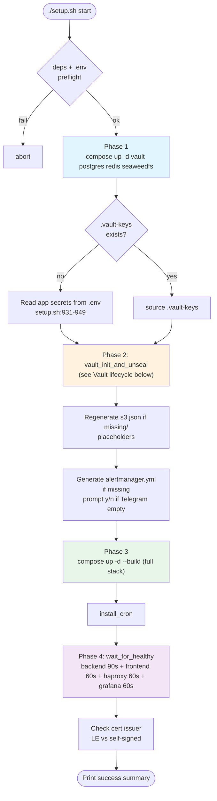
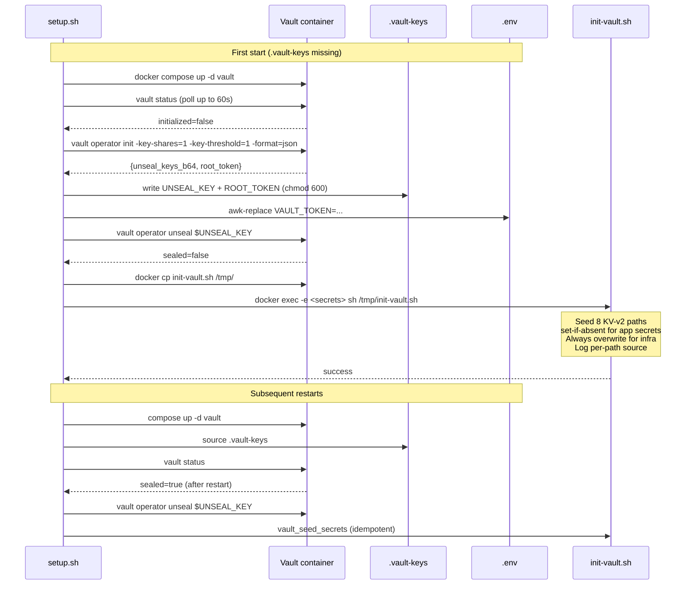

# Деплой

> Читать на: [English](../en/DEPLOYMENT.md) · **Русский**

Это операторский гайд по запуску AstroCTFb в production. Он покрывает предварительные требования, жизненный цикл `setup.sh`, инициализацию Vault, выпуск TLS, постдеплойную проверку, ротацию секретов, восстановление после аварий и диагностику проблем.

---

## Содержание

- [Предварительные требования](#prerequisites)
- [Домен и DNS](#domain--dns)
- [Внешние сервисы](#external-services)
- [Пошаговый деплой](#step-by-step-deploy)
- [Что делает `setup.sh start`](#what-setupsh-start-does)
- [Жизненный цикл Vault](#vault-lifecycle)
- [Жизненный цикл TLS](#tls-lifecycle)
- [Проверка после деплоя](#post-deploy-verification)
- [Управление сервисами](#service-management)
- [Управление секретами](#secrets-management)
- [Восстановление после аварий](#disaster-recovery)
- [Сброс / удаление](#reset--uninstall)
- [Cron-задача](#cron-job)
- [Диагностика проблем](#troubleshooting)

---

<a id="prerequisites"></a>

## Предварительные требования

### Сервер

| Resource   | Minimum             | Recommended              |
| ---------- | ------------------- | ------------------------ |
| OS         | Linux (kernel 5.x+) | Ubuntu 22.04 / Debian 12 |
| CPU        | 2 vCPU              | 4 vCPU                   |
| RAM        | 4 GB                | 8 GB                     |
| Disk       | 30 GB SSD           | 50 GB SSD                |
| Open ports | 80, 443 (inbound)   | + 22 SSH                 |

Платформа целиком работает в Docker, на хост ставится только runtime.

### Зависимости на хосте

```bash
sudo apt-get update
sudo apt-get install -y docker.io docker-compose-plugin jq openssl dnsutils
sudo systemctl enable --now docker
# If running as non-root, add yourself to the docker group:
sudo usermod -aG docker "$USER"
newgrp docker
```

`setup.sh` откажется продолжать без `docker`, `docker compose`, `jq`, `openssl` и `dig`.

---

<a id="domain--dns"></a>

## Домен и DNS

Нужен домен, которым вы управляете, и возможность добавлять DNS A-records.

**Пять A-record'ов** должны указывать на публичный IP сервера: Let's Encrypt выпускает один multi-SAN сертификат на все из них, и отсутствие хотя бы одного ломает весь запрос.

| Record                | Purpose                                          | Required        |
| --------------------- | ------------------------------------------------ | --------------- |
| `example.com`         | SPA frontend                                     | **Yes**         |
| `api.example.com`     | Backend REST API + WebSocket + SSE               | **Yes**         |
| `grafana.example.com` | Grafana (только для admin IP allowlist)          | **Yes** для TLS |
| `vault.example.com`   | Vault UI (только для операторов по IP allowlist) | **Yes** для TLS |
| `s3.example.com`      | SeaweedFS UI + public S3 endpoint                | **Yes** для TLS |

Проверьте распространение DNS до деплоя:

```bash
for sub in example.com api.example.com grafana.example.com vault.example.com s3.example.com; do
  echo -n "$sub -> "; dig +short @1.1.1.1 "$sub" | tail -n1
done
```

Wizard автоматически делает это через `check_dns_preflight` (`setup.sh:225`). Несовпадения дают предупреждение, но не блокируют запуск: дальше уже вы решаете, идти ли в bootstrap с self-signed сертификатом.

---

<a id="external-services"></a>

## Внешние сервисы

Все они опциональны, но в production обычно нужны.

### Resend (транзакционная почта)

Зарегистрируйтесь на [resend.com](https://resend.com), подтвердите свой sender-domain (`noreply@example.com`) и скопируйте API key. `RESEND_FROM_EMAIL` должен принадлежать именно этому verified domain, иначе Resend вернёт ошибку вида `domain is not verified`. Без этого регистрация не отправляет письма подтверждения, а reset password не работает.

### GitHub OAuth App

[https://github.com/settings/developers](https://github.com/settings/developers) -> **New OAuth App**. Authorization callback URL: `https://api.example.com/api/v1/auth/oauth/github/callback`. URL должен совпадать с `OAUTH_GITHUB_REDIRECT_URL` byte-for-byte. Скопируйте `Client ID` и `Client Secret`.

### Google OAuth

[Google Cloud Console](https://console.cloud.google.com/) -> **APIs & Services** -> **Credentials** -> **OAuth 2.0 Client IDs**. Authorized redirect URI: `https://api.example.com/api/v1/auth/oauth/google/callback`. URI должен совпадать с `OAUTH_GOOGLE_REDIRECT_URL` byte-for-byte, иначе получите `redirect_uri_mismatch`. Если OAuth consent screen находится в режиме **Testing**, добавьте свои аккаунты в **Test users**, иначе Google тоже завернёт логин. Скопируйте `Client ID` и `Client Secret`.

### Telegram bot (alerts)

Напишите [@BotFather](https://t.me/BotFather), выполните `/newbot`, сохраните token. Создайте группу или канал, добавьте туда бота, отправьте тестовое сообщение, затем:

```bash
curl "https://api.telegram.org/bot<TOKEN>/getUpdates" | jq '.result[].message.chat.id'
```

При upgrade группы в supergroup её `chat_id` меняется, поэтому если алерты перестали приходить, снова проверьте `getUpdates`.

---

<a id="step-by-step-deploy"></a>

## Пошаговый деплой

Есть два пути к работающей платформе: **интерактивный wizard** (`./setup.sh`) и **ручной путь через `.env` + `./setup.sh start`**. Оба в итоге приходят к одному и тому же `init-vault.sh` + `compose up` flow.

### Path A - interactive wizard

```bash
git clone https://github.com/TakuyaYagam1/AstroCTFb.git
cd AstroCTFb
./setup.sh
```

Если `.env` отсутствует, скрипт запускает wizard из 8 шагов:

| Step | What it asks                                                                |
| ---- | --------------------------------------------------------------------------- |
| 1/8  | Имя CTF-платформы (1–80 chars, обязателен ASCII letter/digit) + version     |
| 2/8  | Домен, ожидаемый public IP сервера для DNS-проверки, allowlist Vault UI (`VAULT_ADMIN_IP`, по умолчанию `127.0.0.1/32`), 4 admin-сабдомена, LE staging y/N |
| 3/8  | Postgres user / password (≥12 chars) / db name                              |
| 4/8  | Redis password (≥12 chars)                                                  |
| 5/8  | Admin username / email / password (≥12 chars, upper + lower + digit)        |
| 6/8  | SeaweedFS S3 access key (≥12) и secret key (≥16); `Enter` для auto-generate |
| 7/8  | Пароль администратора Grafana (≥12) + optional Telegram (token + chat_id)   |
| 8/8  | Resend (optional) + GitHub OAuth (optional) + Google OAuth (optional)       |

После подтверждения `setup.sh`:

1. Записывает `.env` (сохраняет комментарии и структуру через `env_set`).
2. Генерирует `deployment/seaweedfs/s3.json` из `s3.json.example`.
3. Генерирует `monitoring/alertmanager/alertmanager.yml` (с Telegram или null receiver).
4. Запускает `deploy_fresh` -> см. [Что делает `setup.sh start`](#what-setupsh-start-does).

### Path B - manual `.env`

Подходит для unattended-деплоя (CI, перенос `.env` со staging и т.п.):

```bash
git clone https://github.com/TakuyaYagam1/AstroCTFb.git
cd AstroCTFb
cp .env.example .env
chmod 600 .env
$EDITOR .env  # заполнить REQUIRED-блок, см. ENVIRONMENT.md
./setup.sh start
```

`do_start` (`setup.sh:919`) видит отсутствие `.vault-keys` и читает app-level секреты напрямую из `.env` (`setup.sh:931–949`) перед вызовом `init-vault.sh`. Семантика Vault `set-if-absent` гарантирует, что последующие рестарты не ротируют значения.

> **Обязательные поля для Path B:** см. [REQUIRED-блок в ENVIRONMENT.md](ENVIRONMENT.md#required--fill-before-first-start). Если пропустить хотя бы одно, `setup.sh start` упадёт: Postgres, Grafana и HAProxy жёстко требуют пароли через `:?` в compose.

Если хотите автогенерацию криптографических секретов, оставьте пустыми `FLAG_ENCRYPTION_KEY`, `JWT_*_SECRET`, `OAUTH_STATE_SECRET`, `ADMIN_PASSWORD` в `.env`: `init-vault.sh` сгенерирует их и залогирует источник по каждому пути (`[seeded from env]` против `[auto-generated]`). `SETUP_TOKEN` хранится только в `.env`; `setup.sh start` сгенерирует его автоматически, если поле пустое. При прохождении browser setup вставьте это значение в поле Setup token.

---

<a id="what-setupsh-start-does"></a>

## Что делает `setup.sh start`



Суммарное время первого деплоя: **3–8 минут**. Основная часть уходит на `docker build` для backend и frontend.

---

<a id="vault-lifecycle"></a>

## Жизненный цикл Vault

`vault_init_and_unseal` (`setup.sh:716–786`) и `init-vault.sh` (`deployment/docker/init-vault.sh`) закрывают весь lifecycle без ручного участия оператора: **вводить unseal key вручную не нужно**. Ключ генерируется самим Vault при первом init и сохраняется в `./.vault-keys`.



### 8 secret paths (KV v2, mount `secret/`)

| Path                    | Fields                                                                                                 | Sourced from                                                                             |
| ----------------------- | ------------------------------------------------------------------------------------------------------ | ---------------------------------------------------------------------------------------- |
| `ctf-platform/database` | `user`, `password`, `dbname`                                                                           | `POSTGRES_USER/PASSWORD/DB` (всегда перезаписываются)                                    |
| `ctf-platform/redis`    | `password`                                                                                             | `REDIS_PASSWORD` (всегда перезаписывается)                                               |
| `ctf-platform/storage`  | `access_key`, `secret_key`                                                                             | `SEAWEED_S3_ACCESS_KEY/SECRET_KEY` (всегда перезаписываются)                             |
| `ctf-platform/jwt`      | `access_secret`, `refresh_secret`                                                                      | `JWT_ACCESS_SECRET / JWT_REFRESH_SECRET` (set-if-absent, autogen 64 alnum)               |
| `ctf-platform/app`      | `flag_encryption_key`                                                                                  | `FLAG_ENCRYPTION_KEY` (set-if-absent, autogen 64 hex)                                    |
| `ctf-platform/resend`   | `api_key`                                                                                              | `RESEND_API_KEY` (set-if-absent, default `placeholder`)                                  |
| `ctf-platform/admin`    | `username`, `email`, `password`                                                                        | `ADMIN_USERNAME/EMAIL/PASSWORD` (set-if-absent, autogen 16 alnum, печатается один раз)   |
| `ctf-platform/oauth`    | `state_secret`, `github_client_id`, `github_client_secret`, `google_client_id`, `google_client_secret` | `OAUTH_*` (`state_secret` через set-if-absent, client ID/secret всегда перезаписываются) |

`init-vault.sh` на каждом запуске печатает лог по каждому пути:

```text
[seeded from env]    secret/ctf-platform/database
[seeded from env]    secret/ctf-platform/redis
[seeded from env]    secret/ctf-platform/storage
[updated from env]   secret/ctf-platform/jwt
[kept existing]      secret/ctf-platform/app
[auto-generated]     secret/ctf-platform/admin
                     admin password = aB3xK9mQp2N7vR5L   <-- WRITE THIS DOWN
[seeded from env]    secret/ctf-platform/oauth

Auto-generated paths (replace if you want your own values):
    secret/ctf-platform/admin   (change: ./setup.sh secrets edit)
```

Посмотреть путь:

```bash
docker exec -e VAULT_ADDR=http://127.0.0.1:8200 \
            -e VAULT_TOKEN=$(grep ^ROOT_TOKEN= .vault-keys | cut -d= -f2) \
  vault vault kv get secret/ctf-platform/admin
```

### `.vault-keys` - обязательно сделайте бэкап

Этот файл - **single point of failure** для всего состояния секретов платформы. Потеряете его -> после следующего рестарта контейнера Vault навсегда останется sealed -> не будет JWT signing key, не расшифруются флаги, восстановление невозможно.

```bash
# Сразу после первого деплоя:
scp user@server:/path/to/AstroCTFb/.vault-keys ~/secure-backup/vault-keys-$(date +%Y%m%d).txt
chmod 600 ~/secure-backup/vault-keys-*.txt
```

Храните файл вне сервера: в зашифрованном volume, 1Password, KeePass или аналогичном хранилище.

---

<a id="tls-lifecycle"></a>

## Жизненный цикл TLS

HAProxy завершает TLS на multi-SAN сертификате Let's Encrypt, покрывающем все 5 доменов. Certbot работает как sidecar: на первом старте он получает сертификат через HTTP-01 challenge (порт 80 -> HAProxy -> volume `certbot_webroot`), затем ставит его в HAProxy через Runtime API, без перезапуска HAProxy.

```text
HTTP-01 challenge flow:
  Client (Let's Encrypt) -> http://example.com/.well-known/acme-challenge/<token>
  -> HAProxy serves token from certbot_webroot volume
  -> certbot validates -> receives signed certificate
  -> renewal-hook.sh writes cert atomically + signals HAProxy via socat
  -> HAProxy hot-reloads cert (no downtime)
```

### Staging-first deploys (рекомендуется)

На самом первом деплое выставьте `USE_LE_STAGING=true` в `.env`. Staging-сертификаты браузер не доверяет, но они:

- Не расходуют production rate limit (5 duplicate certs/week).
- Почти идентичны по пути и формату, поэтому безопасны для проверки пайплайна.

После того как сайт открылся в браузере:

```bash
sed -i 's/^USE_LE_STAGING=true/USE_LE_STAGING=false/' .env
docker volume rm docker_certbot_data 2>/dev/null || true
docker compose --env-file .env -f deployment/docker/docker-compose.yml up -d --force-recreate certbot
docker logs certbot -f   # wait for "Successfully received certificate"
```

Hot-reload дойдёт примерно за 30 секунд; после этого можно обновить страницу и увидеть доверенный сертификат.

### Renewal

Certbot работает в цикле `sleep 12h ; certbot renew`. `renewal-hook.sh` (`/etc/letsencrypt/renewal-hooks/post/haproxy-reload.sh`) вызывается после успешного обновления:

1. Склеивает `fullchain.pem + privkey.pem` и пишет в `${PEM_FILE}.new` (chmod 600).
2. Отправляет `set ssl cert <path> << \n<payload>\n` и `commit ssl cert <path>` в HAProxy через `socat /var/run/haproxy/haproxy.sock`.
3. Атомарно переименовывает `${PEM_FILE}.new -> ${PEM_FILE}`.

Если Runtime API socket недоступен, сертификат всё равно оказывается на диске и HAProxy подхватит его при следующем рестарте.

### CDN-terminated TLS

Если перед платформой стоит Cloudflare / DDoS-Guard, выставьте `HAPROXY_BEHIND_CDN=true` и `TRUSTED_CDN_CIDRS=<cdn-ranges>`. В этом режиме HAProxy перестаёт слушать `:443` и доверяет `X-Forwarded-For` только от CDN-диапазонов. Certbot тут уже не нужен.

---

<a id="post-deploy-verification"></a>

## Проверка после деплоя

```bash
# 1. Все контейнеры запущены и healthy
docker compose --env-file .env -f deployment/docker/docker-compose.yml ps
# Expected: all "Up X minutes (healthy)"; alertmanager OK without Telegram

# 2. Vault распечатан
docker exec vault vault status
# Expected: Sealed: false, Initialized: true, HA Enabled: false

# 3. Все 8 secret paths засеяны
docker exec -e VAULT_ADDR=http://127.0.0.1:8200 \
            -e VAULT_TOKEN=$(grep ^ROOT_TOKEN= .vault-keys | cut -d= -f2) \
  vault vault kv list secret/ctf-platform/
# Keys: admin, app, database, jwt, oauth, redis, resend, storage

# 4. HTTP healthchecks
curl -kI https://api.example.com/api/v1/healthcheck   # 200 OK
curl -kI https://example.com                           # 200 OK

# 5. WebSocket
wscat -c wss://api.example.com/api/v1/ws \
  -H "Authorization: Bearer $TOKEN"                   # connected event

# 6. TLS issuer
docker compose -f deployment/docker/docker-compose.yml exec haproxy \
  openssl x509 -in /etc/haproxy/certs/example.com.pem -noout -issuer
# Expected after staging->prod swap: "Let's Encrypt"

# 7. В логах backend нет ERROR
./setup.sh logs | grep -E '(ERROR|FATAL)' | head
# (empty output is good)

# 8. Логин под админом
# Open https://example.com -> /login -> admin@example.com / <password from .env or .vault-keys>
```

---

<a id="service-management"></a>

## Управление сервисами

```bash
./setup.sh start         # запуск (auto-unseal + seed)
./setup.sh stop          # остановить все контейнеры
./setup.sh restart       # stop + start
./setup.sh status        # docker compose ps
./setup.sh logs          # tail backend logs (ctrl+C to exit)
./setup.sh reconfigure   # снова пройти wizard (Vault secrets сохраняются, .env бэкапится)
```

Без аргументов `./setup.sh` показывает интерактивное меню (если `.env` уже существует) или запускает wizard (если `.env` ещё нет).

---

<a id="secrets-management"></a>

## Управление секретами

| Command                          | Effect                                                                         | Requires confirmation           |
| -------------------------------- | ------------------------------------------------------------------------------ | ------------------------------- |
| `./setup.sh secrets edit`        | Интерактивное изменение admin password / Resend API key / OAuth client secrets | menu choice                     |
| `./setup.sh secrets rotate`      | Ротация JWT access+refresh и OAuth state                                       | ввести `ROTATE`                 |
| `./setup.sh secrets rotate-flag` | Ротация `FLAG_ENCRYPTION_KEY` - **уничтожает все encrypted regex flags**       | ввести `YES I ACCEPT DATA LOSS` |
| `./setup.sh secrets rotate-s3`   | Ротация SeaweedFS S3 credentials (краткий рестарт seaweedfs + backend)         | ввести `ROTATE`                 |

После ротации:

- `secrets edit` -> администратору нужно перелогиниться, если менялся пароль.
- `secrets rotate` -> **все пользователи разлогинятся** (refresh token'ы инвалидируются; OAuth state cookies тоже).
- `secrets rotate-flag` -> админам придётся заново ввести все regex-encrypted флаги.
- `secrets rotate-s3` -> backend прозрачно подхватит новые креды; reload seaweedfs делается автоматически.

Для non-secret конфига (rate limits, TTL, имя CTF из admin UI) правьте `.env` напрямую и делайте `./setup.sh restart`.

---

<a id="disaster-recovery"></a>

## Восстановление после аварий

| Scenario                                                       | Recovery                                                                                                                                                                                      |
| -------------------------------------------------------------- | --------------------------------------------------------------------------------------------------------------------------------------------------------------------------------------------- |
| Потеря `.vault-keys` после первого деплоя                      | Невосстановимо. `docker volume rm docker_vault_data` -> `./setup.sh start` (инициализация с нуля). Encrypted regex flags будут потеряны, админы должны ввести их заново                       |
| Потеря сервера, но есть `.vault-keys` + `.env` + dump Postgres | Поднимите новый сервер с тем же `DOMAIN`. `git clone`, `cp .env`, `cp .vault-keys`, `pg_restore`, `./setup.sh start`. Vault откроется тем же unseal key, backend привяжется к старым секретам |
| Повреждён Postgres                                             | Делайте ежедневный `pg_dump`. Восстановление: `docker compose down`, восстановить volume `postgres_data`, затем `up -d`                                                                       |
| Потерян volume SeaweedFS                                       | Потеряны файлы: аватары, uploads, challenge attachments. Если это критично, регулярно бэкапьте volume `seaweed_data`                                                                          |
| Скомпрометирован admin password                                | `./setup.sh secrets edit` -> choice 1 -> задать новый                                                                                                                                         |
| Скомпрометирован JWT secret                                    | `./setup.sh secrets rotate` -> все сессии инвалидируются                                                                                                                                      |
| Скомпрометирован flag encryption key                           | `./setup.sh secrets rotate-flag` -> все regex flags требуют повторного ввода                                                                                                                  |

> Планируйте ежедневный `pg_dump` и `tar czf` для `vault_data + seaweed_data + grafana_data`. Храните минимум 7 дней бэкапов вне сервера.

---

<a id="reset--uninstall"></a>

## Сброс / удаление

| Command                                           | What it deletes                                                    | Volumes preserved? | Data preserved? |
| ------------------------------------------------- | ------------------------------------------------------------------ | ------------------ | --------------- |
| `./setup.sh reset config`                         | `.env`, `.vault-keys`, `s3.json`, `alertmanager.yml`, `deploy.log` | Yes                | Yes             |
| `./setup.sh reset data` (type `WIPE DATA`)        | Всё выше + все docker volumes (DB, Vault, Grafana, LE certs)       | No                 | No              |
| `./setup.sh uninstall` (type `DELETE EVERYTHING`) | Всё выше + локально собранные образы + host cron                   | No                 | No              |

Используйте `reset config`, если хотите заново пройти wizard, но сохранить все данные. Используйте `reset data` для полного clean slate. `uninstall` полностью удаляет платформу с хоста.

---

<a id="cron-job"></a>

## Cron-задача

`install_cron` (`setup.sh:661`) ставит `/etc/cron.d/ctf-platform-cleanup` (root:root, 644) во время `setup.sh start`. Для автоматической установки нужен `EUID=0`; иначе скрипт печатает команду для ручного `sudo cp`.

```cron
# 02:00 - backend cleanup binary (orphaned files, old tracking, soft-deleted teams)
0 2 * * * root /usr/bin/docker exec backend /usr/local/bin/ctf-platform-cleanup >> /var/log/ctf-platform-cleanup.log 2>&1

# 03:00 - docker image prune
0 3 * * * root docker image prune -f --filter "until=168h" >> /var/log/docker-prune.log 2>&1
```

Cleanup binary (`backend/cmd/cleanup/main.go`) удаляет:

- Soft-deleted команды старше 30 дней.
- Осиротевшие S3-файлы (без записи в БД под `tasks/`).
- Осиротевшие avatar-файлы (`users/`, `teams/`).
- Строки `tracking` и `challenge_opens` старше 90 дней.

В GitLab CI `deploy:cron` выполняется отдельно (`/.gitlab-ci.yml:362`): `scp` binary + cron file -> `sudo install` -> `systemctl reload cron`.

Ручной запуск:

```bash
docker exec backend /usr/local/bin/ctf-platform-cleanup
```

---

<a id="troubleshooting"></a>

## Диагностика проблем

### Vault не инициализируется / не распечатывается

```bash
docker logs vault --tail 30
docker exec vault vault status
```

Типовые причины:

- **Конфликт по порту 8200:** что-то ещё слушает его.
- **Закончилось место на диске:** проверьте `df -BG /var/lib/docker`.
- **Есть старый `vault_data` от другого деплоя:** `setup.sh start` откажется повторно инициализировать Vault, если `.vault-keys` существует, а Vault считает `initialized=false` (например, volume удалили, а keys-файл оставили). Решение: удалить `.vault-keys` и запустить заново.
- **Потерян unseal key:** см. [Восстановление после аварий](#disaster-recovery).

### Backend-контейнер уходит в restart loop

```bash
docker logs backend --tail 50
```

Типовые причины:

- **Vault sealed:** `docker exec vault vault status` -> `Sealed: true`. `./setup.sh restart` заново выполнит unseal.
- **Postgres ещё не готов:** проверьте `docker logs postgres`; обычно решается сам в течение ~30 секунд после старта.
- **В Vault отсутствует секрет:** `init-vault.sh` по какой-то причине не завершился. Повторный `./setup.sh start` безопасен и идемпотентен.
- **Неверная длина `FLAG_ENCRYPTION_KEY`:** требуется ровно 64 hex-символа. Бэкенд падает fast-fail валидацией (`config.go:153`).

### SeaweedFS даёт 403 на S3-операциях

Креды в `s3.json` расходятся с теми, что лежат в Vault (`secret/ctf-platform/storage`).

```bash
cat deployment/seaweedfs/s3.json
docker exec vault vault kv get secret/ctf-platform/storage

# If they don't match: ./setup.sh start re-seeds Vault from .env.
# To regenerate s3.json: ./setup.sh reconfigure (or edit + restart seaweedfs).
```

### HAProxy: "certificate not found"

```bash
docker logs certbot --tail 30
```

Ищите ошибки ACME HTTP-01 challenge: DNS не указывает на сервер, закрыт порт 80 и т.п. После исправления:

```bash
docker compose --env-file .env -f deployment/docker/docker-compose.yml up -d --force-recreate certbot
```

Bootstrap self-signed сертификат позволяет HAProxy пережить этот этап, пока настоящий сертификат ещё не выпущен.

### HAProxy: ошибка валидации конфига

```bash
docker logs haproxy --tail 30
```

Entrypoint выполняет `haproxy -c -f haproxy.cfg -f /tmp/fe_main.cfg` (dry-run) перед запуском настоящего процесса. Ошибки печатаются на старте. Самый частый кейс: кривое env-подставленное значение, например IP со случайными пробелами в `ADMIN_ALLOWED_IPS`.

### Grafana not healthy

```bash
docker logs grafana --tail 20
```

Типовые причины:

- **Отсутствует `GRAFANA_ADMIN_PASSWORD`:** compose требует его через `:?` (`docker-compose.yml:558`).
- **Prometheus not healthy:** Grafana зависит от него; смотрите `docker logs prometheus`.

### "Server returned 429" сразу после деплоя

Stick-table'ы HAProxy разогреваются не мгновенно: интенсивное тестирование сразу после старта может сработать на rate limit. Таблицы очищаются сами за 2–10 минут, либо можно просто перезапустить `haproxy`.

### Cookie не сохраняется / login loop

Browser DevTools -> Application -> Cookies. Refresh-cookie должен быть выставлен на `*.example.com`, с флагами `httpOnly`, `Secure`, `SameSite=Strict`.

Если cookie не появляется:

- **Mixed-content blocked:** `API_BASE_URL` начинается с `https://...`, а SPA открыта по `http://...`.
- **`SECURE_COOKIES=true` + невалидный TLS:** браузер молча отбрасывает cookie. Сначала пройдите staging cert, затем обновите страницу после исправления TLS.

### Типичный timeline старта

```text
T+0s    ./setup.sh start
T+2s    vault container up
T+8s    vault status reachable
T+12s   unseal + seed (8 paths)
T+15s   compose up -d --build (full stack)
T+35s   postgres / redis / seaweedfs healthy
T+50s   backend healthy (Vault, DB, Redis connected)
T+70s   grafana healthy
T+80s   alertmanager / promtail / prometheus healthy
T+90s+  certbot starts ACME challenge (1–3 attempts × 60s)
```

Полный порядок разрешения env-переменных см. в [ENVIRONMENT.md](ENVIRONMENT.md). Мониторинг, алерты и dashboard'ы описаны в [MONITORING.md](MONITORING.md). Внутреннее устройство системы описано в [ARCHITECTURE.md](ARCHITECTURE.md).
