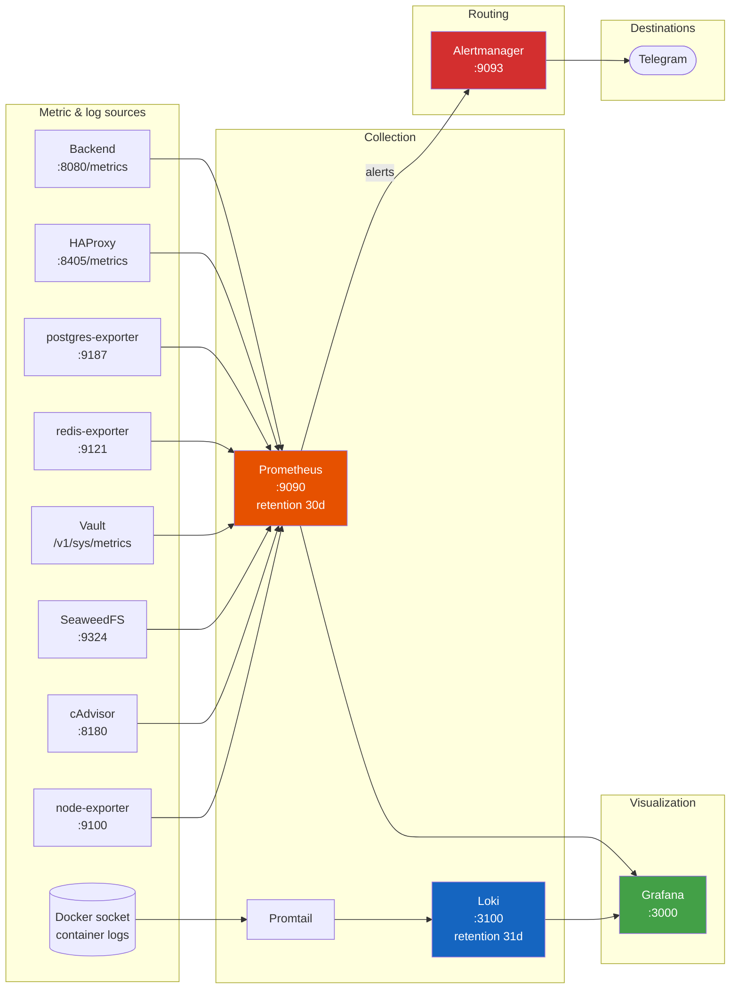

# Мониторинг

> Читать на: [English](../en/MONITORING.md) · **Русский**

Платформа поставляется с полным observability-стеком: Prometheus для метрик, Loki для логов, Promtail для доставки логов, Alertmanager для маршрутизации алертов и Grafana для визуализации. Все компоненты контейнеризованы, автопровиженятся и изолированы в bridge-сети `ctf_platform_network`.

---

## Содержание

- [Обзор](#overview)
- [Источники метрик](#metric-sources)
- [Prometheus](#prometheus)
- [Правила алертов](#alert-rules)
- [Alertmanager](#alertmanager)
- [Loki и Promtail](#loki--promtail)
- [Grafana](#grafana)
- [Доступ](#access)
- [Практики эксплуатации](#best-practices)

---

<a id="overview"></a>

## Обзор



**Retention по умолчанию:**

- Prometheus: 30 дней (`--storage.tsdb.retention.time=30d`).
- Loki: 31 день (`limits_config.retention_period: 744h`).

---

<a id="metric-sources"></a>

## Источники метрик

В `monitoring/prometheus/prometheus.yml` настроено 10 scrape-target'ов.

| Job                 | Target                   | Path                                | What it exposes                                                                                                                                                                              |
| ------------------- | ------------------------ | ----------------------------------- | -------------------------------------------------------------------------------------------------------------------------------------------------------------------------------------------- |
| `prometheus`        | `localhost:9090`         | `/metrics`                          | Собственные метрики Prometheus                                                                                                                                                               |
| `backend`           | `backend:8080`           | `/metrics`                          | HTTP RED histogram (`kitMiddleware.Metrics`), custom counters: `rate_limit_redis_errors_total{limiter}`, `submission_batcher_{dropped,flushed,flush_errors}_total`, `tracking_dropped_total` |
| `postgres-exporter` | `postgres-exporter:9187` | `/metrics`                          | `pg_up`, `pg_stat_activity_count`, `pg_stat_database_*`, deadlocks                                                                                                                           |
| `redis-exporter`    | `redis-exporter:9121`    | `/metrics`                          | `redis_up`, память, число ключей, hit ratio, ops/sec                                                                                                                                         |
| `vault`             | `vault:8200`             | `/v1/sys/metrics?format=prometheus` | `vault_core_unsealed`, audit, KV ops                                                                                                                                                         |
| `seaweedfs`         | `seaweedfs:9324`         | `/metrics`                          | volume ops, частота S3-запросов, число файлов                                                                                                                                                |
| `seaweedfs-ui`      | `seaweedfs-ui:5000`      | `/metrics`                          | placeholder для nginx                                                                                                                                                                        |
| `node-exporter`     | `node-exporter:9100`     | `/metrics`                          | host-level метрики: CPU, память, диск, сеть, filesystem                                                                                                                                      |
| `cadvisor`          | `cadvisor:8180`          | `/metrics`                          | per-container метрики: CPU, memory working-set, network, FS                                                                                                                                  |
| `haproxy`           | `haproxy:8405`           | `/metrics`                          | frontend/backend request rates, queue depths, размеры stick-table                                                                                                                            |

> Endpoint `/metrics` у бэкенда ограничен через `METRICS_ALLOWED_IPS` (по умолчанию пусто = deny all). Чтобы Prometheus мог его скрейпить, добавьте CIDR docker bridge, например `METRICS_ALLOWED_IPS=172.16.0.0/12`. Внутри compose это работает автоматически, потому что оба контейнера сидят в одной сети.

### Backend custom metrics

| Metric                                  | Type      | Labels                | Notes                                                           |
| --------------------------------------- | --------- | --------------------- | --------------------------------------------------------------- |
| `rate_limit_redis_errors_total`         | Counter   | `limiter`             | Ошибки Redis при rate-limit проверках (фолбэк идёт в in-memory) |
| `submission_batcher_dropped_total`      | Counter   | -                     | Сабмиты отброшены из-за переполненного буфера                   |
| `submission_batcher_flushed_total`      | Counter   | -                     | Сабмиты успешно сброшены                                        |
| `submission_batcher_flush_errors_total` | Counter   | -                     | Ошибки сброса                                                   |
| `tracking_dropped_total`                | Counter   | -                     | Tracking-события отброшены под нагрузкой                        |
| `http_requests_total`                   | Counter   | route, method, status | Стандартная RED-метрика                                         |
| `http_request_duration_seconds`         | Histogram | route, method, status | Стандартная RED-метрика                                         |

---

<a id="prometheus"></a>

## Prometheus

Конфигурация: `monitoring/prometheus/prometheus.yml`.

```yaml
global:
  scrape_interval: 15s
  evaluation_interval: 15s
  external_labels:
    monitor: ctf-platform

rule_files:
  - /etc/prometheus/alerts.yml

alerting:
  alertmanagers:
    - static_configs:
        - targets: ["alertmanager:9093"]
```

Хранилище:

- Volume: `prometheus_data` (named volume в compose).
- Path: `/prometheus`.
- Retention: 30 дней.
- Lifecycle API включён (`--web.enable-lifecycle`) - можно делать `curl -X POST http://prometheus:9090/-/reload`, чтобы перечитать rules без рестарта.

---

<a id="alert-rules"></a>

## Правила алертов

Определены в `monitoring/prometheus/alerts.yml` в группе `ctf_platform_alerts`. Всего **12 правил**:

| Alert                       | Expr                                                                                               | For  | Severity | Means                                               |
| --------------------------- | -------------------------------------------------------------------------------------------------- | ---- | -------- | --------------------------------------------------- |
| `InstanceDown`              | `up == 0`                                                                                          | 30 s | critical | Любой scrape-target недоступен                      |
| `HighCpuUsage`              | `sum(rate(container_cpu_usage_seconds_total{name!=""}[5m])) by (name) * 100 > 80`                  | 5 m  | warning  | Контейнер держит > 80% одного ядра 5 минут          |
| `HighMemoryUsage`           | `container_memory_working_set_bytes{name!=""} > 1.5e+9`                                            | 5 m  | warning  | Working set > 1.5 GB                                |
| `RedisDown`                 | `redis_up == 0`                                                                                    | 1 m  | critical | Redis exporter сообщает, что Redis недоступен       |
| `PostgreSQLDown`            | `pg_up == 0`                                                                                       | 1 m  | critical | Postgres exporter сообщает, что Postgres недоступен |
| `PostgreSQLHighConnections` | `pg_stat_activity_count > 300`                                                                     | 2 m  | warning  | > 300 из 400 max connections                        |
| `PostgreSQLDeadLocks`       | `increase(pg_stat_database_deadlocks[1m]) > 0`                                                     | 1 m  | warning  | Был хотя бы один deadlock за последнюю минуту       |
| `APIDown`                   | `up{job="backend"} == 0`                                                                           | 1 m  | critical | Бэкенд недоступен из Prometheus                     |
| `HighDiskUsage`             | `(node_filesystem_avail_bytes{mountpoint="/"} / node_filesystem_size_bytes{mountpoint="/"}) < 0.1` | 5 m  | critical | На root filesystem осталось < 10% места             |
| `HighHTTPErrorRate`         | `sum(rate(http_requests_total{status=~"5.."}[5m])) / sum(rate(http_requests_total[5m])) > 0.05`    | 2 m  | warning  | Доля 5xx > 5%                                       |
| `HighLatencyP95`            | `histogram_quantile(0.95, sum(rate(http_request_duration_seconds_bucket[5m])) by (le)) > 2`        | 5 m  | warning  | P95 latency > 2 s                                   |
| `VaultSealed`               | `vault_core_unsealed == 0`                                                                         | 1 m  | critical | Vault запечатан, бэкенд перестанет работать         |

Чтобы добавить свои правила, отредактируйте `monitoring/prometheus/alerts.yml` и перечитайте конфиг:

```bash
curl -X POST http://localhost:9090/-/reload
# или рестарт: docker compose restart prometheus
```

---

<a id="alertmanager"></a>

## Alertmanager

Конфигурация: `monitoring/alertmanager/alertmanager.yml` (генерируется `setup.sh` из `alertmanager.yml.example`).

```yaml
global:
  resolve_timeout: 5m

route:
  group_by: ["alertname"]
  group_wait: 30s
  group_interval: 5m
  repeat_interval: 4h
  receiver: "telegram-notifications"

inhibit_rules:
  - source_matchers: [alertname = "InstanceDown"]
    target_matchers: [severity = "critical"]
    equal: ["instance"]

receivers:
  - name: "telegram-notifications"
    telegram_configs:
      - bot_token: ${TELEGRAM_BOT_TOKEN}
        chat_id: ${TELEGRAM_CHAT_ID}
        parse_mode: HTML
        message: |
          <b>{{ .Status | toUpper }}</b>: {{ .GroupLabels.alertname }}
          {{ range .Alerts }}
          <b>Instance:</b> {{ .Labels.instance }}
          <b>Description:</b> {{ .Annotations.description }}
          {{ end }}
```

`docker-compose.yml:517` включает env-expansion (`--config.expand-env=true`), поэтому `${TELEGRAM_BOT_TOKEN}` и `${TELEGRAM_CHAT_ID}` подставляются на runtime из env контейнера.

### Inhibit rule

Когда для какого-то `instance` срабатывает `InstanceDown`, **все остальные critical-алерты** по тому же instance подавляются. Это не даёт заспамить Telegram шумом при полном падении сервиса.

### Null-receiver fallback

Если Telegram отключён (`TELEGRAM_BOT_TOKEN` пуст в `.env`), `setup.sh` записывает урезанный конфиг с null receiver:

```yaml
route:
  receiver: "null"
receivers:
  - name: "null"
```

Алерты всё равно остаются в Prometheus и видны в Grafana -> Alerting, но наружу ничего не уходит.

### Нюанс с Chat ID

Если Telegram-группа была upgraded до supergroup, её `chat_id` меняется и превращается в отрицательное 13-значное число. Если алерты перестали приходить:

```bash
curl "https://api.telegram.org/bot<TOKEN>/getUpdates" | jq '.result[].message.chat'
```

Обновите `TELEGRAM_CHAT_ID` в `.env` и выполните `./setup.sh restart`.

---

<a id="loki--promtail"></a>

## Loki и Promtail

### Loki

Конфигурация: `monitoring/loki/loki-config.yml`.

- HTTP: `:3100`, gRPC: `:9096`.
- Storage: filesystem (`/loki/chunks`, `/loki/rules`).
- Schema: `tsdb`, v13, период индекса 24h.
- Retention: 31 день (`744h`).
- Compactor включён, запускается каждые 10 минут.
- Ruler отправляет алерты в Alertmanager (`http://alertmanager:9093`).
- Auth отключён, только внутренняя сеть.

Образ Loki собирается из кастомного Dockerfile (`deployment/docker/loki.Dockerfile`):

```dockerfile
FROM busybox:1.37-musl AS busybox
FROM grafana/loki:latest
COPY --from=busybox /bin/busybox /usr/bin/wget
```

В базовом образе `grafana/loki` нет `wget`, который нужен healthcheck'у Docker. Multi-stage сборка копирует только бинарь `wget` из busybox и не раздувает образ.

### Promtail

Конфигурация: `monitoring/promtail/promtail-config.yml`.

- HTTP: `:9080`.
- Client: `http://loki:3100/loki/api/v1/push`.
- Positions file: `/data/positions.yaml` (сохраняется в `promtail_data` volume).
- Source: `docker_sd_configs` читает метаданные контейнеров через `/var/run/docker.sock` (refresh 5 с).

### Pipeline stages (по сервисам)

Логи каждого контейнера проходят через pipeline, специфичный для сервиса, который вытаскивает labels и переписывает строку лога:

| Service                     | Pipeline                                                      | Output labels        |
| --------------------------- | ------------------------------------------------------------- | -------------------- |
| `backend`                   | JSON parse -> extract `level`, `msg`, `trace_id`, `component` | `level`, `component` |
| `postgres`                  | regex parse формата логов PostgreSQL                          | `level`, `pid`       |
| `postgres-exporter`         | regex `level=(\w+) msg="([^"]*)"`                             | `level`              |
| `seaweedfs` / `seaweedfs-*` | regex `YYYY/MM/DD HH:MM:SS LEVEL message`                     | `level`              |

Все записи также получают стандартные relabel-label'ы: `container`, `stream`, `compose_service`, `container_id`.

### Поиск по логам

В Grafana -> Explore -> Loki:

```logql
{compose_service="backend"} |= "ERROR"
{compose_service="backend"} | json | level="error"
{compose_service="backend", component="usecase.user"} | json | line_format "{{.msg}}"
{compose_service=~"postgres.*"} | regex "deadlock"
```

---

<a id="grafana"></a>

## Grafana

Автопровиженится через `monitoring/grafana/provisioning/`.

### Datasources (`provisioning/datasources/datasources.yml`)

- **Prometheus** (uid: `prometheus`, default, proxy mode, `http://prometheus:9090`, `timeInterval: 15s`).
- **Loki** (uid: `loki`, proxy mode, `http://loki:3100`, `maxLines: 1000`).

### Dashboard provider (`provisioning/dashboards/dashboards.yml`)

Настроено 6 provider'ов с `disableDeletion: true`, `updateIntervalSeconds: 10`, `allowUiUpdates: false`. Файлы dashboard'ов читаются из `/var/lib/grafana/dashboards/<folder>/*.json`, которые монтируются с хоста через compose.

### Dashboards (10 файлов в 6 папках)

| Folder         | Dashboards                                                   | Source                                |
| -------------- | ------------------------------------------------------------ | ------------------------------------- |
| **System**     | `system-overview.json`, `node-exporter.json`, `haproxy.json` | host CPU/RAM/disk, статистика HAProxy |
| **Backend**    | `backend-metrics.json`, `backend-logs.json`                  | HTTP RED, Go runtime, error logs      |
| **PostgreSQL** | `postgresql-details.json`                                    | соединения, query stats, locks        |
| **Redis**      | `redis-overview.json`                                        | память, ops/sec, ключи, hit ratio     |
| **Vault**      | `vault-health.json`                                          | seal status, token ops, audit         |
| **SeaweedFS**  | `seaweedfs.json`, `seaweedfs-ui.json`                        | volume ops, S3 metrics                |

Чтобы добавить свой dashboard:

1. Положите JSON-файл в `monitoring/grafana/dashboards/<folder>/`.
2. Перезапустите Grafana: `docker compose restart grafana` или подождите 10 секунд до auto-reload.

### Login

- URL: `https://grafana.${DOMAIN}` (ограничен по admin IP) или SSH tunnel на `localhost:3000`.
- User: значение `GRAFANA_ADMIN_USER` (по умолчанию `admin`).
- Password: значение `GRAFANA_ADMIN_PASSWORD` (обязательно; без него контейнер не стартует).

`GF_USERS_ALLOW_SIGN_UP=false`, поэтому входить может только администратор. Для саппорт-команды создавайте read-only аккаунты через UI управления пользователями Grafana.

---

<a id="access"></a>

## Доступ

Админские сабдомены (`grafana.`, `s3.`, `vault.`) закрыты allowlist'ами IP на стороне HAProxy. Снаружи allowlist есть три варианта доступа:

### SSH tunnel (рекомендуется для эпизодического доступа)

```bash
# Grafana
ssh -L 3000:grafana:3000 user@server
# open http://localhost:3000

# Vault UI
ssh -L 8200:vault:8200 user@server
# open http://localhost:8200

# HAProxy stats
ssh -L 8405:haproxy:8405 user@server
# open http://localhost:8405/stats
```

### Добавить IP в allowlist

Отредактируйте `.env`:

```env
ADMIN_ALLOWED_IPS=10.0.0.0/8 172.16.0.0/12 192.168.0.0/16 127.0.0.1/32 203.0.113.42/32
VAULT_ADMIN_IP=203.0.113.42
```

После этого выполните `./setup.sh restart` (entrypoint HAProxy заново сгенерирует `admin_ips.txt` и `vault_ips.txt` при старте).

### CDN-only access

Если платформа стоит за Cloudflare Access или аналогом, можно перенести IP-ограничения на уровень CDN и ослабить их в HAProxy: выставить `ADMIN_ALLOWED_IPS` в диапазоны CDN и убедиться, что `HAPROXY_BEHIND_CDN=true`.

### HAProxy stats

Живой dashboard по frontend/backend в `:8405/stats`:

- Auth: `HAPROXY_STATS_USER` / `HAPROXY_STATS_PASSWORD`.
- Refresh: 5 с.
- Показывает размеры stick-table, request rates, queue depths и health бэкендов.

---

<a id="best-practices"></a>

## Практики эксплуатации

### Alert hygiene

- **Один Telegram-канал на одно окружение.** Не смешивайте dev и prod алерты.
- **Заглушайте шумные алерты во время инцидента.** Для planned maintenance используйте silences Alertmanager (UI на `:9093` через SSH tunnel).
- **Подгоняйте thresholds под свой масштаб.** `PostgreSQLHighConnections` на 300/400 может быть слишком высоким или слишком низким для вашего CTF.
- **Пишите runbook'и.** Если новый алерт сработал впервые, задокументируйте реакцию в `docs/runbooks/<alert-name>.md` (сейчас этот каталог не версионируется, но его стоит завести).

### Dashboards

- **Держите системные dashboards read-only.** Автопровиженинг с `allowUiUpdates: false` защищает от случайных правок; для экспериментов клонируйте dashboard в свою папку.
- **Ленивая работа с дорогими панелями.** Долгие интервалы на `histogram_quantile` могут грузить Prometheus; используйте `$__rate_interval` и избегайте `[1d]` на высококардинальных histogram'ах.

### Logs

- **Оставляйте structured logging в бэкенде.** `STRUCTURED_LOGGER=true` (по умолчанию) даёт JSON, из которого Promtail индексирует `level`, `component`, `trace_id`. Не переключайте prod на консольный вывод без причины.
- **Не логируйте high-cardinality поля как labels.** ID пользователей и команд допустимы в тексте события, но не как Loki labels, иначе производительность быстро деградирует.

### Capacity planning

- **Диск Prometheus:** около 3 GB в день при дефолтных scrape-интервалах этого стека. Для хранения 30 дней планируйте минимум 100 GB.
- **Диск Loki:** зависит от объёма логов. Бэкенд на INFO с structured logging даёт примерно 500 MB/день. SeaweedFS access logs могут быть заметно тяжелее.
- **Grafana:** по сути stateless, кроме пользовательских dashboard'ов и аккаунтов. Если делаете важные настройки через UI, бэкапьте volume `grafana_data`.

Полный список monitoring-переменных см. в [ENVIRONMENT.md](ENVIRONMENT.md). Операторские команды и порядок деплоя см. в [DEPLOYMENT.md](DEPLOYMENT.md).
