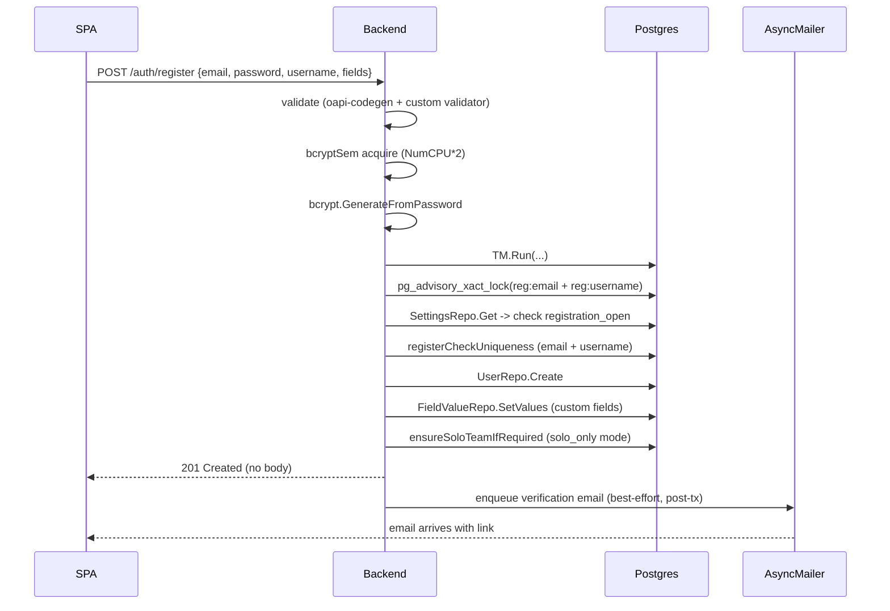
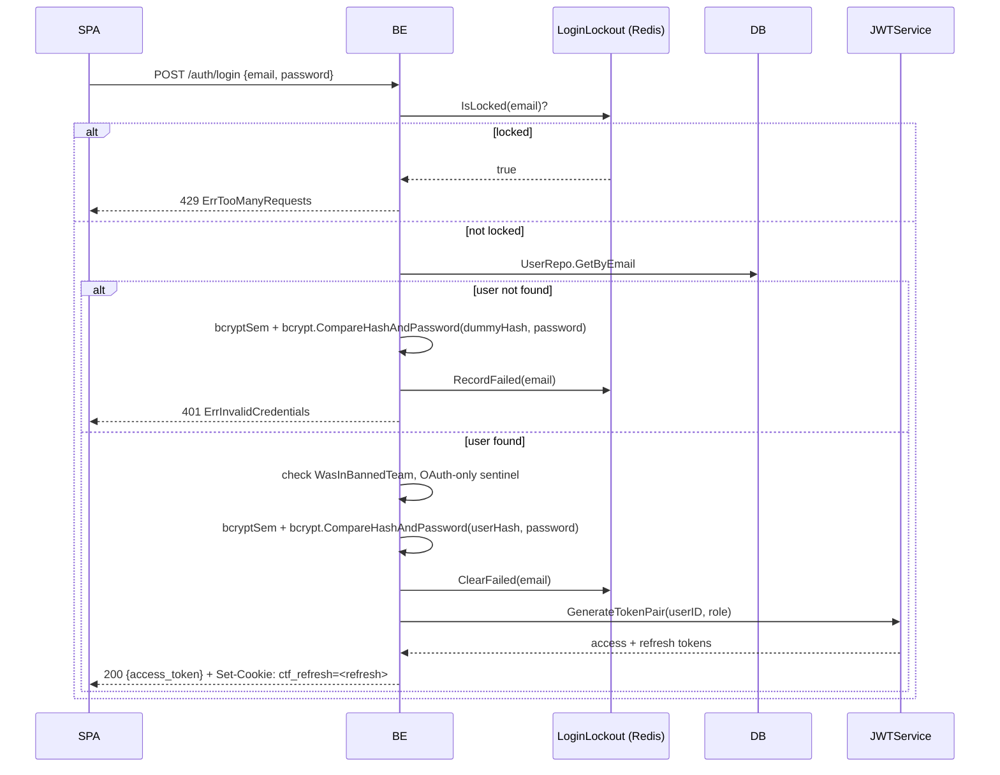
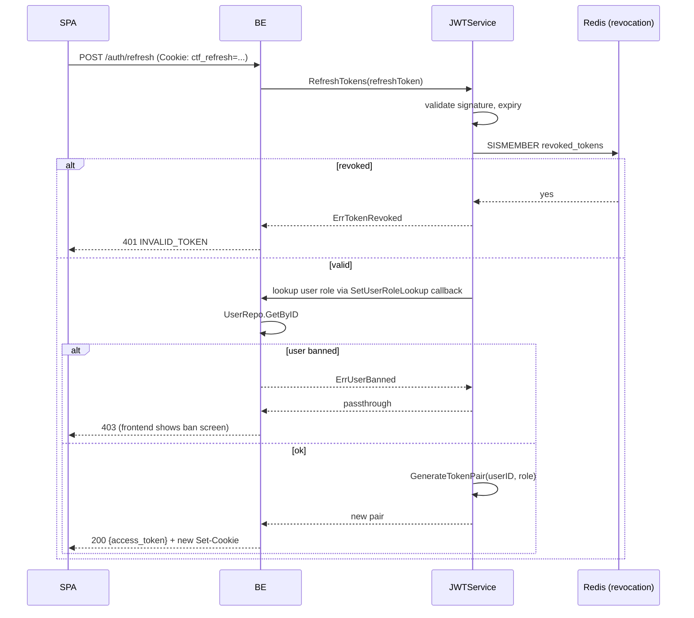
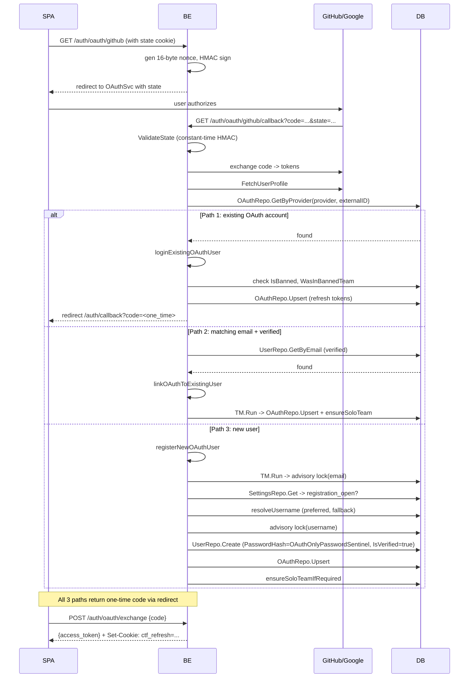
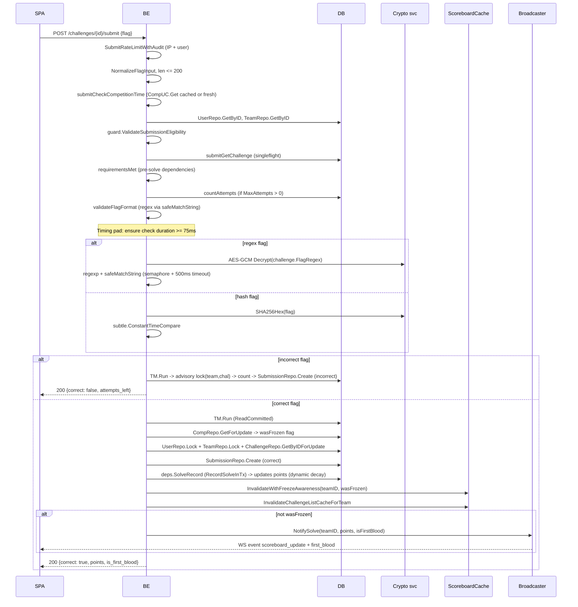
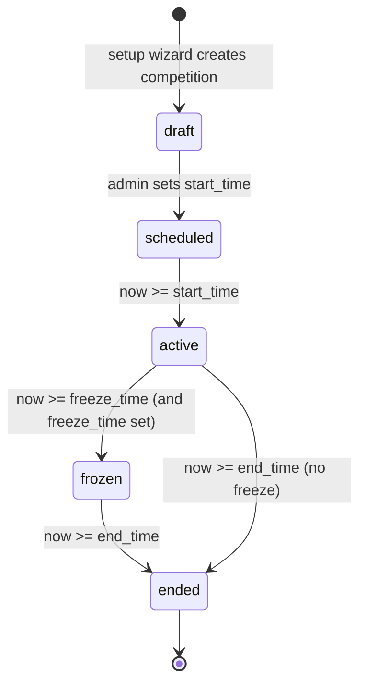
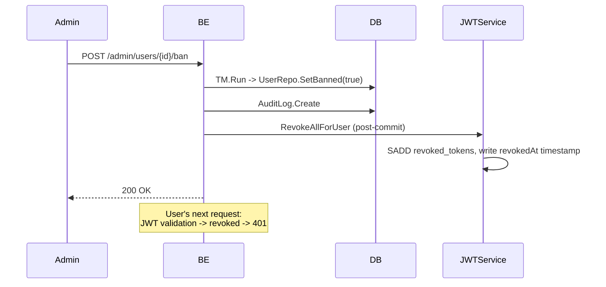
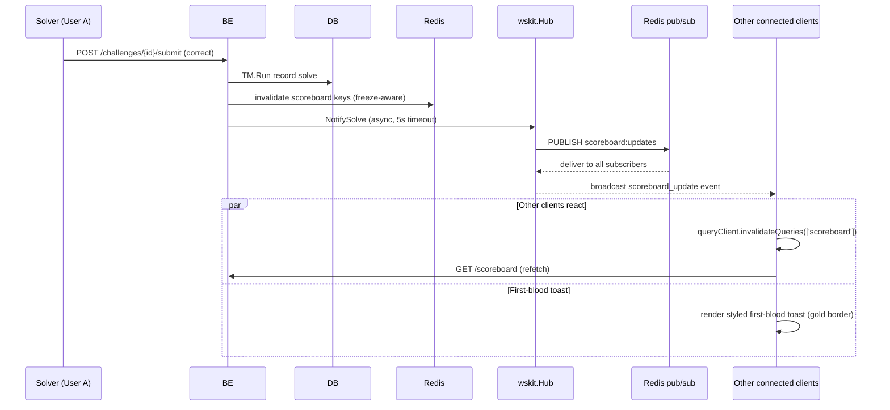

# Пользовательские флоу и справочник API

> Читать на: [English](../en/WORKFLOW.md) · **Русский**

Этот документ описывает пользовательские флоу (регистрация, OAuth, формирование команд, отправка флагов, распространение scoreboard, действия администратора) и HTTP/WebSocket API surface, которая за ними стоит. Sequence-диаграммы показывают путь от браузера через HAProxy и backend до PostgreSQL/Redis/Vault с привязкой к исходным файлам.

---

## Содержание

- [Карта API-маршрутов](#api-route-map)
- [Флоу аутентификации](#authentication-flows)
  - [Email-регистрация](#email-registration)
  - [Логин](#login)
  - [Refresh](#refresh)
  - [Logout](#logout)
  - [Сброс пароля](#password-reset)
  - [OAuth (3 пути)](#oauth-3-paths)
- [Флоу команд](#team-flows)
- [Флоу задач](#challenge-flows)
  - [Просмотр задач](#browse)
  - [Отправка флага](#flag-submission)
  - [Разблокировка подсказки](#hint-unlock)
  - [Скачивание файла](#file-download)
- [Жизненный цикл соревнования](#competition-lifecycle)
- [Административные флоу](#admin-flows)
- [Реальное время](#real-time)

---

<a id="api-route-map"></a>

## Карта API-маршрутов

Все API-маршруты смонтированы под `/api/v1`. Колонка Auth: **public** = без аутентификации, **user** = Bearer JWT, **admin** = Bearer JWT + роль admin. Rate limit применяется и на edge в HAProxy (stick tables), и в backend (`middleware/ratelimit.go`).

`challenge_visibility` и `account_visibility` не делают страницы задач, пользователей или команд доступными гостям: эти read-only endpoint'ы всегда требуют `user` auth, а visibility-настройки ограничивают уже аутентифицированных non-admin пользователей. `score_visibility` - отдельный публично-настраиваемый флоу: scoreboard/statistics могут быть доступны гостям при значении `public`.

### Auth

| Method | Path                              | Auth                            | Backing usecase                                 |
| ------ | --------------------------------- | ------------------------------- | ----------------------------------------------- |
| POST   | `/auth/register`                  | public                          | `UserUseCase.Register`                          |
| POST   | `/auth/login`                     | public                          | `UserUseCase.Login`                             |
| POST   | `/auth/refresh`                   | cookie                          | `JWTService.RefreshTokens`                      |
| POST   | `/auth/logout`                    | user                            | отзывает refresh-токен                          |
| POST   | `/auth/verify-email`              | public (token в body)           | `EmailUseCase.Verify`                           |
| POST   | `/auth/resend-verification`       | public (rate-limited per email) | `EmailUseCase.ResendVerification`               |
| POST   | `/auth/forgot-password`           | public (rate-limited per email) | `EmailUseCase.ForgotPassword`                   |
| POST   | `/auth/reset-password`            | public (token в body)           | `EmailUseCase.ResetPassword`                    |
| GET    | `/auth/me`                        | user                            | `UserUseCase.GetMe`                             |
| PATCH  | `/auth/me`                        | user                            | `UserUseCase.UpdateMe`                          |
| GET    | `/auth/oauth/providers`           | public                          | список включённых провайдеров                   |
| GET    | `/auth/oauth/{provider}`          | public                          | `OAuthUseCase.GetAuthURL` (ставит state cookie) |
| GET    | `/auth/oauth/{provider}/callback` | public (HMAC state)             | `OAuthUseCase.HandleCallback`                   |
| POST   | `/auth/oauth/exchange`            | public (one-time code)          | выдаёт JWT после backend redirect               |

### Challenges

| Method | Path                                        | Auth                | Backing usecase                    |
| ------ | ------------------------------------------- | ------------------- | ---------------------------------- |
| GET    | `/challenges`                               | user                | `ChallengeUseCase.List`            |
| GET    | `/challenges/{id}`                          | user                | `ChallengeUseCase.GetDetail`       |
| GET    | `/challenges/{id}/requirements`             | user                | `ChallengeUseCase.GetRequirements` |
| POST   | `/challenges/{id}/submit`                   | user (rate-limited) | `ChallengeUseCase.SubmitFlag`      |
| GET    | `/challenges/{id}/hints`                    | user                | `HintUseCase.List`                 |
| POST   | `/challenges/{id}/hints/{hint_id}/unlock`   | user                | `HintUseCase.Unlock`               |
| GET    | `/challenges/{id}/comments`                 | user                | `CommentUseCase.List`              |
| POST   | `/challenges/{id}/comments`                 | user                | `CommentUseCase.Create`            |
| GET    | `/challenges/{id}/files/{file_id}/download` | user                | `FileUseCase.GeneratePresigned`    |
| POST   | `/challenges/{id}/ratings`                  | user                | `RatingUseCase.Rate`               |
| GET    | `/tags`                                     | user                | `TagUseCase.List`                  |
| GET    | `/challenge-types`                          | user                | enum                               |

### Teams

| Method | Path                            | Auth                | Backing usecase                    |
| ------ | ------------------------------- | ------------------- | ---------------------------------- |
| GET    | `/teams`                        | user                | `TeamUseCase.List` (paginated)     |
| GET    | `/teams/{id}`                   | user                | `TeamUseCase.GetProfile`           |
| GET    | `/teams/{id}/solves`            | user                | `TeamUseCase.GetSolves`            |
| GET    | `/teams/{id}/awards`            | user                | `AwardUseCase.GetForTeam`          |
| GET    | `/teams/{id}/fails`             | user                | `TeamUseCase.GetFailedSubmissions` |
| POST   | `/teams`                        | user                | `TeamUseCase.Create`               |
| POST   | `/teams/{id}/join`              | user (invite token) | `TeamUseCase.Join`                 |
| POST   | `/teams/{id}/leave`             | user (member)       | `TeamUseCase.Leave`                |
| POST   | `/teams/{id}/disband`           | user (captain)      | `TeamUseCase.Disband`              |
| PATCH  | `/teams/{id}`                   | user (captain)      | `TeamUseCase.Rename`               |
| POST   | `/teams/{id}/kick/{user_id}`    | user (captain)      | `TeamUseCase.KickMember`           |
| POST   | `/teams/{id}/transfer-captain`  | user (captain)      | `TeamUseCase.TransferCaptain`      |
| POST   | `/teams/{id}/regenerate-invite` | user (captain)      | `TeamUseCase.RegenerateInvite`     |
| GET    | `/team/me`                      | user (member)       | `TeamUseCase.GetMyTeam`            |

### Scoreboard / Competition

| Method | Path                        | Auth        | Notes                                                               |
| ------ | --------------------------- | ----------- | ------------------------------------------------------------------- |
| GET    | `/scoreboard`               | public/user | `SolveUseCase.GetScoreboard` (закрывается через `score_visibility`) |
| GET    | `/scoreboard/graph`         | public/user | top-N progression для графика                                       |
| GET    | `/scoreboard/brackets/{id}` | public/user | scoreboard по конкретному bracket                                   |
| GET    | `/competition/status`       | public      | текущее состояние, freeze-время                                     |
| GET    | `/competition/params`       | user        | scoring config                                                      |
| GET    | `/brackets`                 | user        | competition brackets                                                |
| GET    | `/statistics`               | user        | `StatisticsUseCase.Public`                                          |

### Users

| Method | Path                 | Auth             |
| ------ | -------------------- | ---------------- |
| GET    | `/users`             | user (paginated) |
| GET    | `/users/{id}`        | user             |
| GET    | `/users/{id}/solves` | user             |
| GET    | `/users/{id}/awards` | user             |

### Notifications

| Method | Path                            | Auth                     |
| ------ | ------------------------------- | ------------------------ |
| GET    | `/notifications`                | user (global broadcasts) |
| GET    | `/notifications/personal`       | user                     |
| POST   | `/notifications/{id}/mark-read` | user                     |
| GET    | `/notifications/unread-count`   | user                     |

### Public configuration

| Method | Path              | Auth                                                                    |
| ------ | ----------------- | ----------------------------------------------------------------------- |
| GET    | `/configs/public` | public (имя CTF, theme, social links, scoring policy, `setup_complete`) |
| GET    | `/pages`          | public                                                                  |
| GET    | `/pages/{slug}`   | public                                                                  |
| GET    | `/fields`         | public (кастомные поля регистрации)                                     |

### Setup wizard

| Method | Path            | Auth                                        | Notes                   |
| ------ | --------------- | ------------------------------------------- | ----------------------- |
| GET    | `/setup/status` | public                                      | всегда доступен         |
| POST   | `/setup`        | public (только если `setup_complete=false`) | `SetupUseCase.Complete` |

### Реальное время

| Method | Path   | Notes                                                                  |
| ------ | ------ | ---------------------------------------------------------------------- |
| GET    | `/ws`  | WebSocket upgrade. Auth через `Sec-WebSocket-Protocol: bearer,<token>` |
| GET    | `/sse` | Fallback Server-Sent Events. Заголовок `Authorization: Bearer <token>` |

### Admin (всё под `/admin/*`, везде нужна admin role)

| Method | Path                           | Notes                                                 |
| ------ | ------------------------------ | ----------------------------------------------------- |
| GET    | `/admin/users`                 | paginated                                             |
| GET    | `/admin/users/{id}`            | profile                                               |
| POST   | `/admin/users/{id}/ban`        | банит пользователя (и отзывает его JWT)               |
| POST   | `/admin/users/{id}/unban`      | снимает бан                                           |
| POST   | `/admin/users`                 | создание пользователя админом (`IsVerified: true`)    |
| GET    | `/admin/teams`                 | paginated                                             |
| POST   | `/admin/teams/{id}/ban`        | банит команду                                         |
| GET    | `/admin/challenges`            | полный список, включая hidden                         |
| POST   | `/admin/challenges`            | создать                                               |
| PATCH  | `/admin/challenges/{id}`       | обновить                                              |
| DELETE | `/admin/challenges/{id}`       | soft delete                                           |
| POST   | `/admin/challenges/{id}/files` | загрузить файл                                        |
| GET    | `/admin/awards`                | список                                                |
| POST   | `/admin/awards`                | выдать award/penalty                                  |
| GET    | `/admin/audit-log`             | paginated                                             |
| GET    | `/admin/competition`           | получить config                                       |
| PATCH  | `/admin/competition`           | обновить таймеры, freeze, mode                        |
| GET    | `/admin/settings`              | динамические настройки                                |
| PATCH  | `/admin/settings`              | обновить (rate limits, видимость scoreboard и т.д.)   |
| GET    | `/admin/configs`               | статические конфиги (имя CTF, theme, mail templates)  |
| PATCH  | `/admin/configs`               | обновить                                              |
| GET    | `/admin/backup/export`         | JSON или CSV export                                   |
| POST   | `/admin/backup/import`         | JSON или CSV import                                   |
| GET    | `/admin/appeals`               | очередь ban-appeals                                   |
| POST   | `/admin/appeals/{id}/resolve`  | закрыть appeal (разбанивает пользователя при approve) |
| GET    | `/admin/submissions`           | лог сабмитов                                          |
| GET    | `/admin/storage`               | storage stats                                         |

### Health / metrics

| Method | Path                  | Auth                                 | Notes                 |
| ------ | --------------------- | ------------------------------------ | --------------------- |
| GET    | `/healthcheck`        | public                               | container healthcheck |
| GET    | `/api/v1/healthcheck` | public                               | alias                 |
| GET    | `/metrics`            | IP allowlist (`METRICS_ALLOWED_IPS`) | Prometheus            |
| GET    | `/openapi.json`       | public                               | spec                  |
| GET    | `/swagger/*`          | public                               | Swagger UI            |

Исходники OpenAPI spec лежат в `backend/internal/openapi/` (27 route YAML + 27 schema YAML файлов). После изменений запускайте `make openapi-bundle && make generate`, чтобы пересобрать `server.gen.go`, `types.gen.go`, `client.gen.go`, `spec.gen.go`.

---

<a id="authentication-flows"></a>

## Флоу аутентификации

<a id="email-registration"></a>

### Email-регистрация



Ключевые файлы:

- `controller/restapi/v1/user.go:PostAuthRegister`
- `usecase/user/user.go:Register` (line ~183)
- `usecase/user/user.go:registrationAdvisoryKey` (FNV-1a hash для детерминированного порядка локов)
- `pkg/mailer/async.go:Enqueue`

<a id="login"></a>

### Логин



Dummy bcrypt при отсутствии пользователя защищает от username enumeration через тайминги.

Refresh-cookie: `httpOnly`, `SameSite=Strict`, path `/api/v1/auth`, `Secure`, если `SECURE_COOKIES=true`.

<a id="refresh"></a>

### Refresh



Фронтенд `authMiddleware` автоматически повторяет исходный запрос после успешного refresh (singleflight через module-level `refreshPromise`).

<a id="logout"></a>

### Logout

`POST /auth/logout` добавляет `jti` текущего refresh-токена в Redis-набор отозванных токенов с TTL = `JWT_REFRESH_TTL_HOURS`. После этого фронтенд очищает локальное состояние, удаляет флаг `ctf_has_session` и вызывает `queryClient.clear()`.

<a id="password-reset"></a>

### Сброс пароля

`POST /auth/forgot-password` rate-limited по email (10/24h через `PerKeyRateLimiter`). Запрос генерирует verification token, кладёт его в `verification_tokens` и отправляет письмо с deep link. `POST /auth/reset-password` валидирует токен, обновляет hash пароля и **отзывает все refresh-токены пользователя** (после коммита, через `context.WithoutCancel(ctx)`).

<a id="oauth-3-paths"></a>

### OAuth (3 пути)

GitHub и Google используют один и тот же кодовый путь (`usecase/user/oauth.go`). State подписывается HMAC-SHA256: `state = nonceHex + "." + sigHex`, проверка идёт через `hmac.Equal`.



**Единая обработка банов:** и `loginExistingOAuthUser`, и `linkOAuthToExistingUser` возвращают `ErrInvalidCredentials`, а не `ErrUserBanned`. Идентичный ответ скрывает факт бана от brute-force probe'ов.

---

<a id="team-flows"></a>

## Флоу команд

### Create / solo enrollment

```text
SPA -> POST /teams {name}
  TM.Run:
    guard.Check(comp)                        // competition state allows team ops?
    pg_advisory_xact_lock(0x4354467465616D73)
    CountActiveTeams (max teams check)
    UserRepo.Lock(captainID)                 // row lock
    TeamRepo.GetByName                       // uniqueness
    if captain in solo-team and confirmReset:
      handleSoloTeamCleanup
    TeamRepo.Create + AddMember
  Post-tx:
    cacheutil.InvalidateUser(captainID)
    cacheutil.InvalidateScoreboardForTeam(team)
```

### Join / leave / kick / transfer

| Operation           | Notes                                                                                                                                    |
| ------------------- | ---------------------------------------------------------------------------------------------------------------------------------------- |
| Join (invite token) | Проверяет signed JWT или DB token. Лочит user + team. Проверяет лимиты по размеру и ограничения соревнования. Затем `TeamRepo.AddMember` |
| Leave               | Captain не может выйти без передачи капитанства. Из solo-team выйти нельзя (`ErrCannotLeaveSoloTeam`)                                    |
| Kick member         | Только captain. `leaveTx` возвращает `(uuid.UUID, error)`, чтобы post-commit invalidator мог определить teamID                           |
| Disband (captain)   | Solo-team нельзя распустить (`ErrCannotDisbandSoloTeam`). `TM.RunSerializable` -> lock team + всех участников -> `TeamRepo.SoftDelete`   |
| Transfer captain    | Новый captain обязан уже быть участником команды. `TM.Run` -> `TeamRepo.UpdateCaptain`                                                   |
| Roster freeze       | Когда включается freeze (`comp.IsFreezeActive()`), любые team mutations отвергаются через `guard.ValidateTeamSwitchState`                |

---

<a id="challenge-flows"></a>

## Флоу задач

<a id="browse"></a>

### Просмотр задач

`GET /challenges` требует Bearer/API-token auth и возвращает задачи, видимые конкретному пользователю, сгруппированные по категориям и отсортированные по position. Видимость определяется через `challenge_visibility`, `comp.IsSubmissionAllowed()`, brackets и состояние самой задачи (`hidden`, `visible`, `locked`).

L1 cache: in-process ttlcache (TTL 2 с). L2 cache: Redis (TTL 15 с, freeze-aware suffix в ключе). Singleflight не даёт thundering herd на cache miss.

<a id="flag-submission"></a>

### Отправка флага

Это hot path. `usecase/challenge/challenge_submit.go:SubmitFlag` содержит около 129 строк тщательно выстроенной логики.



Ключевые механизмы безопасности:

- **Timing pad** (минимум 75 ms) выравнивает время ответа между дешёвым incorrect path и дорогим correct path.
- **`safeMatchString`** использует weighted semaphore (cap 100) + timeout контекста 500 ms, чтобы избежать ReDoS на злонамеренных regex / input парах.
- **Compiled regex cache**: LRU + singleflight (`regexSf`).
- **Advisory lock** на `(teamID, challengeID)` гарантирует атомарный count+insert при `MaxAttempts > 0`.
- **CompRepo.GetForUpdate** берёт row-level lock на строку соревнования, чтобы атомарно считать freeze state вместе с записью solve.
- **`InvalidateWithFreezeAwareness`** при freeze инвалидирует только live-cache и не трогает публичный frozen snapshot.

<a id="hint-unlock"></a>

### Разблокировка подсказки

```text
POST /challenges/{id}/hints/{hint_id}/unlock
  TM.Run:
    HintRepo.AcquireAdvisoryLock (per-hint)
    HintRepo.GetByID
    UserRepo.Lock + TeamRepo.Lock
    check team has enough points (with awards)
    HintRepo.RecordUnlock
    award negative points
  Post-tx:
    cache invalidation for team
```

Advisory lock не даёт двум параллельным unlock-запросам на одну и ту же подсказку дважды списать очки.

<a id="file-download"></a>

### Скачивание файла

`GET /challenges/{id}/files/{file_id}/download`:

1. Backend выпускает AES-зашифрованный токен с `{file_id, user_id, expires_at}`.
2. Токен прокидывается как query parameter в presigned S3 URL.
3. SeaweedFS валидирует presigned signature, а backend проверяет AES-token в redirect callback перед фактической загрузкой.

`STORAGE_PRESIGNED_EXPIRY_MINUTES` управляет временем жизни токена. `JWT_DOWNLOAD_SECRET` (HMAC-derive из `JWT_ACCESS_SECRET`, если не задан явно) подписывает AES-обёртку.

---

<a id="competition-lifecycle"></a>

## Жизненный цикл соревнования



Состояние выводится только из timestamp'ов (`competition` row: `start_time`, `freeze_time`, `end_time`, плюс `paused` boolean). Основные методы:

- `Competition.IsSubmissionAllowed()` - `now ∈ [start_time, end_time)` и `paused=false`.
- `Competition.IsFreezeActive()` - `freeze_time != nil && now >= freeze_time && now < end_time`.

Когда начинается freeze:

- Новые solve по-прежнему записываются, но скрываются из `GET /scoreboard`, который отдаёт frozen snapshot.
- `Broadcaster.NotifySolve` не вызывается, то есть WS push не идёт.
- `InvalidateLiveOnly` сохраняет frozen snapshot нетронутым.

Когда соревнование заканчивается, запускается пересчёт очков через `scoring.RecalculatePoints`.

`reconcileSettings()` вызывается на каждом старте backend (`app/app.go`) и синхронизирует `APP_NAME`, `RESEND_FROM_NAME`, `RESEND_FROM_EMAIL` из env в таблицы `app_settings` и `configs`, но **только если** в БД по-прежнему хранится общий дефолт `'CTF Platform'`. Это защищает правки, сделанные через admin UI.

---

<a id="admin-flows"></a>

## Административные флоу

### User ban / appeal



`BanUser` записывает `revokedAt = now()` (Unix seconds). Если потом пользователь заново логинится уже после разбана, новый JWT получает `iat > revokedAt` и проходит валидацию.

Appeal flow:

- `POST /appeals` (забаненный пользователь, rate-limited) создаёт запись в `ban_appeals`.
- `GET /auth/me` возвращает `BanStatus.can_appeal` и `has_pending_appeal`.
- `POST /admin/appeals/{id}/resolve` (admin) при approve снимает бан (`is_banned=false` в БД), но **не** очищает JWT revocation, поэтому пользователь должен залогиниться заново.

### Award / penalty

`POST /admin/awards` создаёт запись в `awards` с положительным или отрицательным изменением очков. Если bracket использует dynamic scoring, дополнительно запускается `RecalculatePoints`.

### Audit log

Каждая admin-мутация пишет строку в `audit_logs` (admin user, action, target entity, before/after JSON). Список доступен через `GET /admin/audit-log` с пагинацией.

### Backup / restore

- `GET /admin/backup/export?format=json|csv` стримит полный export всех данных CTF: challenges, teams, users, solves, awards и т.д.
- `POST /admin/backup/import` валидирует схему и делает идемпотентный upsert.

`BackupUseCase` находится в `usecase/backup/`. Для CSV используется `csv_delimiter` из configs (по умолчанию `,`).

### Dynamic settings

`GET /admin/settings` отдаёт строку `app_settings`. Изменяемые поля включают rate limit для endpoint'ов (login, register, forgot, reset, scoreboard, submit, hint и т.д.), а также `score_visibility`, `account_visibility`, `registration_open`. `account_visibility` и `challenge_visibility` применяются после auth, а не открывают guest-доступ. Изменения вступают в силу в пределах TTL `RateLimitConfigCache` (30 с) и не требуют рестарта.

---

<a id="real-time"></a>

## Реальное время

### WebSocket

`GET /api/v1/ws` - upgrade через `wskit.Accept`. Аутентификация: `Sec-WebSocket-Protocol: bearer,<token>` вместо query string, чтобы токен не попадал в логи.

При подключении сервер сразу шлёт `{"type":"connected","payload":null}`.

Keep-alive: ping каждые 30 с, write timeout 10 с.

Pub/sub идёт через Redis channel `scoreboard:updates`. Hub мультиплексирует Redis-события всем подключённым клиентам на этом инстансе и при горизонтальном масштабировании делится состоянием между backend-инстансами.

### SSE

`GET /api/v1/sse` - fallback, если WS блокируется (например, corporate proxy или CDN). Backend использует `pkg/sse/NewSSEHandler(wsHub, l)`, подписывается на те же hub-события и стримит их как `text/event-stream`.

Фронтенд выбирает транспорт так: сначала WebSocket; после 3 подряд неудачных reconnect'ов откатывается на SSE (`wsStore.ts:SSE_FALLBACK_THRESHOLD = 3`).

### Event envelope

Все события используют конверт `{type: string, payload: any}`:

| `type`              | `payload` shape                                                                                               | Source                     |
| ------------------- | ------------------------------------------------------------------------------------------------------------- | -------------------------- |
| `connected`         | `null`                                                                                                        | отправляется на handshake  |
| `scoreboard_update` | `{type: "solve" \| "first_blood", team_id, challenge: {id, title, category}, points: int, timestamp: ISO}`    | `Broadcaster.NotifySolve`  |
| `notification`      | `{type: "notification", message: string, level: "info" \| "warning" \| "error" \| "success", timestamp: ISO}` | admin broadcast или system |

### Scoreboard propagation



Frontend handler в `shared/api/ws.ts` инвалидирует query `['scoreboard']` при `scoreboard_update` и показывает стилизованный toast на `first_blood`.

За архитектурой, конфигурацией и deployment lifecycle, которые стоят за этими флоу, см. [ARCHITECTURE.md](ARCHITECTURE.md), [ENVIRONMENT.md](ENVIRONMENT.md), [DEPLOYMENT.md](DEPLOYMENT.md) и [MONITORING.md](MONITORING.md).
